# Small CRM — architecture

Diagrams from the inside out: the tables first, then the objects mapped onto them, the code
around those, the conversations between the parts, and finally the one process the whole thing
ships as.

All diagrams are Mermaid and render on GitHub and in any Mermaid-aware viewer.

- [1. Persistence model](#1-persistence-model)
- [2. Domain model](#2-domain-model)
- [3. Backend structure](#3-backend-structure)
- [4. Frontend structure](#4-frontend-structure)
- [5. Behaviour](#5-behaviour)
- [6. Runtime containers](#6-runtime-containers)
- [7. Deployment](#7-deployment)

---

## 1. Persistence model

One H2 file, ten tables, owned by Flyway (`src/main/resources/db/migration`). Hibernate is set to
`validate`, so the schema below is the authority and a drift between it and the entities fails the
start rather than being quietly patched.

Everything a user creates points at its `owner`, but ownership is informational: this is a shared
workspace, and every signed-in user sees every record.

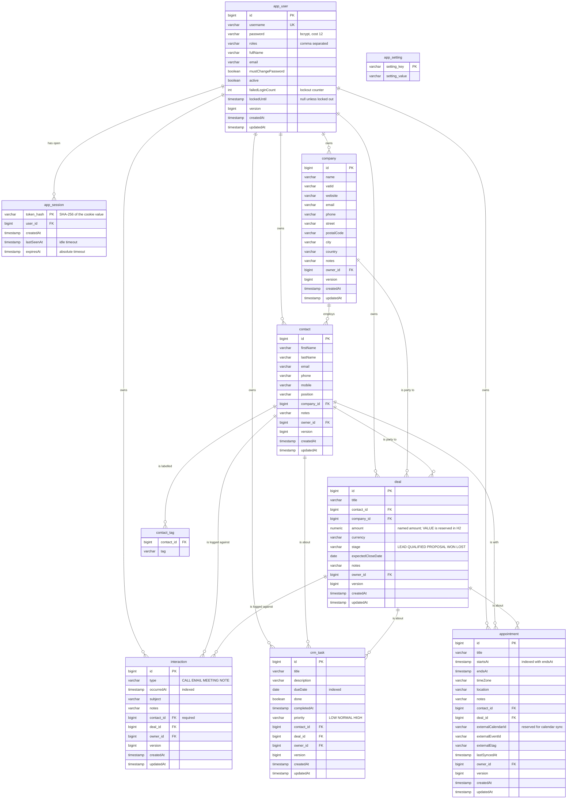

`app_setting` stands apart: a two-column key/value table holding the settings a user can change
from the interface, currently only the backup retention period. It has no foreign keys and no
owner because it belongs to the installation rather than to anybody in it.

Deleting never cascades into other people's work. Removing a company detaches its contacts and
deals; removing a contact deletes only the interactions logged against it, which have no meaning
without it, and detaches everything else.

---

## 2. Domain model

Panache active-record entities with public fields — Quarkus' idiom, and the reason there are no
repository classes. `BaseEntity` carries what every business record has; `AppUser` and
`AppSession` sit outside it because accounts are not business data and are deliberately excluded
from backups.

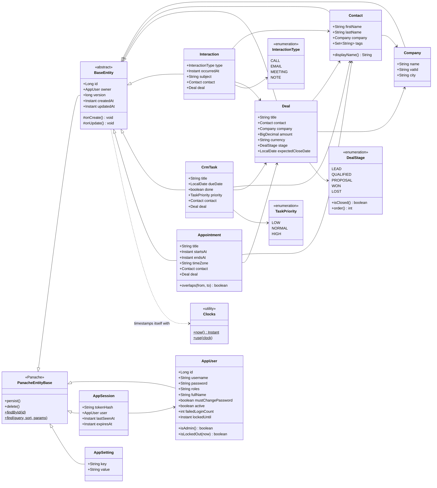

`Clocks` is a static holder rather than an injected dependency because `@PrePersist` and
`@PreUpdate` have no injection point of their own. `ClockProducer` fills it at startup, so a test
with a fixed clock gets fixed timestamps.

---

## 3. Backend structure

Four packages, one direction of dependency. Resources speak HTTP and know nothing about
persistence; services own the business rules and the transactions; entities own the data and the
rules that belong on it. `security` and `backup` are cross-cutting and hang off the request
lifecycle rather than being called from the middle of it.

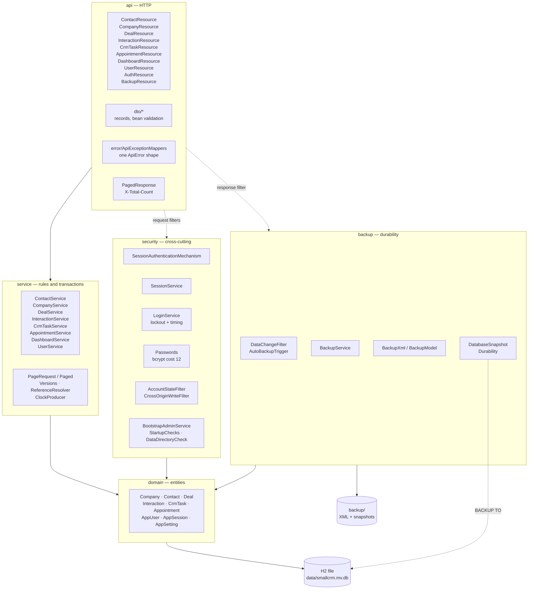

The one dependency worth pointing out is the dotted one from `api` to `backup`: nothing calls the
backup code. `DataChangeFilter` watches successful writes go past and tells `AutoBackupTrigger`
something changed, which is why adding an endpoint cannot accidentally leave it out of the
backups.

### Request pipeline

The order matters, and two of the steps exist because of specific failure modes.

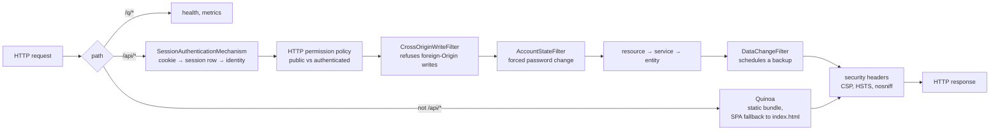

`quarkus.rest.path=/api` is what makes the second branch possible: the REST layer never sees a
front-end URL, so an unmatched path falls through to Quinoa's single-page fallback instead of
being answered with a 404 by the API's own error handling.

---

## 4. Frontend structure

Angular 22, standalone components, signals, zoneless change detection. `core` holds everything
shared and stateful; each screen is one lazily-loaded component under `features`; `shared` holds
the three pieces of interaction vocabulary every screen reuses.

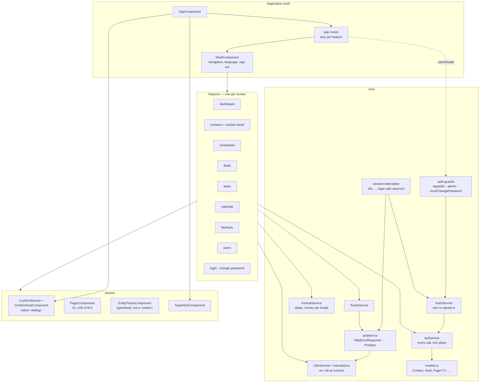

Two rules hold across every screen: nothing is fetched that is not shown (the pickers look records
up as you type rather than filling a dropdown from the whole table), and no list is trusted to be
complete without the server saying how many there are.

---

## 5. Behaviour

### Signing in, and what the cookie is worth

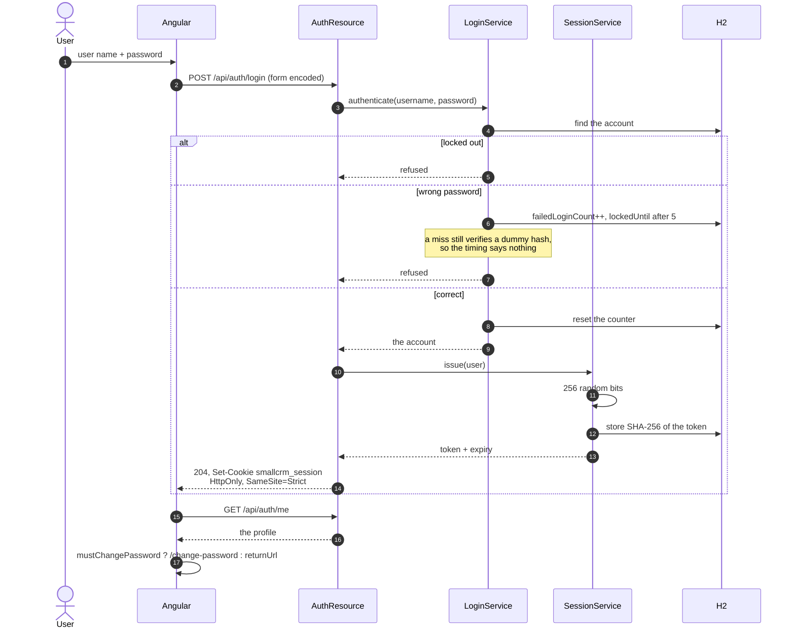

The cookie carries a random token and nothing else. Everything about the session lives in
`app_session`, which is why a password change, a deactivation or an administrator's reset can end
a session immediately — and why there is no key anywhere that could be used to mint one.

### Booking an appointment without double-booking

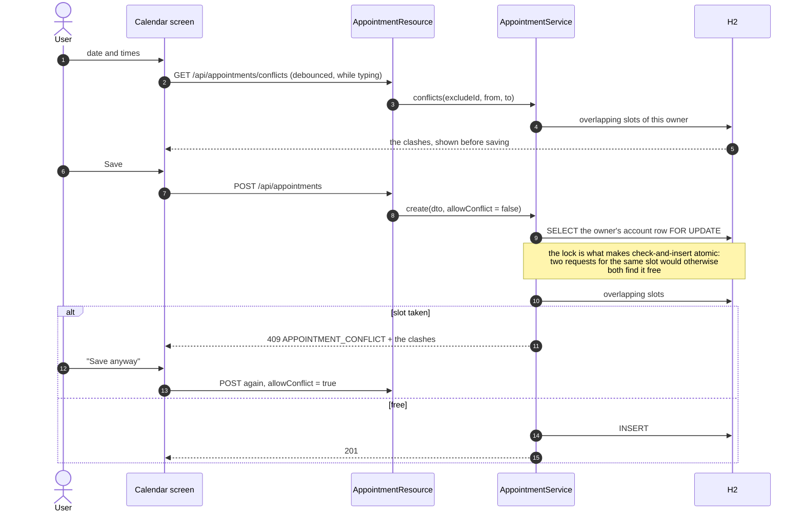

### A change reaching a backup file

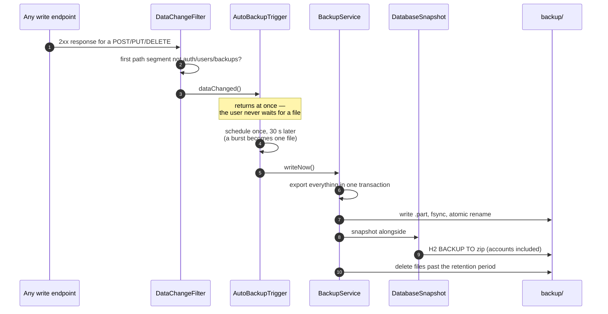

On shutdown a still-pending write is flushed first, so the last change before a service stop is
not the one that never made it to disk.

### Restoring

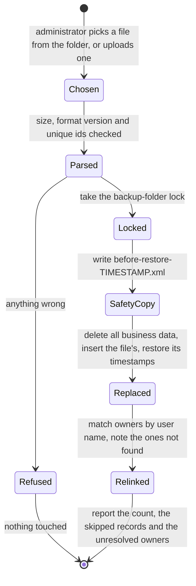

The safety copy and the replacement happen inside one lock. Without it, a record saved between the
two would be wiped by the restore and appear in neither the safety copy nor any automatic backup.

---

## 6. Runtime containers

One process. The Angular bundle is not a separate deployment: Quinoa builds it during
`mvn package` and it is served from the same jar, on the same port, as static resources.

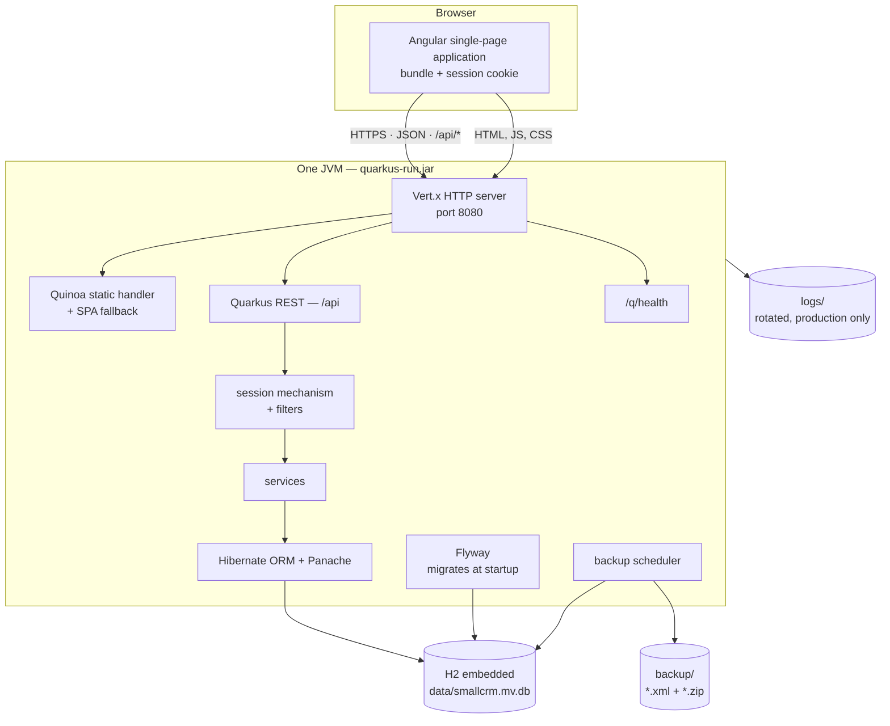

No database server, no message broker, no cache, no container runtime. That is a deliberate
product decision: the audience is one self-employed person, and every additional moving part is
one more thing they would have to keep alive.

---

## 7. Deployment

The two ways this is actually run — on the owner's own machine, which is the usual case, and on
a small server behind a reverse proxy. Everything the installation consists of lives in three
directories beside the jar.

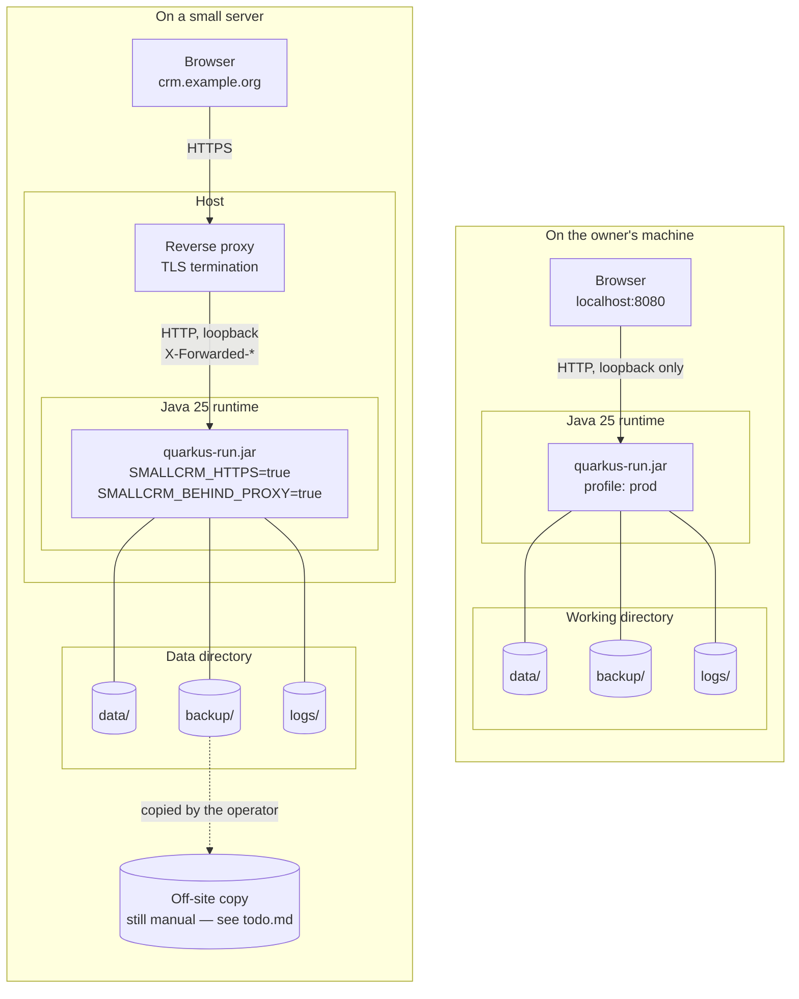

What changes between the two is configuration, not code:

| | Own machine | Behind a proxy |
| --- | --- | --- |
| `SMALLCRM_HTTPS` | `false` — a `Secure` cookie would be dropped over plain HTTP | `true` |
| `SMALLCRM_BEHIND_PROXY` | `false` | `true`, and the proxy must strip client-supplied `X-Forwarded-*` |
| `SMALLCRM_DATA_DIR` | `./data` | wherever the backed-up volume is |
| First password | printed once to the console | printed once to the log file |
| Off-site backups | the owner copies `backup/` | the operator copies `backup/` |

A future Google Calendar synchronisation is the only outbound connection the design anticipates;
the schema already carries the fields for it (`externalEventId`, `externalEtag`, `lastSyncedAt`)
so appointments entered today can be adopted without a migration.
