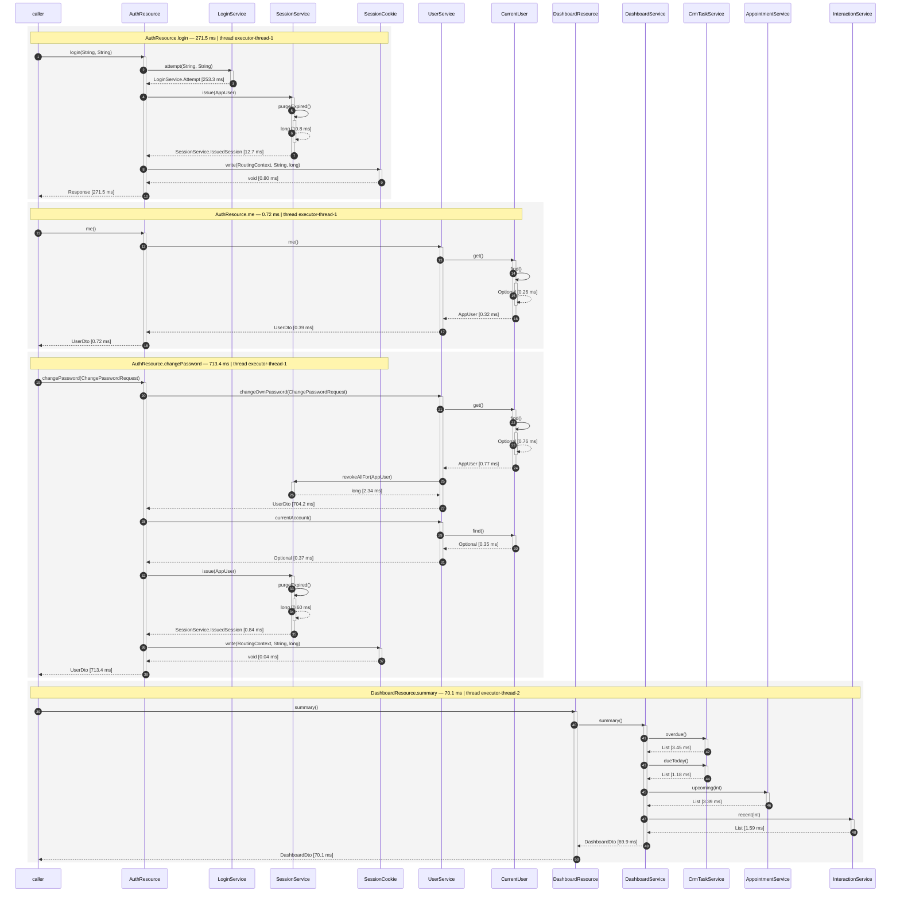
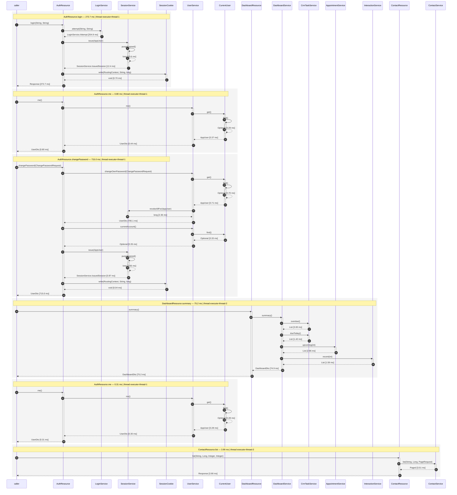
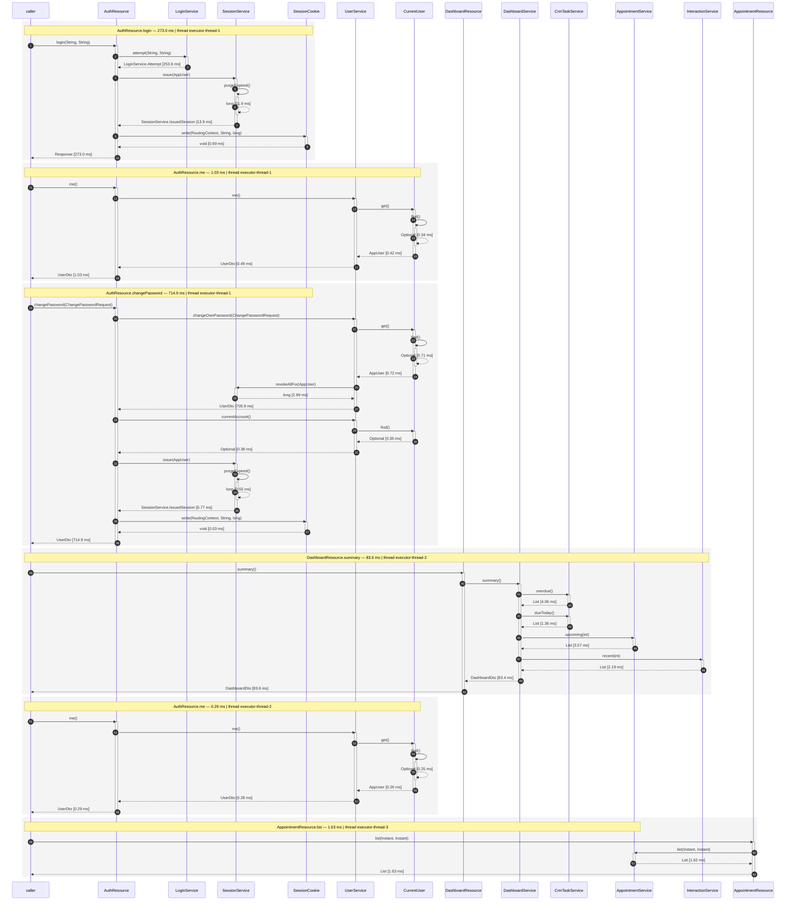
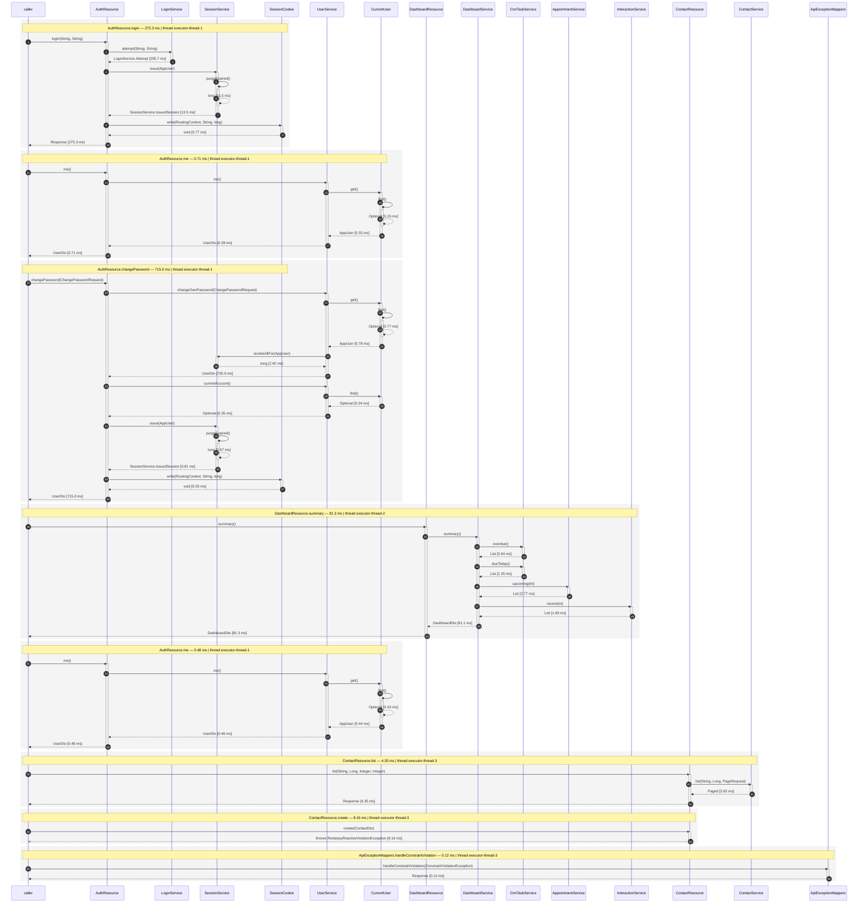
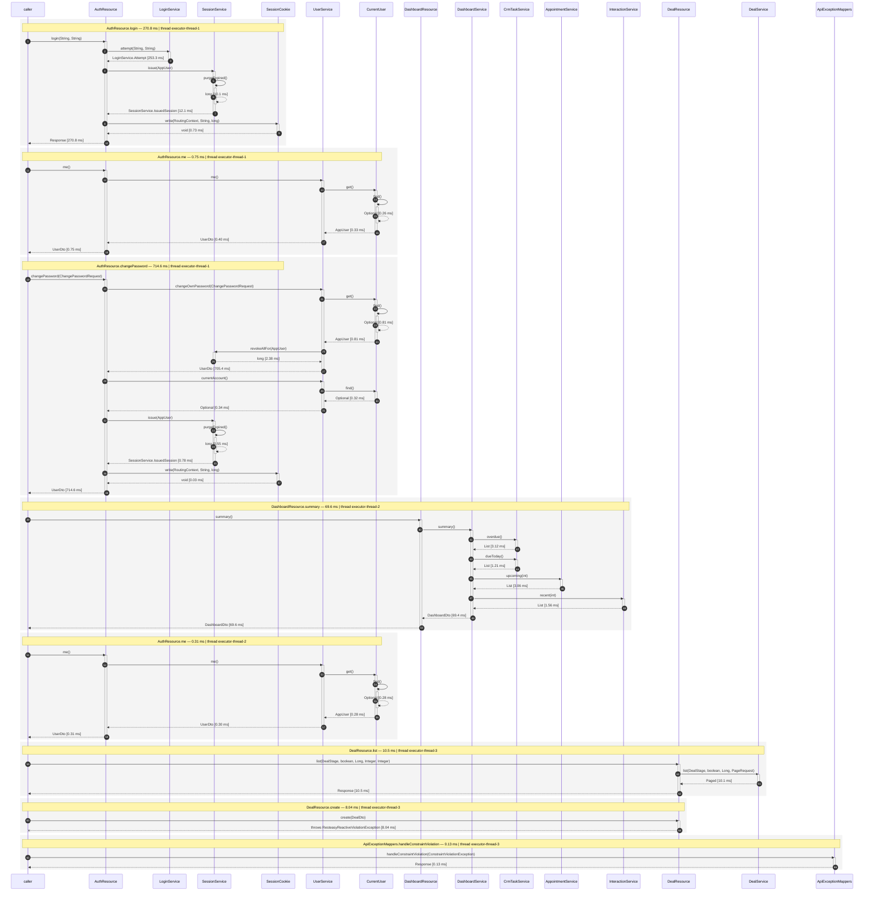

# What each use-case does

The 26 use-cases of the application, as the end-to-end suite drives them, each with the
sequence diagram cdi-flow recorded while it ran. One block per request, in the order the
application handled them; the blocks are the recorded chains, unchanged.

Generated by `node e2e/scripts/record-flows.mjs` - the prose lives in
`e2e/scripts/use-case-descriptions.mjs`, everything else is recorded. The per-chain diagrams
each use-case is made of are in the directory linked from its heading.

## 1. first start forces the administrator to pick a new password

The very first start of a fresh installation, which is also what a new owner walks through: signing in with the bootstrap password lands on the forced password change, a repetition that does not match is refused, and the chosen password opens the overview.

Driven by `e2e/tests/auth.setup.ts`, passed. 4 request(s), 12 distinct chain(s) of 40 recorded — [all of them](auth/01-first-start-forces-the-administrator-to-pick-a-new-password/README.md).


```mermaid
sequenceDiagram
    autonumber
    participant Caller as caller
    participant AuthResource
    participant LoginService
    participant SessionService
    participant SessionCookie
    participant UserService
    participant CurrentUser
    participant DashboardResource
    participant DashboardService
    participant CrmTaskService
    participant AppointmentService
    participant InteractionService
    rect rgb(244, 244, 244)
        Note over Caller,SessionCookie: AuthResource.login — 272.9 ms | thread executor-thread-1
        Caller->>AuthResource: login(String, String)
        activate AuthResource
            AuthResource->>LoginService: attempt(String, String)
            activate LoginService
            LoginService-->>AuthResource: LoginService.Attempt [253.4 ms]
            deactivate LoginService
            AuthResource->>SessionService: issue(AppUser)
            activate SessionService
                SessionService->>SessionService: purgeExpired()
                activate SessionService
                SessionService-->>SessionService: long [12.0 ms]
                deactivate SessionService
            SessionService-->>AuthResource: SessionService.IssuedSession [13.8 ms]
            deactivate SessionService
            AuthResource->>SessionCookie: write(RoutingContext, String, long)
            activate SessionCookie
            SessionCookie-->>AuthResource: void [0.73 ms]
            deactivate SessionCookie
        AuthResource-->>Caller: Response [272.9 ms]
        deactivate AuthResource
    end
    rect rgb(244, 244, 244)
        Note over Caller,CurrentUser: AuthResource.me — 0.94 ms | thread executor-thread-1
        Caller->>AuthResource: me()
        activate AuthResource
            AuthResource->>UserService: me()
            activate UserService
                UserService->>CurrentUser: get()
                activate CurrentUser
                    CurrentUser->>CurrentUser: find()
                    activate CurrentUser
                    CurrentUser-->>CurrentUser: Optional [0.31 ms]
                    deactivate CurrentUser
                CurrentUser-->>UserService: AppUser [0.41 ms]
                deactivate CurrentUser
            UserService-->>AuthResource: UserDto [0.48 ms]
            deactivate UserService
        AuthResource-->>Caller: UserDto [0.94 ms]
        deactivate AuthResource
    end
    rect rgb(244, 244, 244)
        Note over Caller,SessionCookie: AuthResource.changePassword — 714.1 ms | thread executor-thread-1
        Caller->>AuthResource: changePassword(ChangePasswordRequest)
        activate AuthResource
            AuthResource->>UserService: changeOwnPassword(ChangePasswordRequest)
            activate UserService
                UserService->>CurrentUser: get()
                activate CurrentUser
                    CurrentUser->>CurrentUser: find()
                    activate CurrentUser
                    CurrentUser-->>CurrentUser: Optional [0.65 ms]
                    deactivate CurrentUser
                CurrentUser-->>UserService: AppUser [0.65 ms]
                deactivate CurrentUser
                UserService->>SessionService: revokeAllFor(AppUser)
                activate SessionService
                SessionService-->>UserService: long [2.36 ms]
                deactivate SessionService
            UserService-->>AuthResource: UserDto [705.9 ms]
            deactivate UserService
            AuthResource->>UserService: currentAccount()
            activate UserService
                UserService->>CurrentUser: find()
                activate CurrentUser
                CurrentUser-->>UserService: Optional [0.34 ms]
                deactivate CurrentUser
            UserService-->>AuthResource: Optional [0.36 ms]
            deactivate UserService
            AuthResource->>SessionService: issue(AppUser)
            activate SessionService
                SessionService->>SessionService: purgeExpired()
                activate SessionService
                SessionService-->>SessionService: long [0.58 ms]
                deactivate SessionService
            SessionService-->>AuthResource: SessionService.IssuedSession [0.82 ms]
            deactivate SessionService
            AuthResource->>SessionCookie: write(RoutingContext, String, long)
            activate SessionCookie
            SessionCookie-->>AuthResource: void [0.03 ms]
            deactivate SessionCookie
        AuthResource-->>Caller: UserDto [714.1 ms]
        deactivate AuthResource
    end
    rect rgb(244, 244, 244)
        Note over Caller,InteractionService: DashboardResource.summary — 92.9 ms | thread executor-thread-1
        Caller->>DashboardResource: summary()
        activate DashboardResource
            DashboardResource->>DashboardService: summary()
            activate DashboardService
                DashboardService->>CrmTaskService: overdue()
                activate CrmTaskService
                CrmTaskService-->>DashboardService: List [4.89 ms]
                deactivate CrmTaskService
                DashboardService->>CrmTaskService: dueToday()
                activate CrmTaskService
                CrmTaskService-->>DashboardService: List [1.58 ms]
                deactivate CrmTaskService
                DashboardService->>AppointmentService: upcoming(int)
                activate AppointmentService
                AppointmentService-->>DashboardService: List [3.55 ms]
                deactivate AppointmentService
                DashboardService->>InteractionService: recent(int)
                activate InteractionService
                InteractionService-->>DashboardService: List [1.51 ms]
                deactivate InteractionService
            DashboardService-->>DashboardResource: DashboardDto [92.6 ms]
            deactivate DashboardService
        DashboardResource-->>Caller: DashboardDto [92.9 ms]
        deactivate DashboardResource
    end
```

## 2. the stylesheet is applied, not merely served

Loads the login screen signed out and checks computed colours and sizes, so a stylesheet that is served and parsed but applied to nothing fails the build - which is how it once shipped, with the whole suite green.

Driven by `e2e/tests/appearance.spec.ts`, passed. 4 request(s), 12 distinct chain(s) of 48 recorded — [all of them](appearance/02-the-stylesheet-is-applied-not-merely-served/README.md).


```mermaid
sequenceDiagram
    autonumber
    participant Caller as caller
    participant AuthResource
    participant LoginService
    participant SessionService
    participant SessionCookie
    participant UserService
    participant CurrentUser
    participant DashboardResource
    participant DashboardService
    participant CrmTaskService
    participant AppointmentService
    participant InteractionService
    rect rgb(244, 244, 244)
        Note over Caller,SessionCookie: AuthResource.login — 271.5 ms | thread executor-thread-1
        Caller->>AuthResource: login(String, String)
        activate AuthResource
            AuthResource->>LoginService: attempt(String, String)
            activate LoginService
            LoginService-->>AuthResource: LoginService.Attempt [253.3 ms]
            deactivate LoginService
            AuthResource->>SessionService: issue(AppUser)
            activate SessionService
                SessionService->>SessionService: purgeExpired()
                activate SessionService
                SessionService-->>SessionService: long [10.8 ms]
                deactivate SessionService
            SessionService-->>AuthResource: SessionService.IssuedSession [12.7 ms]
            deactivate SessionService
            AuthResource->>SessionCookie: write(RoutingContext, String, long)
            activate SessionCookie
            SessionCookie-->>AuthResource: void [0.80 ms]
            deactivate SessionCookie
        AuthResource-->>Caller: Response [271.5 ms]
        deactivate AuthResource
    end
    rect rgb(244, 244, 244)
        Note over Caller,CurrentUser: AuthResource.me — 0.72 ms | thread executor-thread-1
        Caller->>AuthResource: me()
        activate AuthResource
            AuthResource->>UserService: me()
            activate UserService
                UserService->>CurrentUser: get()
                activate CurrentUser
                    CurrentUser->>CurrentUser: find()
                    activate CurrentUser
                    CurrentUser-->>CurrentUser: Optional [0.26 ms]
                    deactivate CurrentUser
                CurrentUser-->>UserService: AppUser [0.32 ms]
                deactivate CurrentUser
            UserService-->>AuthResource: UserDto [0.39 ms]
            deactivate UserService
        AuthResource-->>Caller: UserDto [0.72 ms]
        deactivate AuthResource
    end
    rect rgb(244, 244, 244)
        Note over Caller,SessionCookie: AuthResource.changePassword — 713.4 ms | thread executor-thread-1
        Caller->>AuthResource: changePassword(ChangePasswordRequest)
        activate AuthResource
            AuthResource->>UserService: changeOwnPassword(ChangePasswordRequest)
            activate UserService
                UserService->>CurrentUser: get()
                activate CurrentUser
                    CurrentUser->>CurrentUser: find()
                    activate CurrentUser
                    CurrentUser-->>CurrentUser: Optional [0.76 ms]
                    deactivate CurrentUser
                CurrentUser-->>UserService: AppUser [0.77 ms]
                deactivate CurrentUser
                UserService->>SessionService: revokeAllFor(AppUser)
                activate SessionService
                SessionService-->>UserService: long [2.34 ms]
                deactivate SessionService
            UserService-->>AuthResource: UserDto [704.2 ms]
            deactivate UserService
            AuthResource->>UserService: currentAccount()
            activate UserService
                UserService->>CurrentUser: find()
                activate CurrentUser
                CurrentUser-->>UserService: Optional [0.35 ms]
                deactivate CurrentUser
            UserService-->>AuthResource: Optional [0.37 ms]
            deactivate UserService
            AuthResource->>SessionService: issue(AppUser)
            activate SessionService
                SessionService->>SessionService: purgeExpired()
                activate SessionService
                SessionService-->>SessionService: long [0.60 ms]
                deactivate SessionService
            SessionService-->>AuthResource: SessionService.IssuedSession [0.84 ms]
            deactivate SessionService
            AuthResource->>SessionCookie: write(RoutingContext, String, long)
            activate SessionCookie
            SessionCookie-->>AuthResource: void [0.04 ms]
            deactivate SessionCookie
        AuthResource-->>Caller: UserDto [713.4 ms]
        deactivate AuthResource
    end
    rect rgb(244, 244, 244)
        Note over Caller,InteractionService: DashboardResource.summary — 70.1 ms | thread executor-thread-2
        Caller->>DashboardResource: summary()
        activate DashboardResource
            DashboardResource->>DashboardService: summary()
            activate DashboardService
                DashboardService->>CrmTaskService: overdue()
                activate CrmTaskService
                CrmTaskService-->>DashboardService: List [3.45 ms]
                deactivate CrmTaskService
                DashboardService->>CrmTaskService: dueToday()
                activate CrmTaskService
                CrmTaskService-->>DashboardService: List [1.18 ms]
                deactivate CrmTaskService
                DashboardService->>AppointmentService: upcoming(int)
                activate AppointmentService
                AppointmentService-->>DashboardService: List [3.39 ms]
                deactivate AppointmentService
                DashboardService->>InteractionService: recent(int)
                activate InteractionService
                InteractionService-->>DashboardService: List [1.59 ms]
                deactivate InteractionService
            DashboardService-->>DashboardResource: DashboardDto [69.9 ms]
            deactivate DashboardService
        DashboardResource-->>Caller: DashboardDto [70.1 ms]
        deactivate DashboardResource
    end
```

## 3. the styles survive into the signed-in application

Opens a feature screen of the signed-in shell and checks that the component styles arrive there too, not only the global sheet.

Driven by `e2e/tests/appearance.spec.ts`, passed. 6 request(s), 13 distinct chain(s) of 77 recorded — [all of them](appearance/03-the-styles-survive-into-the-signed-in-application/README.md).


```mermaid
sequenceDiagram
    autonumber
    participant Caller as caller
    participant AuthResource
    participant LoginService
    participant SessionService
    participant SessionCookie
    participant UserService
    participant CurrentUser
    participant DashboardResource
    participant DashboardService
    participant CrmTaskService
    participant AppointmentService
    participant InteractionService
    participant ContactResource
    participant ContactService
    rect rgb(244, 244, 244)
        Note over Caller,SessionCookie: AuthResource.login — 272.7 ms | thread executor-thread-1
        Caller->>AuthResource: login(String, String)
        activate AuthResource
            AuthResource->>LoginService: attempt(String, String)
            activate LoginService
            LoginService-->>AuthResource: LoginService.Attempt [254.9 ms]
            deactivate LoginService
            AuthResource->>SessionService: issue(AppUser)
            activate SessionService
                SessionService->>SessionService: purgeExpired()
                activate SessionService
                SessionService-->>SessionService: long [10.6 ms]
                deactivate SessionService
            SessionService-->>AuthResource: SessionService.IssuedSession [12.4 ms]
            deactivate SessionService
            AuthResource->>SessionCookie: write(RoutingContext, String, long)
            activate SessionCookie
            SessionCookie-->>AuthResource: void [0.70 ms]
            deactivate SessionCookie
        AuthResource-->>Caller: Response [272.7 ms]
        deactivate AuthResource
    end
    rect rgb(244, 244, 244)
        Note over Caller,CurrentUser: AuthResource.me — 0.80 ms | thread executor-thread-1
        Caller->>AuthResource: me()
        activate AuthResource
            AuthResource->>UserService: me()
            activate UserService
                UserService->>CurrentUser: get()
                activate CurrentUser
                    CurrentUser->>CurrentUser: find()
                    activate CurrentUser
                    CurrentUser-->>CurrentUser: Optional [0.29 ms]
                    deactivate CurrentUser
                CurrentUser-->>UserService: AppUser [0.37 ms]
                deactivate CurrentUser
            UserService-->>AuthResource: UserDto [0.44 ms]
            deactivate UserService
        AuthResource-->>Caller: UserDto [0.80 ms]
        deactivate AuthResource
    end
    rect rgb(244, 244, 244)
        Note over Caller,SessionCookie: AuthResource.changePassword — 715.0 ms | thread executor-thread-1
        Caller->>AuthResource: changePassword(ChangePasswordRequest)
        activate AuthResource
            AuthResource->>UserService: changeOwnPassword(ChangePasswordRequest)
            activate UserService
                UserService->>CurrentUser: get()
                activate CurrentUser
                    CurrentUser->>CurrentUser: find()
                    activate CurrentUser
                    CurrentUser-->>CurrentUser: Optional [0.70 ms]
                    deactivate CurrentUser
                CurrentUser-->>UserService: AppUser [0.71 ms]
                deactivate CurrentUser
                UserService->>SessionService: revokeAllFor(AppUser)
                activate SessionService
                SessionService-->>UserService: long [2.36 ms]
                deactivate SessionService
            UserService-->>AuthResource: UserDto [706.1 ms]
            deactivate UserService
            AuthResource->>UserService: currentAccount()
            activate UserService
                UserService->>CurrentUser: find()
                activate CurrentUser
                CurrentUser-->>UserService: Optional [0.33 ms]
                deactivate CurrentUser
            UserService-->>AuthResource: Optional [0.35 ms]
            deactivate UserService
            AuthResource->>SessionService: issue(AppUser)
            activate SessionService
                SessionService->>SessionService: purgeExpired()
                activate SessionService
                SessionService-->>SessionService: long [0.65 ms]
                deactivate SessionService
            SessionService-->>AuthResource: SessionService.IssuedSession [0.87 ms]
            deactivate SessionService
            AuthResource->>SessionCookie: write(RoutingContext, String, long)
            activate SessionCookie
            SessionCookie-->>AuthResource: void [0.04 ms]
            deactivate SessionCookie
        AuthResource-->>Caller: UserDto [715.0 ms]
        deactivate AuthResource
    end
    rect rgb(244, 244, 244)
        Note over Caller,InteractionService: DashboardResource.summary — 75.2 ms | thread executor-thread-2
        Caller->>DashboardResource: summary()
        activate DashboardResource
            DashboardResource->>DashboardService: summary()
            activate DashboardService
                DashboardService->>CrmTaskService: overdue()
                activate CrmTaskService
                CrmTaskService-->>DashboardService: List [3.00 ms]
                deactivate CrmTaskService
                DashboardService->>CrmTaskService: dueToday()
                activate CrmTaskService
                CrmTaskService-->>DashboardService: List [1.42 ms]
                deactivate CrmTaskService
                DashboardService->>AppointmentService: upcoming(int)
                activate AppointmentService
                AppointmentService-->>DashboardService: List [2.86 ms]
                deactivate AppointmentService
                DashboardService->>InteractionService: recent(int)
                activate InteractionService
                InteractionService-->>DashboardService: List [1.59 ms]
                deactivate InteractionService
            DashboardService-->>DashboardResource: DashboardDto [74.9 ms]
            deactivate DashboardService
        DashboardResource-->>Caller: DashboardDto [75.2 ms]
        deactivate DashboardResource
    end
    rect rgb(244, 244, 244)
        Note over Caller,CurrentUser: AuthResource.me — 0.31 ms | thread executor-thread-1
        Caller->>AuthResource: me()
        activate AuthResource
            AuthResource->>UserService: me()
            activate UserService
                UserService->>CurrentUser: get()
                activate CurrentUser
                    CurrentUser->>CurrentUser: find()
                    activate CurrentUser
                    CurrentUser-->>CurrentUser: Optional [0.28 ms]
                    deactivate CurrentUser
                CurrentUser-->>UserService: AppUser [0.28 ms]
                deactivate CurrentUser
            UserService-->>AuthResource: UserDto [0.30 ms]
            deactivate UserService
        AuthResource-->>Caller: UserDto [0.31 ms]
        deactivate AuthResource
    end
    rect rgb(244, 244, 244)
        Note over Caller,ContactService: ContactResource.list — 3.90 ms | thread executor-thread-2
        Caller->>ContactResource: list(String, Long, Integer, Integer)
        activate ContactResource
            ContactResource->>ContactService: list(String, Long, PageRequest)
            activate ContactService
            ContactService-->>ContactResource: Paged [3.51 ms]
            deactivate ContactService
        ContactResource-->>Caller: Response [3.90 ms]
        deactivate ContactResource
    end
```

## 4. a backup can be created, downloaded and restored from the folder

Creates a company, takes a backup, downloads it to confirm the company is really in it, adds a second company, and restores the backup: the later company is gone, the earlier one is back, and a before-restore copy of what was replaced has appeared in the folder.

Driven by `e2e/tests/backups.spec.ts`, passed. 29 request(s), 20 distinct chain(s) of 193 recorded — [all of them](backups/04-a-backup-can-be-created-downloaded-and-restored-from-the-folder/README.md).

Its 29 requests are too many to inline here: [`use-case.mmd`](backups/04-a-backup-can-be-created-downloaded-and-restored-from-the-folder/use-case.mmd).

## 5. an unwanted restore can be undone with the before-restore file

Restores an older backup on purpose and then restores the before-restore copy the application wrote by itself, which brings the newer state back.

Driven by `e2e/tests/backups.spec.ts`, passed, run with its whole spec in front of it. 78 request(s), 25 distinct chain(s) of 571 recorded — [all of them](backups/05-an-unwanted-restore-can-be-undone-with-the-before-restore-file/README.md).

Its 78 requests are too many to inline here: [`use-case.mmd`](backups/05-an-unwanted-restore-can-be-undone-with-the-before-restore-file/use-case.mmd).

## 6. the retention period can be changed from the screen

Changes the retention period from the backup screen, reloads to prove it was persisted, and puts the default back for the specs that follow.

Driven by `e2e/tests/backups.spec.ts`, passed. 14 request(s), 15 distinct chain(s) of 120 recorded — [all of them](backups/06-the-retention-period-can-be-changed-from-the-screen/README.md).


```mermaid
sequenceDiagram
    autonumber
    participant Caller as caller
    participant AuthResource
    participant LoginService
    participant SessionService
    participant SessionCookie
    participant UserService
    participant CurrentUser
    participant DashboardResource
    participant DashboardService
    participant CrmTaskService
    participant AppointmentService
    participant InteractionService
    participant BackupResource
    participant BackupService
    participant BackupSettingsService
    rect rgb(244, 244, 244)
        Note over Caller,SessionCookie: AuthResource.login — 271.2 ms | thread executor-thread-1
        Caller->>AuthResource: login(String, String)
        activate AuthResource
            AuthResource->>LoginService: attempt(String, String)
            activate LoginService
            LoginService-->>AuthResource: LoginService.Attempt [253.3 ms]
            deactivate LoginService
            AuthResource->>SessionService: issue(AppUser)
            activate SessionService
                SessionService->>SessionService: purgeExpired()
                activate SessionService
                SessionService-->>SessionService: long [10.6 ms]
                deactivate SessionService
            SessionService-->>AuthResource: SessionService.IssuedSession [12.6 ms]
            deactivate SessionService
            AuthResource->>SessionCookie: write(RoutingContext, String, long)
            activate SessionCookie
            SessionCookie-->>AuthResource: void [0.73 ms]
            deactivate SessionCookie
        AuthResource-->>Caller: Response [271.2 ms]
        deactivate AuthResource
    end
    rect rgb(244, 244, 244)
        Note over Caller,CurrentUser: AuthResource.me — 0.79 ms | thread executor-thread-1
        Caller->>AuthResource: me()
        activate AuthResource
            AuthResource->>UserService: me()
            activate UserService
                UserService->>CurrentUser: get()
                activate CurrentUser
                    CurrentUser->>CurrentUser: find()
                    activate CurrentUser
                    CurrentUser-->>CurrentUser: Optional [0.26 ms]
                    deactivate CurrentUser
                CurrentUser-->>UserService: AppUser [0.33 ms]
                deactivate CurrentUser
            UserService-->>AuthResource: UserDto [0.39 ms]
            deactivate UserService
        AuthResource-->>Caller: UserDto [0.79 ms]
        deactivate AuthResource
    end
    rect rgb(244, 244, 244)
        Note over Caller,SessionCookie: AuthResource.changePassword — 716.6 ms | thread executor-thread-1
        Caller->>AuthResource: changePassword(ChangePasswordRequest)
        activate AuthResource
            AuthResource->>UserService: changeOwnPassword(ChangePasswordRequest)
            activate UserService
                UserService->>CurrentUser: get()
                activate CurrentUser
                    CurrentUser->>CurrentUser: find()
                    activate CurrentUser
                    CurrentUser-->>CurrentUser: Optional [0.87 ms]
                    deactivate CurrentUser
                CurrentUser-->>UserService: AppUser [0.88 ms]
                deactivate CurrentUser
                UserService->>SessionService: revokeAllFor(AppUser)
                activate SessionService
                SessionService-->>UserService: long [2.38 ms]
                deactivate SessionService
            UserService-->>AuthResource: UserDto [707.5 ms]
            deactivate UserService
            AuthResource->>UserService: currentAccount()
            activate UserService
                UserService->>CurrentUser: find()
                activate CurrentUser
                CurrentUser-->>UserService: Optional [0.35 ms]
                deactivate CurrentUser
            UserService-->>AuthResource: Optional [0.37 ms]
            deactivate UserService
            AuthResource->>SessionService: issue(AppUser)
            activate SessionService
                SessionService->>SessionService: purgeExpired()
                activate SessionService
                SessionService-->>SessionService: long [0.52 ms]
                deactivate SessionService
            SessionService-->>AuthResource: SessionService.IssuedSession [0.74 ms]
            deactivate SessionService
            AuthResource->>SessionCookie: write(RoutingContext, String, long)
            activate SessionCookie
            SessionCookie-->>AuthResource: void [0.03 ms]
            deactivate SessionCookie
        AuthResource-->>Caller: UserDto [716.6 ms]
        deactivate AuthResource
    end
    rect rgb(244, 244, 244)
        Note over Caller,InteractionService: DashboardResource.summary — 68.2 ms | thread executor-thread-2
        Caller->>DashboardResource: summary()
        activate DashboardResource
            DashboardResource->>DashboardService: summary()
            activate DashboardService
                DashboardService->>CrmTaskService: overdue()
                activate CrmTaskService
                CrmTaskService-->>DashboardService: List [3.67 ms]
                deactivate CrmTaskService
                DashboardService->>CrmTaskService: dueToday()
                activate CrmTaskService
                CrmTaskService-->>DashboardService: List [1.24 ms]
                deactivate CrmTaskService
                DashboardService->>AppointmentService: upcoming(int)
                activate AppointmentService
                AppointmentService-->>DashboardService: List [4.11 ms]
                deactivate AppointmentService
                DashboardService->>InteractionService: recent(int)
                activate InteractionService
                InteractionService-->>DashboardService: List [1.66 ms]
                deactivate InteractionService
            DashboardService-->>DashboardResource: DashboardDto [68.0 ms]
            deactivate DashboardService
        DashboardResource-->>Caller: DashboardDto [68.2 ms]
        deactivate DashboardResource
    end
    rect rgb(244, 244, 244)
        Note over Caller,CurrentUser: AuthResource.me — 0.49 ms | thread executor-thread-1
        Caller->>AuthResource: me()
        activate AuthResource
            AuthResource->>UserService: me()
            activate UserService
                UserService->>CurrentUser: get()
                activate CurrentUser
                    CurrentUser->>CurrentUser: find()
                    activate CurrentUser
                    CurrentUser-->>CurrentUser: Optional [0.45 ms]
                    deactivate CurrentUser
                CurrentUser-->>UserService: AppUser [0.47 ms]
                deactivate CurrentUser
            UserService-->>AuthResource: UserDto [0.48 ms]
            deactivate UserService
        AuthResource-->>Caller: UserDto [0.49 ms]
        deactivate AuthResource
    end
    rect rgb(244, 244, 244)
        Note over Caller,BackupService: BackupResource.list — 0.25 ms | thread executor-thread-1
        Caller->>BackupResource: list()
        activate BackupResource
            BackupResource->>BackupService: list()
            activate BackupService
                BackupService->>BackupService: directory()
                activate BackupService
                BackupService-->>BackupService: Path [0.01 ms]
                deactivate BackupService
            BackupService-->>BackupResource: List [0.03 ms]
            deactivate BackupService
        BackupResource-->>Caller: List [0.25 ms]
        deactivate BackupResource
    end
    rect rgb(244, 244, 244)
        Note over Caller,BackupService: BackupResource.settings — 0.46 ms | thread executor-thread-2
        Caller->>BackupResource: settings()
        activate BackupResource
            BackupResource->>BackupSettingsService: retentionDays()
            activate BackupSettingsService
            BackupSettingsService-->>BackupResource: int [0.42 ms]
            deactivate BackupSettingsService
            BackupResource->>BackupService: directory()
            activate BackupService
            BackupService-->>BackupResource: Path [0.01 ms]
            deactivate BackupService
        BackupResource-->>Caller: BackupSettingsDto [0.46 ms]
        deactivate BackupResource
    end
    rect rgb(244, 244, 244)
        Note over Caller,BackupService: BackupResource.updateSettings — 3.35 ms | thread executor-thread-1
        Caller->>BackupResource: updateSettings(BackupSettingsDto)
        activate BackupResource
            BackupResource->>BackupSettingsService: updateRetentionDays(int)
            activate BackupSettingsService
            BackupSettingsService-->>BackupResource: int [0.22 ms]
            deactivate BackupSettingsService
            BackupResource->>BackupService: applyRetention()
            activate BackupService
                BackupService->>BackupSettingsService: retentionDays()
                activate BackupSettingsService
                BackupSettingsService-->>BackupService: int [0.19 ms]
                deactivate BackupSettingsService
                BackupService->>BackupService: list()
                activate BackupService
                    BackupService->>BackupService: directory()
                    activate BackupService
                    BackupService-->>BackupService: Path [0.01 ms]
                    deactivate BackupService
                BackupService-->>BackupService: List [0.03 ms]
                deactivate BackupService
            BackupService-->>BackupResource: int [0.24 ms]
            deactivate BackupService
            BackupResource->>BackupSettingsService: retentionDays()
            activate BackupSettingsService
            BackupSettingsService-->>BackupResource: int [1.86 ms]
            deactivate BackupSettingsService
            BackupResource->>BackupService: directory()
            activate BackupService
            BackupService-->>BackupResource: Path [0.01 ms]
            deactivate BackupService
        BackupResource-->>Caller: BackupSettingsDto [3.35 ms]
        deactivate BackupResource
    end
    rect rgb(244, 244, 244)
        Note over Caller,CurrentUser: AuthResource.me — 0.42 ms | thread executor-thread-1
        Caller->>AuthResource: me()
        activate AuthResource
            AuthResource->>UserService: me()
            activate UserService
                UserService->>CurrentUser: get()
                activate CurrentUser
                    CurrentUser->>CurrentUser: find()
                    activate CurrentUser
                    CurrentUser-->>CurrentUser: Optional [0.39 ms]
                    deactivate CurrentUser
                CurrentUser-->>UserService: AppUser [0.39 ms]
                deactivate CurrentUser
            UserService-->>AuthResource: UserDto [0.41 ms]
            deactivate UserService
        AuthResource-->>Caller: UserDto [0.42 ms]
        deactivate AuthResource
    end
    rect rgb(244, 244, 244)
        Note over Caller,BackupService: BackupResource.list — 0.04 ms | thread executor-thread-3
        Caller->>BackupResource: list()
        activate BackupResource
            BackupResource->>BackupService: list()
            activate BackupService
                BackupService->>BackupService: directory()
                activate BackupService
                BackupService-->>BackupService: Path [0.01 ms]
                deactivate BackupService
            BackupService-->>BackupResource: List [0.02 ms]
            deactivate BackupService
        BackupResource-->>Caller: List [0.04 ms]
        deactivate BackupResource
    end
    rect rgb(244, 244, 244)
        Note over Caller,BackupService: BackupResource.settings — 0.20 ms | thread executor-thread-1
        Caller->>BackupResource: settings()
        activate BackupResource
            BackupResource->>BackupSettingsService: retentionDays()
            activate BackupSettingsService
            BackupSettingsService-->>BackupResource: int [0.18 ms]
            deactivate BackupSettingsService
            BackupResource->>BackupService: directory()
            activate BackupService
            BackupService-->>BackupResource: Path [0.01 ms]
            deactivate BackupService
        BackupResource-->>Caller: BackupSettingsDto [0.20 ms]
        deactivate BackupResource
    end
    rect rgb(244, 244, 244)
        Note over Caller,BackupService: BackupResource.updateSettings — 1.39 ms | thread executor-thread-1
        Caller->>BackupResource: updateSettings(BackupSettingsDto)
        activate BackupResource
            BackupResource->>BackupSettingsService: updateRetentionDays(int)
            activate BackupSettingsService
            BackupSettingsService-->>BackupResource: int [0.28 ms]
            deactivate BackupSettingsService
            BackupResource->>BackupService: applyRetention()
            activate BackupService
                BackupService->>BackupSettingsService: retentionDays()
                activate BackupSettingsService
                BackupSettingsService-->>BackupService: int [0.23 ms]
                deactivate BackupSettingsService
                BackupService->>BackupService: list()
                activate BackupService
                    BackupService->>BackupService: directory()
                    activate BackupService
                    BackupService-->>BackupService: Path [0.01 ms]
                    deactivate BackupService
                BackupService-->>BackupService: List [0.03 ms]
                deactivate BackupService
            BackupService-->>BackupResource: int [0.28 ms]
            deactivate BackupService
            BackupResource->>BackupSettingsService: retentionDays()
            activate BackupSettingsService
            BackupSettingsService-->>BackupResource: int [0.03 ms]
            deactivate BackupSettingsService
            BackupResource->>BackupService: directory()
            activate BackupService
            BackupService-->>BackupResource: Path [0.00 ms]
            deactivate BackupService
        BackupResource-->>Caller: BackupSettingsDto [1.39 ms]
        deactivate BackupResource
    end
    rect rgb(244, 244, 244)
        Note over Caller,BackupService: BackupResource.list — 0.04 ms | thread executor-thread-3
        Caller->>BackupResource: list()
        activate BackupResource
            BackupResource->>BackupService: list()
            activate BackupService
                BackupService->>BackupService: directory()
                activate BackupService
                BackupService-->>BackupService: Path [0.01 ms]
                deactivate BackupService
            BackupService-->>BackupResource: List [0.02 ms]
            deactivate BackupService
        BackupResource-->>Caller: List [0.04 ms]
        deactivate BackupResource
    end
    rect rgb(244, 244, 244)
        Note over Caller,BackupService: BackupResource.settings — 0.22 ms | thread executor-thread-1
        Caller->>BackupResource: settings()
        activate BackupResource
            BackupResource->>BackupSettingsService: retentionDays()
            activate BackupSettingsService
            BackupSettingsService-->>BackupResource: int [0.20 ms]
            deactivate BackupSettingsService
            BackupResource->>BackupService: directory()
            activate BackupService
            BackupService-->>BackupResource: Path [0.01 ms]
            deactivate BackupService
        BackupResource-->>Caller: BackupSettingsDto [0.22 ms]
        deactivate BackupResource
    end
```

## 7. a file that is not a backup is refused without losing any data

Uploads a file that is not a backup at all: the restore is refused with a message, and the data that was there is still there afterwards.

Driven by `e2e/tests/backups.spec.ts`, passed. 16 request(s), 19 distinct chain(s) of 128 recorded — [all of them](backups/07-a-file-that-is-not-a-backup-is-refused-without-losing-any-data/README.md).


```mermaid
sequenceDiagram
    autonumber
    participant Caller as caller
    participant AuthResource
    participant LoginService
    participant SessionService
    participant SessionCookie
    participant UserService
    participant CurrentUser
    participant DashboardResource
    participant DashboardService
    participant CrmTaskService
    participant AppointmentService
    participant InteractionService
    participant CompanyResource
    participant CompanyService
    participant AutoBackupTrigger
    participant BackupResource
    participant BackupService
    participant BackupSettingsService
    participant BackupXml
    participant ApiExceptionMappers
    rect rgb(244, 244, 244)
        Note over Caller,SessionCookie: AuthResource.login — 272.0 ms | thread executor-thread-1
        Caller->>AuthResource: login(String, String)
        activate AuthResource
            AuthResource->>LoginService: attempt(String, String)
            activate LoginService
            LoginService-->>AuthResource: LoginService.Attempt [253.6 ms]
            deactivate LoginService
            AuthResource->>SessionService: issue(AppUser)
            activate SessionService
                SessionService->>SessionService: purgeExpired()
                activate SessionService
                SessionService-->>SessionService: long [10.5 ms]
                deactivate SessionService
            SessionService-->>AuthResource: SessionService.IssuedSession [12.3 ms]
            deactivate SessionService
            AuthResource->>SessionCookie: write(RoutingContext, String, long)
            activate SessionCookie
            SessionCookie-->>AuthResource: void [1.12 ms]
            deactivate SessionCookie
        AuthResource-->>Caller: Response [272.0 ms]
        deactivate AuthResource
    end
    rect rgb(244, 244, 244)
        Note over Caller,CurrentUser: AuthResource.me — 0.73 ms | thread executor-thread-1
        Caller->>AuthResource: me()
        activate AuthResource
            AuthResource->>UserService: me()
            activate UserService
                UserService->>CurrentUser: get()
                activate CurrentUser
                    CurrentUser->>CurrentUser: find()
                    activate CurrentUser
                    CurrentUser-->>CurrentUser: Optional [0.26 ms]
                    deactivate CurrentUser
                CurrentUser-->>UserService: AppUser [0.35 ms]
                deactivate CurrentUser
            UserService-->>AuthResource: UserDto [0.41 ms]
            deactivate UserService
        AuthResource-->>Caller: UserDto [0.73 ms]
        deactivate AuthResource
    end
    rect rgb(244, 244, 244)
        Note over Caller,SessionCookie: AuthResource.changePassword — 714.5 ms | thread executor-thread-1
        Caller->>AuthResource: changePassword(ChangePasswordRequest)
        activate AuthResource
            AuthResource->>UserService: changeOwnPassword(ChangePasswordRequest)
            activate UserService
                UserService->>CurrentUser: get()
                activate CurrentUser
                    CurrentUser->>CurrentUser: find()
                    activate CurrentUser
                    CurrentUser-->>CurrentUser: Optional [0.88 ms]
                    deactivate CurrentUser
                CurrentUser-->>UserService: AppUser [0.89 ms]
                deactivate CurrentUser
                UserService->>SessionService: revokeAllFor(AppUser)
                activate SessionService
                SessionService-->>UserService: long [2.39 ms]
                deactivate SessionService
            UserService-->>AuthResource: UserDto [705.5 ms]
            deactivate UserService
            AuthResource->>UserService: currentAccount()
            activate UserService
                UserService->>CurrentUser: find()
                activate CurrentUser
                CurrentUser-->>UserService: Optional [0.33 ms]
                deactivate CurrentUser
            UserService-->>AuthResource: Optional [0.34 ms]
            deactivate UserService
            AuthResource->>SessionService: issue(AppUser)
            activate SessionService
                SessionService->>SessionService: purgeExpired()
                activate SessionService
                SessionService-->>SessionService: long [0.55 ms]
                deactivate SessionService
            SessionService-->>AuthResource: SessionService.IssuedSession [0.78 ms]
            deactivate SessionService
            AuthResource->>SessionCookie: write(RoutingContext, String, long)
            activate SessionCookie
            SessionCookie-->>AuthResource: void [0.03 ms]
            deactivate SessionCookie
        AuthResource-->>Caller: UserDto [714.5 ms]
        deactivate AuthResource
    end
    rect rgb(244, 244, 244)
        Note over Caller,InteractionService: DashboardResource.summary — 74.1 ms | thread executor-thread-2
        Caller->>DashboardResource: summary()
        activate DashboardResource
            DashboardResource->>DashboardService: summary()
            activate DashboardService
                DashboardService->>CrmTaskService: overdue()
                activate CrmTaskService
                CrmTaskService-->>DashboardService: List [2.97 ms]
                deactivate CrmTaskService
                DashboardService->>CrmTaskService: dueToday()
                activate CrmTaskService
                CrmTaskService-->>DashboardService: List [1.79 ms]
                deactivate CrmTaskService
                DashboardService->>AppointmentService: upcoming(int)
                activate AppointmentService
                AppointmentService-->>DashboardService: List [2.76 ms]
                deactivate AppointmentService
                DashboardService->>InteractionService: recent(int)
                activate InteractionService
                InteractionService-->>DashboardService: List [1.35 ms]
                deactivate InteractionService
            DashboardService-->>DashboardResource: DashboardDto [73.8 ms]
            deactivate DashboardService
        DashboardResource-->>Caller: DashboardDto [74.1 ms]
        deactivate DashboardResource
    end
    rect rgb(244, 244, 244)
        Note over Caller,CurrentUser: AuthResource.me — 0.44 ms | thread executor-thread-2
        Caller->>AuthResource: me()
        activate AuthResource
            AuthResource->>UserService: me()
            activate UserService
                UserService->>CurrentUser: get()
                activate CurrentUser
                    CurrentUser->>CurrentUser: find()
                    activate CurrentUser
                    CurrentUser-->>CurrentUser: Optional [0.41 ms]
                    deactivate CurrentUser
                CurrentUser-->>UserService: AppUser [0.41 ms]
                deactivate CurrentUser
            UserService-->>AuthResource: UserDto [0.43 ms]
            deactivate UserService
        AuthResource-->>Caller: UserDto [0.44 ms]
        deactivate AuthResource
    end
    rect rgb(244, 244, 244)
        Note over Caller,CompanyService: CompanyResource.list — 2.08 ms | thread executor-thread-1
        Caller->>CompanyResource: list(String, Integer, Integer)
        activate CompanyResource
            CompanyResource->>CompanyService: list(String, PageRequest)
            activate CompanyService
            CompanyService-->>CompanyResource: Paged [1.68 ms]
            deactivate CompanyService
        CompanyResource-->>Caller: Response [2.08 ms]
        deactivate CompanyResource
    end
    rect rgb(244, 244, 244)
        Note over Caller,CurrentUser: CompanyResource.create — 2.51 ms | thread executor-thread-1
        Caller->>CompanyResource: create(CompanyDto)
        activate CompanyResource
            CompanyResource->>CompanyService: create(CompanyDto)
            activate CompanyService
                CompanyService->>CurrentUser: find()
                activate CurrentUser
                CurrentUser-->>CompanyService: Optional [0.47 ms]
                deactivate CurrentUser
            CompanyService-->>CompanyResource: CompanyDto [1.28 ms]
            deactivate CompanyService
        CompanyResource-->>Caller: Response [2.51 ms]
        deactivate CompanyResource
    end
    rect rgb(244, 244, 244)
        Note over Caller,AutoBackupTrigger: AutoBackupTrigger.dataChanged — 0.19 ms | thread executor-thread-1
        Caller->>AutoBackupTrigger: dataChanged()
        activate AutoBackupTrigger
        AutoBackupTrigger-->>Caller: void [0.19 ms]
        deactivate AutoBackupTrigger
    end
    rect rgb(244, 244, 244)
        Note over Caller,CompanyService: CompanyResource.list — 0.72 ms | thread executor-thread-1
        Caller->>CompanyResource: list(String, Integer, Integer)
        activate CompanyResource
            CompanyResource->>CompanyService: list(String, PageRequest)
            activate CompanyService
            CompanyService-->>CompanyResource: Paged [0.68 ms]
            deactivate CompanyService
        CompanyResource-->>Caller: Response [0.72 ms]
        deactivate CompanyResource
    end
    rect rgb(244, 244, 244)
        Note over Caller,CurrentUser: AuthResource.me — 0.25 ms | thread executor-thread-2
        Caller->>AuthResource: me()
        activate AuthResource
            AuthResource->>UserService: me()
            activate UserService
                UserService->>CurrentUser: get()
                activate CurrentUser
                    CurrentUser->>CurrentUser: find()
                    activate CurrentUser
                    CurrentUser-->>CurrentUser: Optional [0.22 ms]
                    deactivate CurrentUser
                CurrentUser-->>UserService: AppUser [0.22 ms]
                deactivate CurrentUser
            UserService-->>AuthResource: UserDto [0.24 ms]
            deactivate UserService
        AuthResource-->>Caller: UserDto [0.25 ms]
        deactivate AuthResource
    end
    rect rgb(244, 244, 244)
        Note over Caller,BackupService: BackupResource.list — 0.27 ms | thread executor-thread-1
        Caller->>BackupResource: list()
        activate BackupResource
            BackupResource->>BackupService: list()
            activate BackupService
                BackupService->>BackupService: directory()
                activate BackupService
                BackupService-->>BackupService: Path [0.01 ms]
                deactivate BackupService
            BackupService-->>BackupResource: List [0.03 ms]
            deactivate BackupService
        BackupResource-->>Caller: List [0.27 ms]
        deactivate BackupResource
    end
    rect rgb(244, 244, 244)
        Note over Caller,BackupService: BackupResource.settings — 0.66 ms | thread executor-thread-2
        Caller->>BackupResource: settings()
        activate BackupResource
            BackupResource->>BackupSettingsService: retentionDays()
            activate BackupSettingsService
            BackupSettingsService-->>BackupResource: int [0.62 ms]
            deactivate BackupSettingsService
            BackupResource->>BackupService: directory()
            activate BackupService
            BackupService-->>BackupResource: Path [0.01 ms]
            deactivate BackupService
        BackupResource-->>Caller: BackupSettingsDto [0.66 ms]
        deactivate BackupResource
    end
    rect rgb(244, 244, 244)
        Note over Caller,BackupXml: BackupResource.restoreUpload — 9.32 ms | thread executor-thread-1
        Caller->>BackupResource: restoreUpload(FileUpload)
        activate BackupResource
            BackupResource->>BackupService: restore(byte[])
            activate BackupService
                BackupService->>BackupService: parse(byte[])
                activate BackupService
                    BackupService->>BackupXml: read(byte[])
                    activate BackupXml
                    BackupXml--xBackupService: throws BusinessRuleException [8.33 ms]
                    deactivate BackupXml
                BackupService--xBackupService: throws BusinessRuleException [9.07 ms]
                deactivate BackupService
            BackupService--xBackupResource: throws BusinessRuleException [9.17 ms]
            deactivate BackupService
        BackupResource--xCaller: throws BusinessRuleException [9.32 ms]
        deactivate BackupResource
    end
    rect rgb(244, 244, 244)
        Note over Caller,ApiExceptionMappers: ApiExceptionMappers.handleBusinessRule — 0.12 ms | thread executor-thread-1
        Caller->>ApiExceptionMappers: handleBusinessRule(BusinessRuleException)
        activate ApiExceptionMappers
        ApiExceptionMappers-->>Caller: Response [0.12 ms]
        deactivate ApiExceptionMappers
    end
    rect rgb(244, 244, 244)
        Note over Caller,CurrentUser: AuthResource.me — 0.23 ms | thread executor-thread-2
        Caller->>AuthResource: me()
        activate AuthResource
            AuthResource->>UserService: me()
            activate UserService
                UserService->>CurrentUser: get()
                activate CurrentUser
                    CurrentUser->>CurrentUser: find()
                    activate CurrentUser
                    CurrentUser-->>CurrentUser: Optional [0.19 ms]
                    deactivate CurrentUser
                CurrentUser-->>UserService: AppUser [0.20 ms]
                deactivate CurrentUser
            UserService-->>AuthResource: UserDto [0.22 ms]
            deactivate UserService
        AuthResource-->>Caller: UserDto [0.23 ms]
        deactivate AuthResource
    end
    rect rgb(244, 244, 244)
        Note over Caller,CompanyService: CompanyResource.list — 0.73 ms | thread executor-thread-2
        Caller->>CompanyResource: list(String, Integer, Integer)
        activate CompanyResource
            CompanyResource->>CompanyService: list(String, PageRequest)
            activate CompanyService
            CompanyService-->>CompanyResource: Paged [0.70 ms]
            deactivate CompanyService
        CompanyResource-->>Caller: Response [0.73 ms]
        deactivate CompanyResource
    end
```

## 8. a plain user cannot reach the backup screen

An administrator creates a plain user, who signs in, chooses their own password, and finds neither the backup navigation entry nor the screen behind its URL.

Driven by `e2e/tests/backups.spec.ts`, passed. 14 request(s), 14 distinct chain(s) of 133 recorded — [all of them](backups/08-a-plain-user-cannot-reach-the-backup-screen/README.md).


```mermaid
sequenceDiagram
    autonumber
    participant Caller as caller
    participant AuthResource
    participant LoginService
    participant SessionService
    participant SessionCookie
    participant UserService
    participant CurrentUser
    participant DashboardResource
    participant DashboardService
    participant CrmTaskService
    participant AppointmentService
    participant InteractionService
    participant UserResource
    rect rgb(244, 244, 244)
        Note over Caller,SessionCookie: AuthResource.login — 272.9 ms | thread executor-thread-1
        Caller->>AuthResource: login(String, String)
        activate AuthResource
            AuthResource->>LoginService: attempt(String, String)
            activate LoginService
            LoginService-->>AuthResource: LoginService.Attempt [253.4 ms]
            deactivate LoginService
            AuthResource->>SessionService: issue(AppUser)
            activate SessionService
                SessionService->>SessionService: purgeExpired()
                activate SessionService
                SessionService-->>SessionService: long [12.1 ms]
                deactivate SessionService
            SessionService-->>AuthResource: SessionService.IssuedSession [14.1 ms]
            deactivate SessionService
            AuthResource->>SessionCookie: write(RoutingContext, String, long)
            activate SessionCookie
            SessionCookie-->>AuthResource: void [0.70 ms]
            deactivate SessionCookie
        AuthResource-->>Caller: Response [272.9 ms]
        deactivate AuthResource
    end
    rect rgb(244, 244, 244)
        Note over Caller,CurrentUser: AuthResource.me — 0.82 ms | thread executor-thread-1
        Caller->>AuthResource: me()
        activate AuthResource
            AuthResource->>UserService: me()
            activate UserService
                UserService->>CurrentUser: get()
                activate CurrentUser
                    CurrentUser->>CurrentUser: find()
                    activate CurrentUser
                    CurrentUser-->>CurrentUser: Optional [0.31 ms]
                    deactivate CurrentUser
                CurrentUser-->>UserService: AppUser [0.41 ms]
                deactivate CurrentUser
            UserService-->>AuthResource: UserDto [0.48 ms]
            deactivate UserService
        AuthResource-->>Caller: UserDto [0.82 ms]
        deactivate AuthResource
    end
    rect rgb(244, 244, 244)
        Note over Caller,SessionCookie: AuthResource.changePassword — 712.6 ms | thread executor-thread-1
        Caller->>AuthResource: changePassword(ChangePasswordRequest)
        activate AuthResource
            AuthResource->>UserService: changeOwnPassword(ChangePasswordRequest)
            activate UserService
                UserService->>CurrentUser: get()
                activate CurrentUser
                    CurrentUser->>CurrentUser: find()
                    activate CurrentUser
                    CurrentUser-->>CurrentUser: Optional [0.79 ms]
                    deactivate CurrentUser
                CurrentUser-->>UserService: AppUser [0.80 ms]
                deactivate CurrentUser
                UserService->>SessionService: revokeAllFor(AppUser)
                activate SessionService
                SessionService-->>UserService: long [2.37 ms]
                deactivate SessionService
            UserService-->>AuthResource: UserDto [703.6 ms]
            deactivate UserService
            AuthResource->>UserService: currentAccount()
            activate UserService
                UserService->>CurrentUser: find()
                activate CurrentUser
                CurrentUser-->>UserService: Optional [0.34 ms]
                deactivate CurrentUser
            UserService-->>AuthResource: Optional [0.36 ms]
            deactivate UserService
            AuthResource->>SessionService: issue(AppUser)
            activate SessionService
                SessionService->>SessionService: purgeExpired()
                activate SessionService
                SessionService-->>SessionService: long [0.54 ms]
                deactivate SessionService
            SessionService-->>AuthResource: SessionService.IssuedSession [0.77 ms]
            deactivate SessionService
            AuthResource->>SessionCookie: write(RoutingContext, String, long)
            activate SessionCookie
            SessionCookie-->>AuthResource: void [0.03 ms]
            deactivate SessionCookie
        AuthResource-->>Caller: UserDto [712.6 ms]
        deactivate AuthResource
    end
    rect rgb(244, 244, 244)
        Note over Caller,InteractionService: DashboardResource.summary — 66.5 ms | thread executor-thread-2
        Caller->>DashboardResource: summary()
        activate DashboardResource
            DashboardResource->>DashboardService: summary()
            activate DashboardService
                DashboardService->>CrmTaskService: overdue()
                activate CrmTaskService
                CrmTaskService-->>DashboardService: List [3.56 ms]
                deactivate CrmTaskService
                DashboardService->>CrmTaskService: dueToday()
                activate CrmTaskService
                CrmTaskService-->>DashboardService: List [1.81 ms]
                deactivate CrmTaskService
                DashboardService->>AppointmentService: upcoming(int)
                activate AppointmentService
                AppointmentService-->>DashboardService: List [3.32 ms]
                deactivate AppointmentService
                DashboardService->>InteractionService: recent(int)
                activate InteractionService
                InteractionService-->>DashboardService: List [1.62 ms]
                deactivate InteractionService
            DashboardService-->>DashboardResource: DashboardDto [66.3 ms]
            deactivate DashboardService
        DashboardResource-->>Caller: DashboardDto [66.5 ms]
        deactivate DashboardResource
    end
    rect rgb(244, 244, 244)
        Note over Caller,CurrentUser: AuthResource.me — 0.30 ms | thread executor-thread-2
        Caller->>AuthResource: me()
        activate AuthResource
            AuthResource->>UserService: me()
            activate UserService
                UserService->>CurrentUser: get()
                activate CurrentUser
                    CurrentUser->>CurrentUser: find()
                    activate CurrentUser
                    CurrentUser-->>CurrentUser: Optional [0.26 ms]
                    deactivate CurrentUser
                CurrentUser-->>UserService: AppUser [0.27 ms]
                deactivate CurrentUser
            UserService-->>AuthResource: UserDto [0.29 ms]
            deactivate UserService
        AuthResource-->>Caller: UserDto [0.30 ms]
        deactivate AuthResource
    end
    rect rgb(244, 244, 244)
        Note over Caller,UserService: UserResource.list — 1.08 ms | thread executor-thread-1
        Caller->>UserResource: list()
        activate UserResource
            UserResource->>UserService: list()
            activate UserService
            UserService-->>UserResource: List [1.07 ms]
            deactivate UserService
        UserResource-->>Caller: List [1.08 ms]
        deactivate UserResource
    end
    rect rgb(244, 244, 244)
        Note over Caller,UserService: UserResource.create — 235.8 ms | thread executor-thread-1
        Caller->>UserResource: create(CreateUserRequest)
        activate UserResource
            UserResource->>UserService: create(CreateUserRequest)
            activate UserService
            UserService-->>UserResource: UserDto [234.6 ms]
            deactivate UserService
        UserResource-->>Caller: Response [235.8 ms]
        deactivate UserResource
    end
    rect rgb(244, 244, 244)
        Note over Caller,UserService: UserResource.list — 0.34 ms | thread executor-thread-1
        Caller->>UserResource: list()
        activate UserResource
            UserResource->>UserService: list()
            activate UserService
            UserService-->>UserResource: List [0.33 ms]
            deactivate UserService
        UserResource-->>Caller: List [0.34 ms]
        deactivate UserResource
    end
    rect rgb(244, 244, 244)
        Note over Caller,SessionCookie: AuthResource.login — 236.0 ms | thread executor-thread-1
        Caller->>AuthResource: login(String, String)
        activate AuthResource
            AuthResource->>LoginService: attempt(String, String)
            activate LoginService
            LoginService-->>AuthResource: LoginService.Attempt [234.3 ms]
            deactivate LoginService
            AuthResource->>SessionService: issue(AppUser)
            activate SessionService
                SessionService->>SessionService: purgeExpired()
                activate SessionService
                SessionService-->>SessionService: long [0.76 ms]
                deactivate SessionService
            SessionService-->>AuthResource: SessionService.IssuedSession [1.03 ms]
            deactivate SessionService
            AuthResource->>SessionCookie: write(RoutingContext, String, long)
            activate SessionCookie
            SessionCookie-->>AuthResource: void [0.03 ms]
            deactivate SessionCookie
        AuthResource-->>Caller: Response [236.0 ms]
        deactivate AuthResource
    end
    rect rgb(244, 244, 244)
        Note over Caller,CurrentUser: AuthResource.me — 0.20 ms | thread executor-thread-1
        Caller->>AuthResource: me()
        activate AuthResource
            AuthResource->>UserService: me()
            activate UserService
                UserService->>CurrentUser: get()
                activate CurrentUser
                    CurrentUser->>CurrentUser: find()
                    activate CurrentUser
                    CurrentUser-->>CurrentUser: Optional [0.17 ms]
                    deactivate CurrentUser
                CurrentUser-->>UserService: AppUser [0.18 ms]
                deactivate CurrentUser
            UserService-->>AuthResource: UserDto [0.19 ms]
            deactivate UserService
        AuthResource-->>Caller: UserDto [0.20 ms]
        deactivate AuthResource
    end
    rect rgb(244, 244, 244)
        Note over Caller,SessionCookie: AuthResource.changePassword — 704.1 ms | thread executor-thread-1
        Caller->>AuthResource: changePassword(ChangePasswordRequest)
        activate AuthResource
            AuthResource->>UserService: changeOwnPassword(ChangePasswordRequest)
            activate UserService
                UserService->>CurrentUser: get()
                activate CurrentUser
                    CurrentUser->>CurrentUser: find()
                    activate CurrentUser
                    CurrentUser-->>CurrentUser: Optional [0.48 ms]
                    deactivate CurrentUser
                CurrentUser-->>UserService: AppUser [0.48 ms]
                deactivate CurrentUser
                UserService->>SessionService: revokeAllFor(AppUser)
                activate SessionService
                SessionService-->>UserService: long [0.94 ms]
                deactivate SessionService
            UserService-->>AuthResource: UserDto [701.8 ms]
            deactivate UserService
            AuthResource->>UserService: currentAccount()
            activate UserService
                UserService->>CurrentUser: find()
                activate CurrentUser
                CurrentUser-->>UserService: Optional [0.31 ms]
                deactivate CurrentUser
            UserService-->>AuthResource: Optional [0.32 ms]
            deactivate UserService
            AuthResource->>SessionService: issue(AppUser)
            activate SessionService
                SessionService->>SessionService: purgeExpired()
                activate SessionService
                SessionService-->>SessionService: long [0.47 ms]
                deactivate SessionService
            SessionService-->>AuthResource: SessionService.IssuedSession [0.69 ms]
            deactivate SessionService
            AuthResource->>SessionCookie: write(RoutingContext, String, long)
            activate SessionCookie
            SessionCookie-->>AuthResource: void [0.02 ms]
            deactivate SessionCookie
        AuthResource-->>Caller: UserDto [704.1 ms]
        deactivate AuthResource
    end
    rect rgb(244, 244, 244)
        Note over Caller,InteractionService: DashboardResource.summary — 2.87 ms | thread executor-thread-2
        Caller->>DashboardResource: summary()
        activate DashboardResource
            DashboardResource->>DashboardService: summary()
            activate DashboardService
                DashboardService->>CrmTaskService: overdue()
                activate CrmTaskService
                CrmTaskService-->>DashboardService: List [0.34 ms]
                deactivate CrmTaskService
                DashboardService->>CrmTaskService: dueToday()
                activate CrmTaskService
                CrmTaskService-->>DashboardService: List [0.27 ms]
                deactivate CrmTaskService
                DashboardService->>AppointmentService: upcoming(int)
                activate AppointmentService
                AppointmentService-->>DashboardService: List [0.28 ms]
                deactivate AppointmentService
                DashboardService->>InteractionService: recent(int)
                activate InteractionService
                InteractionService-->>DashboardService: List [0.22 ms]
                deactivate InteractionService
            DashboardService-->>DashboardResource: DashboardDto [2.86 ms]
            deactivate DashboardService
        DashboardResource-->>Caller: DashboardDto [2.87 ms]
        deactivate DashboardResource
    end
    rect rgb(244, 244, 244)
        Note over Caller,CurrentUser: AuthResource.me — 0.28 ms | thread executor-thread-1
        Caller->>AuthResource: me()
        activate AuthResource
            AuthResource->>UserService: me()
            activate UserService
                UserService->>CurrentUser: get()
                activate CurrentUser
                    CurrentUser->>CurrentUser: find()
                    activate CurrentUser
                    CurrentUser-->>CurrentUser: Optional [0.25 ms]
                    deactivate CurrentUser
                CurrentUser-->>UserService: AppUser [0.26 ms]
                deactivate CurrentUser
            UserService-->>AuthResource: UserDto [0.27 ms]
            deactivate UserService
        AuthResource-->>Caller: UserDto [0.28 ms]
        deactivate AuthResource
    end
    rect rgb(244, 244, 244)
        Note over Caller,InteractionService: DashboardResource.summary — 2.60 ms | thread executor-thread-1
        Caller->>DashboardResource: summary()
        activate DashboardResource
            DashboardResource->>DashboardService: summary()
            activate DashboardService
                DashboardService->>CrmTaskService: overdue()
                activate CrmTaskService
                CrmTaskService-->>DashboardService: List [0.30 ms]
                deactivate CrmTaskService
                DashboardService->>CrmTaskService: dueToday()
                activate CrmTaskService
                CrmTaskService-->>DashboardService: List [0.28 ms]
                deactivate CrmTaskService
                DashboardService->>AppointmentService: upcoming(int)
                activate AppointmentService
                AppointmentService-->>DashboardService: List [0.29 ms]
                deactivate AppointmentService
                DashboardService->>InteractionService: recent(int)
                activate InteractionService
                InteractionService-->>DashboardService: List [0.22 ms]
                deactivate InteractionService
            DashboardService-->>DashboardResource: DashboardDto [2.59 ms]
            deactivate DashboardService
        DashboardResource-->>Caller: DashboardDto [2.60 ms]
        deactivate DashboardResource
    end
```

## 9. the double booking guard blocks a taken slot and can be overridden

Books a free slot, is warned and then refused on an overlapping one, moves that appointment to a free slot, and finally books a deliberate parallel appointment through the override.

Driven by `e2e/tests/calendar.spec.ts`, passed. 22 request(s), 18 distinct chain(s) of 137 recorded — [all of them](calendar/09-the-double-booking-guard-blocks-a-taken-slot-and-can-be-overridden/README.md).

```mermaid
sequenceDiagram
    autonumber
    participant Caller as caller
    participant AuthResource
    participant LoginService
    participant SessionService
    participant SessionCookie
    participant UserService
    participant CurrentUser
    participant DashboardResource
    participant DashboardService
    participant CrmTaskService
    participant AppointmentService
    participant InteractionService
    participant AppointmentResource
    participant ReferenceResolver
    participant AutoBackupTrigger
    participant ApiExceptionMappers
    rect rgb(244, 244, 244)
        Note over Caller,SessionCookie: AuthResource.login — 271.1 ms | thread executor-thread-1
        Caller->>AuthResource: login(String, String)
        activate AuthResource
            AuthResource->>LoginService: attempt(String, String)
            activate LoginService
            LoginService-->>AuthResource: LoginService.Attempt [252.6 ms]
            deactivate LoginService
            AuthResource->>SessionService: issue(AppUser)
            activate SessionService
                SessionService->>SessionService: purgeExpired()
                activate SessionService
                SessionService-->>SessionService: long [10.7 ms]
                deactivate SessionService
            SessionService-->>AuthResource: SessionService.IssuedSession [12.5 ms]
            deactivate SessionService
            AuthResource->>SessionCookie: write(RoutingContext, String, long)
            activate SessionCookie
            SessionCookie-->>AuthResource: void [0.77 ms]
            deactivate SessionCookie
        AuthResource-->>Caller: Response [271.1 ms]
        deactivate AuthResource
    end
    rect rgb(244, 244, 244)
        Note over Caller,CurrentUser: AuthResource.me — 0.69 ms | thread executor-thread-1
        Caller->>AuthResource: me()
        activate AuthResource
            AuthResource->>UserService: me()
            activate UserService
                UserService->>CurrentUser: get()
                activate CurrentUser
                    CurrentUser->>CurrentUser: find()
                    activate CurrentUser
                    CurrentUser-->>CurrentUser: Optional [0.24 ms]
                    deactivate CurrentUser
                CurrentUser-->>UserService: AppUser [0.31 ms]
                deactivate CurrentUser
            UserService-->>AuthResource: UserDto [0.38 ms]
            deactivate UserService
        AuthResource-->>Caller: UserDto [0.69 ms]
        deactivate AuthResource
    end
    rect rgb(244, 244, 244)
        Note over Caller,SessionCookie: AuthResource.changePassword — 712.5 ms | thread executor-thread-1
        Caller->>AuthResource: changePassword(ChangePasswordRequest)
        activate AuthResource
            AuthResource->>UserService: changeOwnPassword(ChangePasswordRequest)
            activate UserService
                UserService->>CurrentUser: get()
                activate CurrentUser
                    CurrentUser->>CurrentUser: find()
                    activate CurrentUser
                    CurrentUser-->>CurrentUser: Optional [0.73 ms]
                    deactivate CurrentUser
                CurrentUser-->>UserService: AppUser [0.73 ms]
                deactivate CurrentUser
                UserService->>SessionService: revokeAllFor(AppUser)
                activate SessionService
                SessionService-->>UserService: long [2.36 ms]
                deactivate SessionService
            UserService-->>AuthResource: UserDto [703.4 ms]
            deactivate UserService
            AuthResource->>UserService: currentAccount()
            activate UserService
                UserService->>CurrentUser: find()
                activate CurrentUser
                CurrentUser-->>UserService: Optional [0.34 ms]
                deactivate CurrentUser
            UserService-->>AuthResource: Optional [0.35 ms]
            deactivate UserService
            AuthResource->>SessionService: issue(AppUser)
            activate SessionService
                SessionService->>SessionService: purgeExpired()
                activate SessionService
                SessionService-->>SessionService: long [0.58 ms]
                deactivate SessionService
            SessionService-->>AuthResource: SessionService.IssuedSession [0.81 ms]
            deactivate SessionService
            AuthResource->>SessionCookie: write(RoutingContext, String, long)
            activate SessionCookie
            SessionCookie-->>AuthResource: void [0.03 ms]
            deactivate SessionCookie
        AuthResource-->>Caller: UserDto [712.5 ms]
        deactivate AuthResource
    end
    rect rgb(244, 244, 244)
        Note over Caller,InteractionService: DashboardResource.summary — 73.7 ms | thread executor-thread-2
        Caller->>DashboardResource: summary()
        activate DashboardResource
            DashboardResource->>DashboardService: summary()
            activate DashboardService
                DashboardService->>CrmTaskService: overdue()
                activate CrmTaskService
                CrmTaskService-->>DashboardService: List [3.40 ms]
                deactivate CrmTaskService
                DashboardService->>CrmTaskService: dueToday()
                activate CrmTaskService
                CrmTaskService-->>DashboardService: List [1.10 ms]
                deactivate CrmTaskService
                DashboardService->>AppointmentService: upcoming(int)
                activate AppointmentService
                AppointmentService-->>DashboardService: List [4.00 ms]
                deactivate AppointmentService
                DashboardService->>InteractionService: recent(int)
                activate InteractionService
                InteractionService-->>DashboardService: List [2.05 ms]
                deactivate InteractionService
            DashboardService-->>DashboardResource: DashboardDto [73.5 ms]
            deactivate DashboardService
        DashboardResource-->>Caller: DashboardDto [73.7 ms]
        deactivate DashboardResource
    end
    rect rgb(244, 244, 244)
        Note over Caller,CurrentUser: AuthResource.me — 0.40 ms | thread executor-thread-1
        Caller->>AuthResource: me()
        activate AuthResource
            AuthResource->>UserService: me()
            activate UserService
                UserService->>CurrentUser: get()
                activate CurrentUser
                    CurrentUser->>CurrentUser: find()
                    activate CurrentUser
                    CurrentUser-->>CurrentUser: Optional [0.35 ms]
                    deactivate CurrentUser
                CurrentUser-->>UserService: AppUser [0.36 ms]
                deactivate CurrentUser
            UserService-->>AuthResource: UserDto [0.38 ms]
            deactivate UserService
        AuthResource-->>Caller: UserDto [0.40 ms]
        deactivate AuthResource
    end
    rect rgb(244, 244, 244)
        Note over Caller,AppointmentService: AppointmentResource.list — 1.43 ms | thread executor-thread-3
        Caller->>AppointmentResource: list(Instant, Instant)
        activate AppointmentResource
            AppointmentResource->>AppointmentService: list(Instant, Instant)
            activate AppointmentService
            AppointmentService-->>AppointmentResource: List [1.42 ms]
            deactivate AppointmentService
        AppointmentResource-->>Caller: List [1.43 ms]
        deactivate AppointmentResource
    end
    rect rgb(244, 244, 244)
        Note over Caller,CurrentUser: AppointmentResource.conflicts — 5.77 ms | thread executor-thread-3
        Caller->>AppointmentResource: conflicts(Instant, Instant, Long)
        activate AppointmentResource
            AppointmentResource->>AppointmentService: conflicts(Long, Instant, Instant)
            activate AppointmentService
                AppointmentService->>CurrentUser: find()
                activate CurrentUser
                CurrentUser-->>AppointmentService: Optional [0.33 ms]
                deactivate CurrentUser
            AppointmentService-->>AppointmentResource: List [5.74 ms]
            deactivate AppointmentService
        AppointmentResource-->>Caller: List [5.77 ms]
        deactivate AppointmentResource
    end
    rect rgb(244, 244, 244)
        Note over Caller,ReferenceResolver: AppointmentResource.create — 8.80 ms | thread executor-thread-3
        Caller->>AppointmentResource: create(AppointmentDto, boolean)
        activate AppointmentResource
            AppointmentResource->>AppointmentService: create(AppointmentDto, boolean)
            activate AppointmentService
                AppointmentService->>CurrentUser: find()
                activate CurrentUser
                CurrentUser-->>AppointmentService: Optional [0.70 ms]
                deactivate CurrentUser
                AppointmentService->>ReferenceResolver: contact(Long)
                activate ReferenceResolver
                ReferenceResolver-->>AppointmentService: Contact [0.00 ms]
                deactivate ReferenceResolver
                AppointmentService->>ReferenceResolver: deal(Long)
                activate ReferenceResolver
                ReferenceResolver-->>AppointmentService: Deal [0.00 ms]
                deactivate ReferenceResolver
            AppointmentService-->>AppointmentResource: AppointmentDto [7.52 ms]
            deactivate AppointmentService
        AppointmentResource-->>Caller: Response [8.80 ms]
        deactivate AppointmentResource
    end
    rect rgb(244, 244, 244)
        Note over Caller,AutoBackupTrigger: AutoBackupTrigger.dataChanged — 0.18 ms | thread executor-thread-3
        Caller->>AutoBackupTrigger: dataChanged()
        activate AutoBackupTrigger
        AutoBackupTrigger-->>Caller: void [0.18 ms]
        deactivate AutoBackupTrigger
    end
    rect rgb(244, 244, 244)
        Note over Caller,AppointmentService: AppointmentResource.list — 0.41 ms | thread executor-thread-3
        Caller->>AppointmentResource: list(Instant, Instant)
        activate AppointmentResource
            AppointmentResource->>AppointmentService: list(Instant, Instant)
            activate AppointmentService
            AppointmentService-->>AppointmentResource: List [0.40 ms]
            deactivate AppointmentService
        AppointmentResource-->>Caller: List [0.41 ms]
        deactivate AppointmentResource
    end
    rect rgb(244, 244, 244)
        Note over Caller,CurrentUser: AppointmentResource.conflicts — 1.46 ms | thread executor-thread-3
        Caller->>AppointmentResource: conflicts(Instant, Instant, Long)
        activate AppointmentResource
            AppointmentResource->>AppointmentService: conflicts(Long, Instant, Instant)
            activate AppointmentService
                AppointmentService->>CurrentUser: find()
                activate CurrentUser
                CurrentUser-->>AppointmentService: Optional [0.52 ms]
                deactivate CurrentUser
            AppointmentService-->>AppointmentResource: List [1.43 ms]
            deactivate AppointmentService
        AppointmentResource-->>Caller: List [1.46 ms]
        deactivate AppointmentResource
    end
    rect rgb(244, 244, 244)
        Note over Caller,ReferenceResolver: AppointmentResource.create — 5.27 ms | thread executor-thread-3
        Caller->>AppointmentResource: create(AppointmentDto, boolean)
        activate AppointmentResource
            AppointmentResource->>AppointmentService: create(AppointmentDto, boolean)
            activate AppointmentService
                AppointmentService->>CurrentUser: find()
                activate CurrentUser
                CurrentUser-->>AppointmentService: Optional [0.55 ms]
                deactivate CurrentUser
                AppointmentService->>ReferenceResolver: contact(Long)
                activate ReferenceResolver
                ReferenceResolver-->>AppointmentService: Contact [0.00 ms]
                deactivate ReferenceResolver
                AppointmentService->>ReferenceResolver: deal(Long)
                activate ReferenceResolver
                ReferenceResolver-->>AppointmentService: Deal [0.00 ms]
                deactivate ReferenceResolver
            AppointmentService--xAppointmentResource: throws AppointmentConflictException [2.10 ms]
            deactivate AppointmentService
        AppointmentResource--xCaller: throws AppointmentConflictException [5.27 ms]
        deactivate AppointmentResource
    end
    rect rgb(244, 244, 244)
        Note over Caller,ApiExceptionMappers: ApiExceptionMappers.handleAppointmentConflict — 0.13 ms | thread executor-thread-3
        Caller->>ApiExceptionMappers: handleAppointmentConflict(AppointmentConflictException)
        activate ApiExceptionMappers
        ApiExceptionMappers-->>Caller: Response [0.13 ms]
        deactivate ApiExceptionMappers
    end
    rect rgb(244, 244, 244)
        Note over Caller,CurrentUser: AppointmentResource.conflicts — 1.18 ms | thread executor-thread-3
        Caller->>AppointmentResource: conflicts(Instant, Instant, Long)
        activate AppointmentResource
            AppointmentResource->>AppointmentService: conflicts(Long, Instant, Instant)
            activate AppointmentService
                AppointmentService->>CurrentUser: find()
                activate CurrentUser
                CurrentUser-->>AppointmentService: Optional [0.38 ms]
                deactivate CurrentUser
            AppointmentService-->>AppointmentResource: List [1.15 ms]
            deactivate AppointmentService
        AppointmentResource-->>Caller: List [1.18 ms]
        deactivate AppointmentResource
    end
    rect rgb(244, 244, 244)
        Note over Caller,ReferenceResolver: AppointmentResource.create — 3.50 ms | thread executor-thread-3
        Caller->>AppointmentResource: create(AppointmentDto, boolean)
        activate AppointmentResource
            AppointmentResource->>AppointmentService: create(AppointmentDto, boolean)
            activate AppointmentService
                AppointmentService->>CurrentUser: find()
                activate CurrentUser
                CurrentUser-->>AppointmentService: Optional [0.60 ms]
                deactivate CurrentUser
                AppointmentService->>ReferenceResolver: contact(Long)
                activate ReferenceResolver
                ReferenceResolver-->>AppointmentService: Contact [0.00 ms]
                deactivate ReferenceResolver
                AppointmentService->>ReferenceResolver: deal(Long)
                activate ReferenceResolver
                ReferenceResolver-->>AppointmentService: Deal [0.00 ms]
                deactivate ReferenceResolver
            AppointmentService-->>AppointmentResource: AppointmentDto [2.66 ms]
            deactivate AppointmentService
        AppointmentResource-->>Caller: Response [3.50 ms]
        deactivate AppointmentResource
    end
    rect rgb(244, 244, 244)
        Note over Caller,AutoBackupTrigger: AutoBackupTrigger.dataChanged — 0.01 ms | thread executor-thread-3
        Caller->>AutoBackupTrigger: dataChanged()
        activate AutoBackupTrigger
        AutoBackupTrigger-->>Caller: void [0.01 ms]
        deactivate AutoBackupTrigger
    end
    rect rgb(244, 244, 244)
        Note over Caller,AppointmentService: AppointmentResource.list — 0.99 ms | thread executor-thread-3
        Caller->>AppointmentResource: list(Instant, Instant)
        activate AppointmentResource
            AppointmentResource->>AppointmentService: list(Instant, Instant)
            activate AppointmentService
            AppointmentService-->>AppointmentResource: List [0.98 ms]
            deactivate AppointmentService
        AppointmentResource-->>Caller: List [0.99 ms]
        deactivate AppointmentResource
    end
    rect rgb(244, 244, 244)
        Note over Caller,ReferenceResolver: AppointmentResource.create — 1.67 ms | thread executor-thread-3
        Caller->>AppointmentResource: create(AppointmentDto, boolean)
        activate AppointmentResource
            AppointmentResource->>AppointmentService: create(AppointmentDto, boolean)
            activate AppointmentService
                AppointmentService->>CurrentUser: find()
                activate CurrentUser
                CurrentUser-->>AppointmentService: Optional [0.33 ms]
                deactivate CurrentUser
                AppointmentService->>ReferenceResolver: contact(Long)
                activate ReferenceResolver
                ReferenceResolver-->>AppointmentService: Contact [0.00 ms]
                deactivate ReferenceResolver
                AppointmentService->>ReferenceResolver: deal(Long)
                activate ReferenceResolver
                ReferenceResolver-->>AppointmentService: Deal [0.00 ms]
                deactivate ReferenceResolver
            AppointmentService--xAppointmentResource: throws AppointmentConflictException [1.34 ms]
            deactivate AppointmentService
        AppointmentResource--xCaller: throws AppointmentConflictException [1.67 ms]
        deactivate AppointmentResource
    end
    rect rgb(244, 244, 244)
        Note over Caller,ApiExceptionMappers: ApiExceptionMappers.handleAppointmentConflict — 0.01 ms | thread executor-thread-3
        Caller->>ApiExceptionMappers: handleAppointmentConflict(AppointmentConflictException)
        activate ApiExceptionMappers
        ApiExceptionMappers-->>Caller: Response [0.01 ms]
        deactivate ApiExceptionMappers
    end
    rect rgb(244, 244, 244)
        Note over Caller,ReferenceResolver: AppointmentResource.create — 1.71 ms | thread executor-thread-3
        Caller->>AppointmentResource: create(AppointmentDto, boolean)
        activate AppointmentResource
            AppointmentResource->>AppointmentService: create(AppointmentDto, boolean)
            activate AppointmentService
                AppointmentService->>CurrentUser: find()
                activate CurrentUser
                CurrentUser-->>AppointmentService: Optional [0.35 ms]
                deactivate CurrentUser
                AppointmentService->>ReferenceResolver: contact(Long)
                activate ReferenceResolver
                ReferenceResolver-->>AppointmentService: Contact [0.00 ms]
                deactivate ReferenceResolver
                AppointmentService->>ReferenceResolver: deal(Long)
                activate ReferenceResolver
                ReferenceResolver-->>AppointmentService: Deal [0.00 ms]
                deactivate ReferenceResolver
            AppointmentService-->>AppointmentResource: AppointmentDto [1.24 ms]
            deactivate AppointmentService
        AppointmentResource-->>Caller: Response [1.71 ms]
        deactivate AppointmentResource
    end
    rect rgb(244, 244, 244)
        Note over Caller,AutoBackupTrigger: AutoBackupTrigger.dataChanged — 0.01 ms | thread executor-thread-3
        Caller->>AutoBackupTrigger: dataChanged()
        activate AutoBackupTrigger
        AutoBackupTrigger-->>Caller: void [0.01 ms]
        deactivate AutoBackupTrigger
    end
    rect rgb(244, 244, 244)
        Note over Caller,AppointmentService: AppointmentResource.list — 0.71 ms | thread executor-thread-3
        Caller->>AppointmentResource: list(Instant, Instant)
        activate AppointmentResource
            AppointmentResource->>AppointmentService: list(Instant, Instant)
            activate AppointmentService
            AppointmentService-->>AppointmentResource: List [0.70 ms]
            deactivate AppointmentService
        AppointmentResource-->>Caller: List [0.71 ms]
        deactivate AppointmentResource
    end
```

## 10. back to back appointments are not treated as a clash

An appointment starting exactly when the previous one ends is booked with no conflict warning: the guard compares intervals, not endpoints.

Driven by `e2e/tests/calendar.spec.ts`, passed. 13 request(s), 16 distinct chain(s) of 104 recorded — [all of them](calendar/10-back-to-back-appointments-are-not-treated-as-a-clash/README.md).


```mermaid
sequenceDiagram
    autonumber
    participant Caller as caller
    participant AuthResource
    participant LoginService
    participant SessionService
    participant SessionCookie
    participant UserService
    participant CurrentUser
    participant DashboardResource
    participant DashboardService
    participant CrmTaskService
    participant AppointmentService
    participant InteractionService
    participant AppointmentResource
    participant ReferenceResolver
    participant AutoBackupTrigger
    rect rgb(244, 244, 244)
        Note over Caller,SessionCookie: AuthResource.login — 272.2 ms | thread executor-thread-1
        Caller->>AuthResource: login(String, String)
        activate AuthResource
            AuthResource->>LoginService: attempt(String, String)
            activate LoginService
            LoginService-->>AuthResource: LoginService.Attempt [253.6 ms]
            deactivate LoginService
            AuthResource->>SessionService: issue(AppUser)
            activate SessionService
                SessionService->>SessionService: purgeExpired()
                activate SessionService
                SessionService-->>SessionService: long [10.7 ms]
                deactivate SessionService
            SessionService-->>AuthResource: SessionService.IssuedSession [12.6 ms]
            deactivate SessionService
            AuthResource->>SessionCookie: write(RoutingContext, String, long)
            activate SessionCookie
            SessionCookie-->>AuthResource: void [0.79 ms]
            deactivate SessionCookie
        AuthResource-->>Caller: Response [272.2 ms]
        deactivate AuthResource
    end
    rect rgb(244, 244, 244)
        Note over Caller,CurrentUser: AuthResource.me — 0.72 ms | thread executor-thread-1
        Caller->>AuthResource: me()
        activate AuthResource
            AuthResource->>UserService: me()
            activate UserService
                UserService->>CurrentUser: get()
                activate CurrentUser
                    CurrentUser->>CurrentUser: find()
                    activate CurrentUser
                    CurrentUser-->>CurrentUser: Optional [0.26 ms]
                    deactivate CurrentUser
                CurrentUser-->>UserService: AppUser [0.33 ms]
                deactivate CurrentUser
            UserService-->>AuthResource: UserDto [0.40 ms]
            deactivate UserService
        AuthResource-->>Caller: UserDto [0.72 ms]
        deactivate AuthResource
    end
    rect rgb(244, 244, 244)
        Note over Caller,SessionCookie: AuthResource.changePassword — 713.9 ms | thread executor-thread-1
        Caller->>AuthResource: changePassword(ChangePasswordRequest)
        activate AuthResource
            AuthResource->>UserService: changeOwnPassword(ChangePasswordRequest)
            activate UserService
                UserService->>CurrentUser: get()
                activate CurrentUser
                    CurrentUser->>CurrentUser: find()
                    activate CurrentUser
                    CurrentUser-->>CurrentUser: Optional [0.72 ms]
                    deactivate CurrentUser
                CurrentUser-->>UserService: AppUser [0.73 ms]
                deactivate CurrentUser
                UserService->>SessionService: revokeAllFor(AppUser)
                activate SessionService
                SessionService-->>UserService: long [2.44 ms]
                deactivate SessionService
            UserService-->>AuthResource: UserDto [705.0 ms]
            deactivate UserService
            AuthResource->>UserService: currentAccount()
            activate UserService
                UserService->>CurrentUser: find()
                activate CurrentUser
                CurrentUser-->>UserService: Optional [0.36 ms]
                deactivate CurrentUser
            UserService-->>AuthResource: Optional [0.38 ms]
            deactivate UserService
            AuthResource->>SessionService: issue(AppUser)
            activate SessionService
                SessionService->>SessionService: purgeExpired()
                activate SessionService
                SessionService-->>SessionService: long [0.58 ms]
                deactivate SessionService
            SessionService-->>AuthResource: SessionService.IssuedSession [0.80 ms]
            deactivate SessionService
            AuthResource->>SessionCookie: write(RoutingContext, String, long)
            activate SessionCookie
            SessionCookie-->>AuthResource: void [0.03 ms]
            deactivate SessionCookie
        AuthResource-->>Caller: UserDto [713.9 ms]
        deactivate AuthResource
    end
    rect rgb(244, 244, 244)
        Note over Caller,InteractionService: DashboardResource.summary — 67.8 ms | thread executor-thread-2
        Caller->>DashboardResource: summary()
        activate DashboardResource
            DashboardResource->>DashboardService: summary()
            activate DashboardService
                DashboardService->>CrmTaskService: overdue()
                activate CrmTaskService
                CrmTaskService-->>DashboardService: List [3.75 ms]
                deactivate CrmTaskService
                DashboardService->>CrmTaskService: dueToday()
                activate CrmTaskService
                CrmTaskService-->>DashboardService: List [2.58 ms]
                deactivate CrmTaskService
                DashboardService->>AppointmentService: upcoming(int)
                activate AppointmentService
                AppointmentService-->>DashboardService: List [4.03 ms]
                deactivate AppointmentService
                DashboardService->>InteractionService: recent(int)
                activate InteractionService
                InteractionService-->>DashboardService: List [1.60 ms]
                deactivate InteractionService
            DashboardService-->>DashboardResource: DashboardDto [67.6 ms]
            deactivate DashboardService
        DashboardResource-->>Caller: DashboardDto [67.8 ms]
        deactivate DashboardResource
    end
    rect rgb(244, 244, 244)
        Note over Caller,CurrentUser: AuthResource.me — 0.30 ms | thread executor-thread-2
        Caller->>AuthResource: me()
        activate AuthResource
            AuthResource->>UserService: me()
            activate UserService
                UserService->>CurrentUser: get()
                activate CurrentUser
                    CurrentUser->>CurrentUser: find()
                    activate CurrentUser
                    CurrentUser-->>CurrentUser: Optional [0.26 ms]
                    deactivate CurrentUser
                CurrentUser-->>UserService: AppUser [0.27 ms]
                deactivate CurrentUser
            UserService-->>AuthResource: UserDto [0.29 ms]
            deactivate UserService
        AuthResource-->>Caller: UserDto [0.30 ms]
        deactivate AuthResource
    end
    rect rgb(244, 244, 244)
        Note over Caller,AppointmentService: AppointmentResource.list — 1.33 ms | thread executor-thread-3
        Caller->>AppointmentResource: list(Instant, Instant)
        activate AppointmentResource
            AppointmentResource->>AppointmentService: list(Instant, Instant)
            activate AppointmentService
            AppointmentService-->>AppointmentResource: List [1.32 ms]
            deactivate AppointmentService
        AppointmentResource-->>Caller: List [1.33 ms]
        deactivate AppointmentResource
    end
    rect rgb(244, 244, 244)
        Note over Caller,ReferenceResolver: AppointmentResource.create — 13.2 ms | thread executor-thread-3
        Caller->>AppointmentResource: create(AppointmentDto, boolean)
        activate AppointmentResource
            AppointmentResource->>AppointmentService: create(AppointmentDto, boolean)
            activate AppointmentService
                AppointmentService->>CurrentUser: find()
                activate CurrentUser
                CurrentUser-->>AppointmentService: Optional [0.67 ms]
                deactivate CurrentUser
                AppointmentService->>ReferenceResolver: contact(Long)
                activate ReferenceResolver
                ReferenceResolver-->>AppointmentService: Contact [0.00 ms]
                deactivate ReferenceResolver
                AppointmentService->>ReferenceResolver: deal(Long)
                activate ReferenceResolver
                ReferenceResolver-->>AppointmentService: Deal [0.00 ms]
                deactivate ReferenceResolver
            AppointmentService-->>AppointmentResource: AppointmentDto [11.9 ms]
            deactivate AppointmentService
        AppointmentResource-->>Caller: Response [13.2 ms]
        deactivate AppointmentResource
    end
    rect rgb(244, 244, 244)
        Note over Caller,AutoBackupTrigger: AutoBackupTrigger.dataChanged — 0.25 ms | thread executor-thread-3
        Caller->>AutoBackupTrigger: dataChanged()
        activate AutoBackupTrigger
        AutoBackupTrigger-->>Caller: void [0.25 ms]
        deactivate AutoBackupTrigger
    end
    rect rgb(244, 244, 244)
        Note over Caller,AppointmentService: AppointmentResource.list — 0.94 ms | thread executor-thread-3
        Caller->>AppointmentResource: list(Instant, Instant)
        activate AppointmentResource
            AppointmentResource->>AppointmentService: list(Instant, Instant)
            activate AppointmentService
            AppointmentService-->>AppointmentResource: List [0.92 ms]
            deactivate AppointmentService
        AppointmentResource-->>Caller: List [0.94 ms]
        deactivate AppointmentResource
    end
    rect rgb(244, 244, 244)
        Note over Caller,CurrentUser: AppointmentResource.conflicts — 0.73 ms | thread executor-thread-3
        Caller->>AppointmentResource: conflicts(Instant, Instant, Long)
        activate AppointmentResource
            AppointmentResource->>AppointmentService: conflicts(Long, Instant, Instant)
            activate AppointmentService
                AppointmentService->>CurrentUser: find()
                activate CurrentUser
                CurrentUser-->>AppointmentService: Optional [0.25 ms]
                deactivate CurrentUser
            AppointmentService-->>AppointmentResource: List [0.71 ms]
            deactivate AppointmentService
        AppointmentResource-->>Caller: List [0.73 ms]
        deactivate AppointmentResource
    end
    rect rgb(244, 244, 244)
        Note over Caller,ReferenceResolver: AppointmentResource.create — 3.58 ms | thread executor-thread-3
        Caller->>AppointmentResource: create(AppointmentDto, boolean)
        activate AppointmentResource
            AppointmentResource->>AppointmentService: create(AppointmentDto, boolean)
            activate AppointmentService
                AppointmentService->>CurrentUser: find()
                activate CurrentUser
                CurrentUser-->>AppointmentService: Optional [0.65 ms]
                deactivate CurrentUser
                AppointmentService->>ReferenceResolver: contact(Long)
                activate ReferenceResolver
                ReferenceResolver-->>AppointmentService: Contact [0.01 ms]
                deactivate ReferenceResolver
                AppointmentService->>ReferenceResolver: deal(Long)
                activate ReferenceResolver
                ReferenceResolver-->>AppointmentService: Deal [0.00 ms]
                deactivate ReferenceResolver
            AppointmentService-->>AppointmentResource: AppointmentDto [2.76 ms]
            deactivate AppointmentService
        AppointmentResource-->>Caller: Response [3.58 ms]
        deactivate AppointmentResource
    end
    rect rgb(244, 244, 244)
        Note over Caller,AutoBackupTrigger: AutoBackupTrigger.dataChanged — 0.01 ms | thread executor-thread-3
        Caller->>AutoBackupTrigger: dataChanged()
        activate AutoBackupTrigger
        AutoBackupTrigger-->>Caller: void [0.01 ms]
        deactivate AutoBackupTrigger
    end
    rect rgb(244, 244, 244)
        Note over Caller,AppointmentService: AppointmentResource.list — 0.62 ms | thread executor-thread-3
        Caller->>AppointmentResource: list(Instant, Instant)
        activate AppointmentResource
            AppointmentResource->>AppointmentService: list(Instant, Instant)
            activate AppointmentService
            AppointmentService-->>AppointmentResource: List [0.61 ms]
            deactivate AppointmentService
        AppointmentResource-->>Caller: List [0.62 ms]
        deactivate AppointmentResource
    end
```

## 11. an end before the start is refused before the form can be sent

An end time before the start is caught in the form - the message appears and the save button stays disabled, so the request is never made.

Driven by `e2e/tests/calendar.spec.ts`, passed. 6 request(s), 13 distinct chain(s) of 77 recorded — [all of them](calendar/11-an-end-before-the-start-is-refused-before-the-form-can-be-sent/README.md).


```mermaid
sequenceDiagram
    autonumber
    participant Caller as caller
    participant AuthResource
    participant LoginService
    participant SessionService
    participant SessionCookie
    participant UserService
    participant CurrentUser
    participant DashboardResource
    participant DashboardService
    participant CrmTaskService
    participant AppointmentService
    participant InteractionService
    participant AppointmentResource
    rect rgb(244, 244, 244)
        Note over Caller,SessionCookie: AuthResource.login — 273.0 ms | thread executor-thread-1
        Caller->>AuthResource: login(String, String)
        activate AuthResource
            AuthResource->>LoginService: attempt(String, String)
            activate LoginService
            LoginService-->>AuthResource: LoginService.Attempt [253.6 ms]
            deactivate LoginService
            AuthResource->>SessionService: issue(AppUser)
            activate SessionService
                SessionService->>SessionService: purgeExpired()
                activate SessionService
                SessionService-->>SessionService: long [11.9 ms]
                deactivate SessionService
            SessionService-->>AuthResource: SessionService.IssuedSession [13.9 ms]
            deactivate SessionService
            AuthResource->>SessionCookie: write(RoutingContext, String, long)
            activate SessionCookie
            SessionCookie-->>AuthResource: void [0.69 ms]
            deactivate SessionCookie
        AuthResource-->>Caller: Response [273.0 ms]
        deactivate AuthResource
    end
    rect rgb(244, 244, 244)
        Note over Caller,CurrentUser: AuthResource.me — 1.03 ms | thread executor-thread-1
        Caller->>AuthResource: me()
        activate AuthResource
            AuthResource->>UserService: me()
            activate UserService
                UserService->>CurrentUser: get()
                activate CurrentUser
                    CurrentUser->>CurrentUser: find()
                    activate CurrentUser
                    CurrentUser-->>CurrentUser: Optional [0.34 ms]
                    deactivate CurrentUser
                CurrentUser-->>UserService: AppUser [0.42 ms]
                deactivate CurrentUser
            UserService-->>AuthResource: UserDto [0.49 ms]
            deactivate UserService
        AuthResource-->>Caller: UserDto [1.03 ms]
        deactivate AuthResource
    end
    rect rgb(244, 244, 244)
        Note over Caller,SessionCookie: AuthResource.changePassword — 714.9 ms | thread executor-thread-1
        Caller->>AuthResource: changePassword(ChangePasswordRequest)
        activate AuthResource
            AuthResource->>UserService: changeOwnPassword(ChangePasswordRequest)
            activate UserService
                UserService->>CurrentUser: get()
                activate CurrentUser
                    CurrentUser->>CurrentUser: find()
                    activate CurrentUser
                    CurrentUser-->>CurrentUser: Optional [0.71 ms]
                    deactivate CurrentUser
                CurrentUser-->>UserService: AppUser [0.72 ms]
                deactivate CurrentUser
                UserService->>SessionService: revokeAllFor(AppUser)
                activate SessionService
                SessionService-->>UserService: long [2.99 ms]
                deactivate SessionService
            UserService-->>AuthResource: UserDto [705.9 ms]
            deactivate UserService
            AuthResource->>UserService: currentAccount()
            activate UserService
                UserService->>CurrentUser: find()
                activate CurrentUser
                CurrentUser-->>UserService: Optional [0.36 ms]
                deactivate CurrentUser
            UserService-->>AuthResource: Optional [0.38 ms]
            deactivate UserService
            AuthResource->>SessionService: issue(AppUser)
            activate SessionService
                SessionService->>SessionService: purgeExpired()
                activate SessionService
                SessionService-->>SessionService: long [0.55 ms]
                deactivate SessionService
            SessionService-->>AuthResource: SessionService.IssuedSession [0.77 ms]
            deactivate SessionService
            AuthResource->>SessionCookie: write(RoutingContext, String, long)
            activate SessionCookie
            SessionCookie-->>AuthResource: void [0.03 ms]
            deactivate SessionCookie
        AuthResource-->>Caller: UserDto [714.9 ms]
        deactivate AuthResource
    end
    rect rgb(244, 244, 244)
        Note over Caller,InteractionService: DashboardResource.summary — 83.6 ms | thread executor-thread-2
        Caller->>DashboardResource: summary()
        activate DashboardResource
            DashboardResource->>DashboardService: summary()
            activate DashboardService
                DashboardService->>CrmTaskService: overdue()
                activate CrmTaskService
                CrmTaskService-->>DashboardService: List [4.06 ms]
                deactivate CrmTaskService
                DashboardService->>CrmTaskService: dueToday()
                activate CrmTaskService
                CrmTaskService-->>DashboardService: List [1.36 ms]
                deactivate CrmTaskService
                DashboardService->>AppointmentService: upcoming(int)
                activate AppointmentService
                AppointmentService-->>DashboardService: List [3.57 ms]
                deactivate AppointmentService
                DashboardService->>InteractionService: recent(int)
                activate InteractionService
                InteractionService-->>DashboardService: List [2.19 ms]
                deactivate InteractionService
            DashboardService-->>DashboardResource: DashboardDto [83.4 ms]
            deactivate DashboardService
        DashboardResource-->>Caller: DashboardDto [83.6 ms]
        deactivate DashboardResource
    end
    rect rgb(244, 244, 244)
        Note over Caller,CurrentUser: AuthResource.me — 0.29 ms | thread executor-thread-2
        Caller->>AuthResource: me()
        activate AuthResource
            AuthResource->>UserService: me()
            activate UserService
                UserService->>CurrentUser: get()
                activate CurrentUser
                    CurrentUser->>CurrentUser: find()
                    activate CurrentUser
                    CurrentUser-->>CurrentUser: Optional [0.25 ms]
                    deactivate CurrentUser
                CurrentUser-->>UserService: AppUser [0.26 ms]
                deactivate CurrentUser
            UserService-->>AuthResource: UserDto [0.28 ms]
            deactivate UserService
        AuthResource-->>Caller: UserDto [0.29 ms]
        deactivate AuthResource
    end
    rect rgb(244, 244, 244)
        Note over Caller,AppointmentService: AppointmentResource.list — 1.63 ms | thread executor-thread-3
        Caller->>AppointmentResource: list(Instant, Instant)
        activate AppointmentResource
            AppointmentResource->>AppointmentService: list(Instant, Instant)
            activate AppointmentService
            AppointmentService-->>AppointmentResource: List [1.62 ms]
            deactivate AppointmentService
        AppointmentResource-->>Caller: List [1.63 ms]
        deactivate AppointmentResource
    end
```

## 12. an existing appointment can be edited without clashing with itself

Edits an existing appointment: the conflict check leaves the appointment being edited out, so it does not clash with itself.

Driven by `e2e/tests/calendar.spec.ts`, passed. 13 request(s), 17 distinct chain(s) of 104 recorded — [all of them](calendar/12-an-existing-appointment-can-be-edited-without-clashing-with-itself/README.md).


```mermaid
sequenceDiagram
    autonumber
    participant Caller as caller
    participant AuthResource
    participant LoginService
    participant SessionService
    participant SessionCookie
    participant UserService
    participant CurrentUser
    participant DashboardResource
    participant DashboardService
    participant CrmTaskService
    participant AppointmentService
    participant InteractionService
    participant AppointmentResource
    participant ReferenceResolver
    participant AutoBackupTrigger
    rect rgb(244, 244, 244)
        Note over Caller,SessionCookie: AuthResource.login — 272.1 ms | thread executor-thread-1
        Caller->>AuthResource: login(String, String)
        activate AuthResource
            AuthResource->>LoginService: attempt(String, String)
            activate LoginService
            LoginService-->>AuthResource: LoginService.Attempt [253.3 ms]
            deactivate LoginService
            AuthResource->>SessionService: issue(AppUser)
            activate SessionService
                SessionService->>SessionService: purgeExpired()
                activate SessionService
                SessionService-->>SessionService: long [11.1 ms]
                deactivate SessionService
            SessionService-->>AuthResource: SessionService.IssuedSession [13.0 ms]
            deactivate SessionService
            AuthResource->>SessionCookie: write(RoutingContext, String, long)
            activate SessionCookie
            SessionCookie-->>AuthResource: void [0.76 ms]
            deactivate SessionCookie
        AuthResource-->>Caller: Response [272.1 ms]
        deactivate AuthResource
    end
    rect rgb(244, 244, 244)
        Note over Caller,CurrentUser: AuthResource.me — 0.68 ms | thread executor-thread-1
        Caller->>AuthResource: me()
        activate AuthResource
            AuthResource->>UserService: me()
            activate UserService
                UserService->>CurrentUser: get()
                activate CurrentUser
                    CurrentUser->>CurrentUser: find()
                    activate CurrentUser
                    CurrentUser-->>CurrentUser: Optional [0.25 ms]
                    deactivate CurrentUser
                CurrentUser-->>UserService: AppUser [0.31 ms]
                deactivate CurrentUser
            UserService-->>AuthResource: UserDto [0.37 ms]
            deactivate UserService
        AuthResource-->>Caller: UserDto [0.68 ms]
        deactivate AuthResource
    end
    rect rgb(244, 244, 244)
        Note over Caller,SessionCookie: AuthResource.changePassword — 715.0 ms | thread executor-thread-1
        Caller->>AuthResource: changePassword(ChangePasswordRequest)
        activate AuthResource
            AuthResource->>UserService: changeOwnPassword(ChangePasswordRequest)
            activate UserService
                UserService->>CurrentUser: get()
                activate CurrentUser
                    CurrentUser->>CurrentUser: find()
                    activate CurrentUser
                    CurrentUser-->>CurrentUser: Optional [0.88 ms]
                    deactivate CurrentUser
                CurrentUser-->>UserService: AppUser [0.89 ms]
                deactivate CurrentUser
                UserService->>SessionService: revokeAllFor(AppUser)
                activate SessionService
                SessionService-->>UserService: long [2.42 ms]
                deactivate SessionService
            UserService-->>AuthResource: UserDto [705.5 ms]
            deactivate UserService
            AuthResource->>UserService: currentAccount()
            activate UserService
                UserService->>CurrentUser: find()
                activate CurrentUser
                CurrentUser-->>UserService: Optional [0.35 ms]
                deactivate CurrentUser
            UserService-->>AuthResource: Optional [0.37 ms]
            deactivate UserService
            AuthResource->>SessionService: issue(AppUser)
            activate SessionService
                SessionService->>SessionService: purgeExpired()
                activate SessionService
                SessionService-->>SessionService: long [0.55 ms]
                deactivate SessionService
            SessionService-->>AuthResource: SessionService.IssuedSession [0.78 ms]
            deactivate SessionService
            AuthResource->>SessionCookie: write(RoutingContext, String, long)
            activate SessionCookie
            SessionCookie-->>AuthResource: void [0.03 ms]
            deactivate SessionCookie
        AuthResource-->>Caller: UserDto [715.0 ms]
        deactivate AuthResource
    end
    rect rgb(244, 244, 244)
        Note over Caller,InteractionService: DashboardResource.summary — 70.5 ms | thread executor-thread-2
        Caller->>DashboardResource: summary()
        activate DashboardResource
            DashboardResource->>DashboardService: summary()
            activate DashboardService
                DashboardService->>CrmTaskService: overdue()
                activate CrmTaskService
                CrmTaskService-->>DashboardService: List [4.27 ms]
                deactivate CrmTaskService
                DashboardService->>CrmTaskService: dueToday()
                activate CrmTaskService
                CrmTaskService-->>DashboardService: List [1.55 ms]
                deactivate CrmTaskService
                DashboardService->>AppointmentService: upcoming(int)
                activate AppointmentService
                AppointmentService-->>DashboardService: List [3.13 ms]
                deactivate AppointmentService
                DashboardService->>InteractionService: recent(int)
                activate InteractionService
                InteractionService-->>DashboardService: List [1.81 ms]
                deactivate InteractionService
            DashboardService-->>DashboardResource: DashboardDto [70.2 ms]
            deactivate DashboardService
        DashboardResource-->>Caller: DashboardDto [70.5 ms]
        deactivate DashboardResource
    end
    rect rgb(244, 244, 244)
        Note over Caller,CurrentUser: AuthResource.me — 0.35 ms | thread executor-thread-2
        Caller->>AuthResource: me()
        activate AuthResource
            AuthResource->>UserService: me()
            activate UserService
                UserService->>CurrentUser: get()
                activate CurrentUser
                    CurrentUser->>CurrentUser: find()
                    activate CurrentUser
                    CurrentUser-->>CurrentUser: Optional [0.31 ms]
                    deactivate CurrentUser
                CurrentUser-->>UserService: AppUser [0.32 ms]
                deactivate CurrentUser
            UserService-->>AuthResource: UserDto [0.34 ms]
            deactivate UserService
        AuthResource-->>Caller: UserDto [0.35 ms]
        deactivate AuthResource
    end
    rect rgb(244, 244, 244)
        Note over Caller,AppointmentService: AppointmentResource.list — 1.76 ms | thread executor-thread-3
        Caller->>AppointmentResource: list(Instant, Instant)
        activate AppointmentResource
            AppointmentResource->>AppointmentService: list(Instant, Instant)
            activate AppointmentService
            AppointmentService-->>AppointmentResource: List [1.74 ms]
            deactivate AppointmentService
        AppointmentResource-->>Caller: List [1.76 ms]
        deactivate AppointmentResource
    end
    rect rgb(244, 244, 244)
        Note over Caller,ReferenceResolver: AppointmentResource.create — 11.2 ms | thread executor-thread-3
        Caller->>AppointmentResource: create(AppointmentDto, boolean)
        activate AppointmentResource
            AppointmentResource->>AppointmentService: create(AppointmentDto, boolean)
            activate AppointmentService
                AppointmentService->>CurrentUser: find()
                activate CurrentUser
                CurrentUser-->>AppointmentService: Optional [0.59 ms]
                deactivate CurrentUser
                AppointmentService->>ReferenceResolver: contact(Long)
                activate ReferenceResolver
                ReferenceResolver-->>AppointmentService: Contact [0.00 ms]
                deactivate ReferenceResolver
                AppointmentService->>ReferenceResolver: deal(Long)
                activate ReferenceResolver
                ReferenceResolver-->>AppointmentService: Deal [0.00 ms]
                deactivate ReferenceResolver
            AppointmentService-->>AppointmentResource: AppointmentDto [10.1 ms]
            deactivate AppointmentService
        AppointmentResource-->>Caller: Response [11.2 ms]
        deactivate AppointmentResource
    end
    rect rgb(244, 244, 244)
        Note over Caller,AutoBackupTrigger: AutoBackupTrigger.dataChanged — 0.20 ms | thread executor-thread-3
        Caller->>AutoBackupTrigger: dataChanged()
        activate AutoBackupTrigger
        AutoBackupTrigger-->>Caller: void [0.20 ms]
        deactivate AutoBackupTrigger
    end
    rect rgb(244, 244, 244)
        Note over Caller,AppointmentService: AppointmentResource.list — 0.37 ms | thread executor-thread-3
        Caller->>AppointmentResource: list(Instant, Instant)
        activate AppointmentResource
            AppointmentResource->>AppointmentService: list(Instant, Instant)
            activate AppointmentService
            AppointmentService-->>AppointmentResource: List [0.36 ms]
            deactivate AppointmentService
        AppointmentResource-->>Caller: List [0.37 ms]
        deactivate AppointmentResource
    end
    rect rgb(244, 244, 244)
        Note over Caller,CurrentUser: AppointmentResource.conflicts — 7.40 ms | thread executor-thread-3
        Caller->>AppointmentResource: conflicts(Instant, Instant, Long)
        activate AppointmentResource
            AppointmentResource->>AppointmentService: conflicts(Long, Instant, Instant)
            activate AppointmentService
                AppointmentService->>CurrentUser: find()
                activate CurrentUser
                CurrentUser-->>AppointmentService: Optional [0.56 ms]
                deactivate CurrentUser
            AppointmentService-->>AppointmentResource: List [7.36 ms]
            deactivate AppointmentService
        AppointmentResource-->>Caller: List [7.40 ms]
        deactivate AppointmentResource
    end
    rect rgb(244, 244, 244)
        Note over Caller,ReferenceResolver: AppointmentResource.update — 4.05 ms | thread executor-thread-3
        Caller->>AppointmentResource: update(Long, AppointmentDto, boolean)
        activate AppointmentResource
            AppointmentResource->>AppointmentService: update(Long, AppointmentDto, boolean)
            activate AppointmentService
                AppointmentService->>ReferenceResolver: contact(Long)
                activate ReferenceResolver
                ReferenceResolver-->>AppointmentService: Contact [0.01 ms]
                deactivate ReferenceResolver
                AppointmentService->>ReferenceResolver: deal(Long)
                activate ReferenceResolver
                ReferenceResolver-->>AppointmentService: Deal [0.00 ms]
                deactivate ReferenceResolver
            AppointmentService-->>AppointmentResource: AppointmentDto [3.39 ms]
            deactivate AppointmentService
        AppointmentResource-->>Caller: AppointmentDto [4.05 ms]
        deactivate AppointmentResource
    end
    rect rgb(244, 244, 244)
        Note over Caller,AutoBackupTrigger: AutoBackupTrigger.dataChanged — 0.01 ms | thread executor-thread-3
        Caller->>AutoBackupTrigger: dataChanged()
        activate AutoBackupTrigger
        AutoBackupTrigger-->>Caller: void [0.01 ms]
        deactivate AutoBackupTrigger
    end
    rect rgb(244, 244, 244)
        Note over Caller,AppointmentService: AppointmentResource.list — 0.41 ms | thread executor-thread-3
        Caller->>AppointmentResource: list(Instant, Instant)
        activate AppointmentResource
            AppointmentResource->>AppointmentService: list(Instant, Instant)
            activate AppointmentService
            AppointmentService-->>AppointmentResource: List [0.40 ms]
            deactivate AppointmentService
        AppointmentResource-->>Caller: List [0.41 ms]
        deactivate AppointmentResource
    end
```

## 13. a company and a contact can be created and linked

Creates a company, then a contact whose company is picked through the typeahead that looks up what was typed, and checks the row shows the company and both tags.

Driven by `e2e/tests/contacts.spec.ts`, passed. 15 request(s), 17 distinct chain(s) of 123 recorded — [all of them](contacts/13-a-company-and-a-contact-can-be-created-and-linked/README.md).


```mermaid
sequenceDiagram
    autonumber
    participant Caller as caller
    participant AuthResource
    participant LoginService
    participant SessionService
    participant SessionCookie
    participant UserService
    participant CurrentUser
    participant DashboardResource
    participant DashboardService
    participant CrmTaskService
    participant AppointmentService
    participant InteractionService
    participant CompanyResource
    participant CompanyService
    participant AutoBackupTrigger
    participant ContactResource
    participant ContactService
    participant ReferenceResolver
    rect rgb(244, 244, 244)
        Note over Caller,SessionCookie: AuthResource.login — 271.0 ms | thread executor-thread-1
        Caller->>AuthResource: login(String, String)
        activate AuthResource
            AuthResource->>LoginService: attempt(String, String)
            activate LoginService
            LoginService-->>AuthResource: LoginService.Attempt [252.3 ms]
            deactivate LoginService
            AuthResource->>SessionService: issue(AppUser)
            activate SessionService
                SessionService->>SessionService: purgeExpired()
                activate SessionService
                SessionService-->>SessionService: long [11.1 ms]
                deactivate SessionService
            SessionService-->>AuthResource: SessionService.IssuedSession [13.0 ms]
            deactivate SessionService
            AuthResource->>SessionCookie: write(RoutingContext, String, long)
            activate SessionCookie
            SessionCookie-->>AuthResource: void [0.75 ms]
            deactivate SessionCookie
        AuthResource-->>Caller: Response [271.0 ms]
        deactivate AuthResource
    end
    rect rgb(244, 244, 244)
        Note over Caller,CurrentUser: AuthResource.me — 0.79 ms | thread executor-thread-1
        Caller->>AuthResource: me()
        activate AuthResource
            AuthResource->>UserService: me()
            activate UserService
                UserService->>CurrentUser: get()
                activate CurrentUser
                    CurrentUser->>CurrentUser: find()
                    activate CurrentUser
                    CurrentUser-->>CurrentUser: Optional [0.29 ms]
                    deactivate CurrentUser
                CurrentUser-->>UserService: AppUser [0.39 ms]
                deactivate CurrentUser
            UserService-->>AuthResource: UserDto [0.46 ms]
            deactivate UserService
        AuthResource-->>Caller: UserDto [0.79 ms]
        deactivate AuthResource
    end
    rect rgb(244, 244, 244)
        Note over Caller,SessionCookie: AuthResource.changePassword — 714.7 ms | thread executor-thread-1
        Caller->>AuthResource: changePassword(ChangePasswordRequest)
        activate AuthResource
            AuthResource->>UserService: changeOwnPassword(ChangePasswordRequest)
            activate UserService
                UserService->>CurrentUser: get()
                activate CurrentUser
                    CurrentUser->>CurrentUser: find()
                    activate CurrentUser
                    CurrentUser-->>CurrentUser: Optional [0.88 ms]
                    deactivate CurrentUser
                CurrentUser-->>UserService: AppUser [0.97 ms]
                deactivate CurrentUser
                UserService->>SessionService: revokeAllFor(AppUser)
                activate SessionService
                SessionService-->>UserService: long [2.37 ms]
                deactivate SessionService
            UserService-->>AuthResource: UserDto [705.9 ms]
            deactivate UserService
            AuthResource->>UserService: currentAccount()
            activate UserService
                UserService->>CurrentUser: find()
                activate CurrentUser
                CurrentUser-->>UserService: Optional [0.40 ms]
                deactivate CurrentUser
            UserService-->>AuthResource: Optional [0.42 ms]
            deactivate UserService
            AuthResource->>SessionService: issue(AppUser)
            activate SessionService
                SessionService->>SessionService: purgeExpired()
                activate SessionService
                SessionService-->>SessionService: long [0.80 ms]
                deactivate SessionService
            SessionService-->>AuthResource: SessionService.IssuedSession [1.12 ms]
            deactivate SessionService
            AuthResource->>SessionCookie: write(RoutingContext, String, long)
            activate SessionCookie
            SessionCookie-->>AuthResource: void [0.04 ms]
            deactivate SessionCookie
        AuthResource-->>Caller: UserDto [714.7 ms]
        deactivate AuthResource
    end
    rect rgb(244, 244, 244)
        Note over Caller,InteractionService: DashboardResource.summary — 86.7 ms | thread executor-thread-2
        Caller->>DashboardResource: summary()
        activate DashboardResource
            DashboardResource->>DashboardService: summary()
            activate DashboardService
                DashboardService->>CrmTaskService: overdue()
                activate CrmTaskService
                CrmTaskService-->>DashboardService: List [3.75 ms]
                deactivate CrmTaskService
                DashboardService->>CrmTaskService: dueToday()
                activate CrmTaskService
                CrmTaskService-->>DashboardService: List [1.30 ms]
                deactivate CrmTaskService
                DashboardService->>AppointmentService: upcoming(int)
                activate AppointmentService
                AppointmentService-->>DashboardService: List [3.93 ms]
                deactivate AppointmentService
                DashboardService->>InteractionService: recent(int)
                activate InteractionService
                InteractionService-->>DashboardService: List [1.80 ms]
                deactivate InteractionService
            DashboardService-->>DashboardResource: DashboardDto [86.3 ms]
            deactivate DashboardService
        DashboardResource-->>Caller: DashboardDto [86.7 ms]
        deactivate DashboardResource
    end
    rect rgb(244, 244, 244)
        Note over Caller,CurrentUser: AuthResource.me — 0.39 ms | thread executor-thread-2
        Caller->>AuthResource: me()
        activate AuthResource
            AuthResource->>UserService: me()
            activate UserService
                UserService->>CurrentUser: get()
                activate CurrentUser
                    CurrentUser->>CurrentUser: find()
                    activate CurrentUser
                    CurrentUser-->>CurrentUser: Optional [0.35 ms]
                    deactivate CurrentUser
                CurrentUser-->>UserService: AppUser [0.36 ms]
                deactivate CurrentUser
            UserService-->>AuthResource: UserDto [0.38 ms]
            deactivate UserService
        AuthResource-->>Caller: UserDto [0.39 ms]
        deactivate AuthResource
    end
    rect rgb(244, 244, 244)
        Note over Caller,CompanyService: CompanyResource.list — 2.08 ms | thread executor-thread-1
        Caller->>CompanyResource: list(String, Integer, Integer)
        activate CompanyResource
            CompanyResource->>CompanyService: list(String, PageRequest)
            activate CompanyService
            CompanyService-->>CompanyResource: Paged [1.66 ms]
            deactivate CompanyService
        CompanyResource-->>Caller: Response [2.08 ms]
        deactivate CompanyResource
    end
    rect rgb(244, 244, 244)
        Note over Caller,CurrentUser: CompanyResource.create — 2.65 ms | thread executor-thread-1
        Caller->>CompanyResource: create(CompanyDto)
        activate CompanyResource
            CompanyResource->>CompanyService: create(CompanyDto)
            activate CompanyService
                CompanyService->>CurrentUser: find()
                activate CurrentUser
                CurrentUser-->>CompanyService: Optional [0.50 ms]
                deactivate CurrentUser
            CompanyService-->>CompanyResource: CompanyDto [1.31 ms]
            deactivate CompanyService
        CompanyResource-->>Caller: Response [2.65 ms]
        deactivate CompanyResource
    end
    rect rgb(244, 244, 244)
        Note over Caller,AutoBackupTrigger: AutoBackupTrigger.dataChanged — 0.24 ms | thread executor-thread-1
        Caller->>AutoBackupTrigger: dataChanged()
        activate AutoBackupTrigger
        AutoBackupTrigger-->>Caller: void [0.24 ms]
        deactivate AutoBackupTrigger
    end
    rect rgb(244, 244, 244)
        Note over Caller,CompanyService: CompanyResource.list — 0.79 ms | thread executor-thread-1
        Caller->>CompanyResource: list(String, Integer, Integer)
        activate CompanyResource
            CompanyResource->>CompanyService: list(String, PageRequest)
            activate CompanyService
            CompanyService-->>CompanyResource: Paged [0.75 ms]
            deactivate CompanyService
        CompanyResource-->>Caller: Response [0.79 ms]
        deactivate CompanyResource
    end
    rect rgb(244, 244, 244)
        Note over Caller,CurrentUser: AuthResource.me — 0.28 ms | thread executor-thread-2
        Caller->>AuthResource: me()
        activate AuthResource
            AuthResource->>UserService: me()
            activate UserService
                UserService->>CurrentUser: get()
                activate CurrentUser
                    CurrentUser->>CurrentUser: find()
                    activate CurrentUser
                    CurrentUser-->>CurrentUser: Optional [0.25 ms]
                    deactivate CurrentUser
                CurrentUser-->>UserService: AppUser [0.25 ms]
                deactivate CurrentUser
            UserService-->>AuthResource: UserDto [0.27 ms]
            deactivate UserService
        AuthResource-->>Caller: UserDto [0.28 ms]
        deactivate AuthResource
    end
    rect rgb(244, 244, 244)
        Note over Caller,ContactService: ContactResource.list — 5.18 ms | thread executor-thread-2
        Caller->>ContactResource: list(String, Long, Integer, Integer)
        activate ContactResource
            ContactResource->>ContactService: list(String, Long, PageRequest)
            activate ContactService
            ContactService-->>ContactResource: Paged [4.91 ms]
            deactivate ContactService
        ContactResource-->>Caller: Response [5.18 ms]
        deactivate ContactResource
    end
    rect rgb(244, 244, 244)
        Note over Caller,CompanyService: CompanyResource.list — 0.74 ms | thread executor-thread-2
        Caller->>CompanyResource: list(String, Integer, Integer)
        activate CompanyResource
            CompanyResource->>CompanyService: list(String, PageRequest)
            activate CompanyService
            CompanyService-->>CompanyResource: Paged [0.71 ms]
            deactivate CompanyService
        CompanyResource-->>Caller: Response [0.74 ms]
        deactivate CompanyResource
    end
    rect rgb(244, 244, 244)
        Note over Caller,CurrentUser: ContactResource.create — 15.3 ms | thread executor-thread-2
        Caller->>ContactResource: create(ContactDto)
        activate ContactResource
            ContactResource->>ContactService: create(ContactDto)
            activate ContactService
                ContactService->>ReferenceResolver: company(Long)
                activate ReferenceResolver
                ReferenceResolver-->>ContactService: Company [0.81 ms]
                deactivate ReferenceResolver
                ContactService->>CurrentUser: find()
                activate CurrentUser
                CurrentUser-->>ContactService: Optional [0.46 ms]
                deactivate CurrentUser
            ContactService-->>ContactResource: ContactDto [4.95 ms]
            deactivate ContactService
        ContactResource-->>Caller: Response [15.3 ms]
        deactivate ContactResource
    end
    rect rgb(244, 244, 244)
        Note over Caller,AutoBackupTrigger: AutoBackupTrigger.dataChanged — 0.01 ms | thread executor-thread-2
        Caller->>AutoBackupTrigger: dataChanged()
        activate AutoBackupTrigger
        AutoBackupTrigger-->>Caller: void [0.01 ms]
        deactivate AutoBackupTrigger
    end
    rect rgb(244, 244, 244)
        Note over Caller,ContactService: ContactResource.list — 3.36 ms | thread executor-thread-2
        Caller->>ContactResource: list(String, Long, Integer, Integer)
        activate ContactResource
            ContactResource->>ContactService: list(String, Long, PageRequest)
            activate ContactService
            ContactService-->>ContactResource: Paged [3.29 ms]
            deactivate ContactService
        ContactResource-->>Caller: Response [3.36 ms]
        deactivate ContactResource
    end
```

## 14. a contact with no name is refused with the message on the field

Saves a contact without a last name: the validation message from the server lands on the field and the dialog stays open, so nothing that was typed is lost.

Driven by `e2e/tests/contacts.spec.ts`, passed. 8 request(s), 15 distinct chain(s) of 83 recorded — [all of them](contacts/14-a-contact-with-no-name-is-refused-with-the-message-on-the-field/README.md).


```mermaid
sequenceDiagram
    autonumber
    participant Caller as caller
    participant AuthResource
    participant LoginService
    participant SessionService
    participant SessionCookie
    participant UserService
    participant CurrentUser
    participant DashboardResource
    participant DashboardService
    participant CrmTaskService
    participant AppointmentService
    participant InteractionService
    participant ContactResource
    participant ContactService
    participant ApiExceptionMappers
    rect rgb(244, 244, 244)
        Note over Caller,SessionCookie: AuthResource.login — 275.3 ms | thread executor-thread-1
        Caller->>AuthResource: login(String, String)
        activate AuthResource
            AuthResource->>LoginService: attempt(String, String)
            activate LoginService
            LoginService-->>AuthResource: LoginService.Attempt [255.7 ms]
            deactivate LoginService
            AuthResource->>SessionService: issue(AppUser)
            activate SessionService
                SessionService->>SessionService: purgeExpired()
                activate SessionService
                SessionService-->>SessionService: long [11.5 ms]
                deactivate SessionService
            SessionService-->>AuthResource: SessionService.IssuedSession [13.5 ms]
            deactivate SessionService
            AuthResource->>SessionCookie: write(RoutingContext, String, long)
            activate SessionCookie
            SessionCookie-->>AuthResource: void [0.77 ms]
            deactivate SessionCookie
        AuthResource-->>Caller: Response [275.3 ms]
        deactivate AuthResource
    end
    rect rgb(244, 244, 244)
        Note over Caller,CurrentUser: AuthResource.me — 0.71 ms | thread executor-thread-1
        Caller->>AuthResource: me()
        activate AuthResource
            AuthResource->>UserService: me()
            activate UserService
                UserService->>CurrentUser: get()
                activate CurrentUser
                    CurrentUser->>CurrentUser: find()
                    activate CurrentUser
                    CurrentUser-->>CurrentUser: Optional [0.25 ms]
                    deactivate CurrentUser
                CurrentUser-->>UserService: AppUser [0.33 ms]
                deactivate CurrentUser
            UserService-->>AuthResource: UserDto [0.39 ms]
            deactivate UserService
        AuthResource-->>Caller: UserDto [0.71 ms]
        deactivate AuthResource
    end
    rect rgb(244, 244, 244)
        Note over Caller,SessionCookie: AuthResource.changePassword — 715.0 ms | thread executor-thread-1
        Caller->>AuthResource: changePassword(ChangePasswordRequest)
        activate AuthResource
            AuthResource->>UserService: changeOwnPassword(ChangePasswordRequest)
            activate UserService
                UserService->>CurrentUser: get()
                activate CurrentUser
                    CurrentUser->>CurrentUser: find()
                    activate CurrentUser
                    CurrentUser-->>CurrentUser: Optional [0.77 ms]
                    deactivate CurrentUser
                CurrentUser-->>UserService: AppUser [0.78 ms]
                deactivate CurrentUser
                UserService->>SessionService: revokeAllFor(AppUser)
                activate SessionService
                SessionService-->>UserService: long [2.40 ms]
                deactivate SessionService
            UserService-->>AuthResource: UserDto [705.9 ms]
            deactivate UserService
            AuthResource->>UserService: currentAccount()
            activate UserService
                UserService->>CurrentUser: find()
                activate CurrentUser
                CurrentUser-->>UserService: Optional [0.34 ms]
                deactivate CurrentUser
            UserService-->>AuthResource: Optional [0.35 ms]
            deactivate UserService
            AuthResource->>SessionService: issue(AppUser)
            activate SessionService
                SessionService->>SessionService: purgeExpired()
                activate SessionService
                SessionService-->>SessionService: long [0.57 ms]
                deactivate SessionService
            SessionService-->>AuthResource: SessionService.IssuedSession [0.81 ms]
            deactivate SessionService
            AuthResource->>SessionCookie: write(RoutingContext, String, long)
            activate SessionCookie
            SessionCookie-->>AuthResource: void [0.03 ms]
            deactivate SessionCookie
        AuthResource-->>Caller: UserDto [715.0 ms]
        deactivate AuthResource
    end
    rect rgb(244, 244, 244)
        Note over Caller,InteractionService: DashboardResource.summary — 81.3 ms | thread executor-thread-2
        Caller->>DashboardResource: summary()
        activate DashboardResource
            DashboardResource->>DashboardService: summary()
            activate DashboardService
                DashboardService->>CrmTaskService: overdue()
                activate CrmTaskService
                CrmTaskService-->>DashboardService: List [3.94 ms]
                deactivate CrmTaskService
                DashboardService->>CrmTaskService: dueToday()
                activate CrmTaskService
                CrmTaskService-->>DashboardService: List [1.35 ms]
                deactivate CrmTaskService
                DashboardService->>AppointmentService: upcoming(int)
                activate AppointmentService
                AppointmentService-->>DashboardService: List [2.77 ms]
                deactivate AppointmentService
                DashboardService->>InteractionService: recent(int)
                activate InteractionService
                InteractionService-->>DashboardService: List [1.69 ms]
                deactivate InteractionService
            DashboardService-->>DashboardResource: DashboardDto [81.1 ms]
            deactivate DashboardService
        DashboardResource-->>Caller: DashboardDto [81.3 ms]
        deactivate DashboardResource
    end
    rect rgb(244, 244, 244)
        Note over Caller,CurrentUser: AuthResource.me — 0.48 ms | thread executor-thread-1
        Caller->>AuthResource: me()
        activate AuthResource
            AuthResource->>UserService: me()
            activate UserService
                UserService->>CurrentUser: get()
                activate CurrentUser
                    CurrentUser->>CurrentUser: find()
                    activate CurrentUser
                    CurrentUser-->>CurrentUser: Optional [0.43 ms]
                    deactivate CurrentUser
                CurrentUser-->>UserService: AppUser [0.44 ms]
                deactivate CurrentUser
            UserService-->>AuthResource: UserDto [0.46 ms]
            deactivate UserService
        AuthResource-->>Caller: UserDto [0.48 ms]
        deactivate AuthResource
    end
    rect rgb(244, 244, 244)
        Note over Caller,ContactService: ContactResource.list — 4.35 ms | thread executor-thread-3
        Caller->>ContactResource: list(String, Long, Integer, Integer)
        activate ContactResource
            ContactResource->>ContactService: list(String, Long, PageRequest)
            activate ContactService
            ContactService-->>ContactResource: Paged [3.92 ms]
            deactivate ContactService
        ContactResource-->>Caller: Response [4.35 ms]
        deactivate ContactResource
    end
    rect rgb(244, 244, 244)
        Note over Caller,ContactResource: ContactResource.create — 8.16 ms | thread executor-thread-3
        Caller->>ContactResource: create(ContactDto)
        activate ContactResource
        ContactResource--xCaller: throws ResteasyReactiveViolationException [8.16 ms]
        deactivate ContactResource
    end
    rect rgb(244, 244, 244)
        Note over Caller,ApiExceptionMappers: ApiExceptionMappers.handleConstraintViolation — 0.12 ms | thread executor-thread-3
        Caller->>ApiExceptionMappers: handleConstraintViolation(ConstraintViolationException)
        activate ApiExceptionMappers
        ApiExceptionMappers-->>Caller: Response [0.12 ms]
        deactivate ApiExceptionMappers
    end
```

## 15. search narrows the list down to the matching contact

Creates two contacts and searches for one of them; exactly one row comes back.

Driven by `e2e/tests/contacts.spec.ts`, passed. 13 request(s), 15 distinct chain(s) of 104 recorded — [all of them](contacts/15-search-narrows-the-list-down-to-the-matching-contact/README.md).


```mermaid
sequenceDiagram
    autonumber
    participant Caller as caller
    participant AuthResource
    participant LoginService
    participant SessionService
    participant SessionCookie
    participant UserService
    participant CurrentUser
    participant DashboardResource
    participant DashboardService
    participant CrmTaskService
    participant AppointmentService
    participant InteractionService
    participant ContactResource
    participant ContactService
    participant ReferenceResolver
    participant AutoBackupTrigger
    rect rgb(244, 244, 244)
        Note over Caller,SessionCookie: AuthResource.login — 272.8 ms | thread executor-thread-1
        Caller->>AuthResource: login(String, String)
        activate AuthResource
            AuthResource->>LoginService: attempt(String, String)
            activate LoginService
            LoginService-->>AuthResource: LoginService.Attempt [254.1 ms]
            deactivate LoginService
            AuthResource->>SessionService: issue(AppUser)
            activate SessionService
                SessionService->>SessionService: purgeExpired()
                activate SessionService
                SessionService-->>SessionService: long [11.2 ms]
                deactivate SessionService
            SessionService-->>AuthResource: SessionService.IssuedSession [12.9 ms]
            deactivate SessionService
            AuthResource->>SessionCookie: write(RoutingContext, String, long)
            activate SessionCookie
            SessionCookie-->>AuthResource: void [0.76 ms]
            deactivate SessionCookie
        AuthResource-->>Caller: Response [272.8 ms]
        deactivate AuthResource
    end
    rect rgb(244, 244, 244)
        Note over Caller,CurrentUser: AuthResource.me — 0.89 ms | thread executor-thread-1
        Caller->>AuthResource: me()
        activate AuthResource
            AuthResource->>UserService: me()
            activate UserService
                UserService->>CurrentUser: get()
                activate CurrentUser
                    CurrentUser->>CurrentUser: find()
                    activate CurrentUser
                    CurrentUser-->>CurrentUser: Optional [0.30 ms]
                    deactivate CurrentUser
                CurrentUser-->>UserService: AppUser [0.39 ms]
                deactivate CurrentUser
            UserService-->>AuthResource: UserDto [0.47 ms]
            deactivate UserService
        AuthResource-->>Caller: UserDto [0.89 ms]
        deactivate AuthResource
    end
    rect rgb(244, 244, 244)
        Note over Caller,SessionCookie: AuthResource.changePassword — 713.8 ms | thread executor-thread-1
        Caller->>AuthResource: changePassword(ChangePasswordRequest)
        activate AuthResource
            AuthResource->>UserService: changeOwnPassword(ChangePasswordRequest)
            activate UserService
                UserService->>CurrentUser: get()
                activate CurrentUser
                    CurrentUser->>CurrentUser: find()
                    activate CurrentUser
                    CurrentUser-->>CurrentUser: Optional [0.84 ms]
                    deactivate CurrentUser
                CurrentUser-->>UserService: AppUser [0.85 ms]
                deactivate CurrentUser
                UserService->>SessionService: revokeAllFor(AppUser)
                activate SessionService
                SessionService-->>UserService: long [2.39 ms]
                deactivate SessionService
            UserService-->>AuthResource: UserDto [704.4 ms]
            deactivate UserService
            AuthResource->>UserService: currentAccount()
            activate UserService
                UserService->>CurrentUser: find()
                activate CurrentUser
                CurrentUser-->>UserService: Optional [0.34 ms]
                deactivate CurrentUser
            UserService-->>AuthResource: Optional [0.35 ms]
            deactivate UserService
            AuthResource->>SessionService: issue(AppUser)
            activate SessionService
                SessionService->>SessionService: purgeExpired()
                activate SessionService
                SessionService-->>SessionService: long [0.55 ms]
                deactivate SessionService
            SessionService-->>AuthResource: SessionService.IssuedSession [0.79 ms]
            deactivate SessionService
            AuthResource->>SessionCookie: write(RoutingContext, String, long)
            activate SessionCookie
            SessionCookie-->>AuthResource: void [0.03 ms]
            deactivate SessionCookie
        AuthResource-->>Caller: UserDto [713.8 ms]
        deactivate AuthResource
    end
    rect rgb(244, 244, 244)
        Note over Caller,InteractionService: DashboardResource.summary — 71.5 ms | thread executor-thread-2
        Caller->>DashboardResource: summary()
        activate DashboardResource
            DashboardResource->>DashboardService: summary()
            activate DashboardService
                DashboardService->>CrmTaskService: overdue()
                activate CrmTaskService
                CrmTaskService-->>DashboardService: List [3.20 ms]
                deactivate CrmTaskService
                DashboardService->>CrmTaskService: dueToday()
                activate CrmTaskService
                CrmTaskService-->>DashboardService: List [1.46 ms]
                deactivate CrmTaskService
                DashboardService->>AppointmentService: upcoming(int)
                activate AppointmentService
                AppointmentService-->>DashboardService: List [2.89 ms]
                deactivate AppointmentService
                DashboardService->>InteractionService: recent(int)
                activate InteractionService
                InteractionService-->>DashboardService: List [1.41 ms]
                deactivate InteractionService
            DashboardService-->>DashboardResource: DashboardDto [71.2 ms]
            deactivate DashboardService
        DashboardResource-->>Caller: DashboardDto [71.5 ms]
        deactivate DashboardResource
    end
    rect rgb(244, 244, 244)
        Note over Caller,CurrentUser: AuthResource.me — 0.34 ms | thread executor-thread-2
        Caller->>AuthResource: me()
        activate AuthResource
            AuthResource->>UserService: me()
            activate UserService
                UserService->>CurrentUser: get()
                activate CurrentUser
                    CurrentUser->>CurrentUser: find()
                    activate CurrentUser
                    CurrentUser-->>CurrentUser: Optional [0.29 ms]
                    deactivate CurrentUser
                CurrentUser-->>UserService: AppUser [0.31 ms]
                deactivate CurrentUser
            UserService-->>AuthResource: UserDto [0.33 ms]
            deactivate UserService
        AuthResource-->>Caller: UserDto [0.34 ms]
        deactivate AuthResource
    end
    rect rgb(244, 244, 244)
        Note over Caller,ContactService: ContactResource.list — 3.95 ms | thread executor-thread-3
        Caller->>ContactResource: list(String, Long, Integer, Integer)
        activate ContactResource
            ContactResource->>ContactService: list(String, Long, PageRequest)
            activate ContactService
            ContactService-->>ContactResource: Paged [3.52 ms]
            deactivate ContactService
        ContactResource-->>Caller: Response [3.95 ms]
        deactivate ContactResource
    end
    rect rgb(244, 244, 244)
        Note over Caller,CurrentUser: ContactResource.create — 8.67 ms | thread executor-thread-3
        Caller->>ContactResource: create(ContactDto)
        activate ContactResource
            ContactResource->>ContactService: create(ContactDto)
            activate ContactService
                ContactService->>ReferenceResolver: company(Long)
                activate ReferenceResolver
                ReferenceResolver-->>ContactService: Company [0.00 ms]
                deactivate ReferenceResolver
                ContactService->>CurrentUser: find()
                activate CurrentUser
                CurrentUser-->>ContactService: Optional [0.63 ms]
                deactivate CurrentUser
            ContactService-->>ContactResource: ContactDto [4.60 ms]
            deactivate ContactService
        ContactResource-->>Caller: Response [8.67 ms]
        deactivate ContactResource
    end
    rect rgb(244, 244, 244)
        Note over Caller,AutoBackupTrigger: AutoBackupTrigger.dataChanged — 0.15 ms | thread executor-thread-3
        Caller->>AutoBackupTrigger: dataChanged()
        activate AutoBackupTrigger
        AutoBackupTrigger-->>Caller: void [0.15 ms]
        deactivate AutoBackupTrigger
    end
    rect rgb(244, 244, 244)
        Note over Caller,ContactService: ContactResource.list — 2.22 ms | thread executor-thread-3
        Caller->>ContactResource: list(String, Long, Integer, Integer)
        activate ContactResource
            ContactResource->>ContactService: list(String, Long, PageRequest)
            activate ContactService
            ContactService-->>ContactResource: Paged [2.19 ms]
            deactivate ContactService
        ContactResource-->>Caller: Response [2.22 ms]
        deactivate ContactResource
    end
    rect rgb(244, 244, 244)
        Note over Caller,CurrentUser: ContactResource.create — 1.41 ms | thread executor-thread-3
        Caller->>ContactResource: create(ContactDto)
        activate ContactResource
            ContactResource->>ContactService: create(ContactDto)
            activate ContactService
                ContactService->>ReferenceResolver: company(Long)
                activate ReferenceResolver
                ReferenceResolver-->>ContactService: Company [0.00 ms]
                deactivate ReferenceResolver
                ContactService->>CurrentUser: find()
                activate CurrentUser
                CurrentUser-->>ContactService: Optional [0.38 ms]
                deactivate CurrentUser
            ContactService-->>ContactResource: ContactDto [0.88 ms]
            deactivate ContactService
        ContactResource-->>Caller: Response [1.41 ms]
        deactivate ContactResource
    end
    rect rgb(244, 244, 244)
        Note over Caller,AutoBackupTrigger: AutoBackupTrigger.dataChanged — 0.00 ms | thread executor-thread-3
        Caller->>AutoBackupTrigger: dataChanged()
        activate AutoBackupTrigger
        AutoBackupTrigger-->>Caller: void [0.00 ms]
        deactivate AutoBackupTrigger
    end
    rect rgb(244, 244, 244)
        Note over Caller,ContactService: ContactResource.list — 2.55 ms | thread executor-thread-3
        Caller->>ContactResource: list(String, Long, Integer, Integer)
        activate ContactResource
            ContactResource->>ContactService: list(String, Long, PageRequest)
            activate ContactService
            ContactService-->>ContactResource: Paged [2.52 ms]
            deactivate ContactService
        ContactResource-->>Caller: Response [2.55 ms]
        deactivate ContactResource
    end
    rect rgb(244, 244, 244)
        Note over Caller,ContactService: ContactResource.list — 41.1 ms | thread executor-thread-3
        Caller->>ContactResource: list(String, Long, Integer, Integer)
        activate ContactResource
            ContactResource->>ContactService: list(String, Long, PageRequest)
            activate ContactService
            ContactService-->>ContactResource: Paged [41.0 ms]
            deactivate ContactService
        ContactResource-->>Caller: Response [41.1 ms]
        deactivate ContactResource
    end
```

## 16. an activity logged on a contact appears in its history

Creates a contact, opens it, logs an interaction on it and finds it in the history.

Driven by `e2e/tests/contacts.spec.ts`, passed. 16 request(s), 20 distinct chain(s) of 128 recorded — [all of them](contacts/16-an-activity-logged-on-a-contact-appears-in-its-history/README.md).


```mermaid
sequenceDiagram
    autonumber
    participant Caller as caller
    participant AuthResource
    participant LoginService
    participant SessionService
    participant SessionCookie
    participant UserService
    participant CurrentUser
    participant DashboardResource
    participant DashboardService
    participant CrmTaskService
    participant AppointmentService
    participant InteractionService
    participant ContactResource
    participant ContactService
    participant ReferenceResolver
    participant AutoBackupTrigger
    participant InteractionResource
    participant CrmTaskResource
    participant DealResource
    participant DealService
    rect rgb(244, 244, 244)
        Note over Caller,SessionCookie: AuthResource.login — 272.0 ms | thread executor-thread-1
        Caller->>AuthResource: login(String, String)
        activate AuthResource
            AuthResource->>LoginService: attempt(String, String)
            activate LoginService
            LoginService-->>AuthResource: LoginService.Attempt [252.5 ms]
            deactivate LoginService
            AuthResource->>SessionService: issue(AppUser)
            activate SessionService
                SessionService->>SessionService: purgeExpired()
                activate SessionService
                SessionService-->>SessionService: long [11.9 ms]
                deactivate SessionService
            SessionService-->>AuthResource: SessionService.IssuedSession [13.8 ms]
            deactivate SessionService
            AuthResource->>SessionCookie: write(RoutingContext, String, long)
            activate SessionCookie
            SessionCookie-->>AuthResource: void [0.86 ms]
            deactivate SessionCookie
        AuthResource-->>Caller: Response [272.0 ms]
        deactivate AuthResource
    end
    rect rgb(244, 244, 244)
        Note over Caller,CurrentUser: AuthResource.me — 0.83 ms | thread executor-thread-1
        Caller->>AuthResource: me()
        activate AuthResource
            AuthResource->>UserService: me()
            activate UserService
                UserService->>CurrentUser: get()
                activate CurrentUser
                    CurrentUser->>CurrentUser: find()
                    activate CurrentUser
                    CurrentUser-->>CurrentUser: Optional [0.28 ms]
                    deactivate CurrentUser
                CurrentUser-->>UserService: AppUser [0.38 ms]
                deactivate CurrentUser
            UserService-->>AuthResource: UserDto [0.46 ms]
            deactivate UserService
        AuthResource-->>Caller: UserDto [0.83 ms]
        deactivate AuthResource
    end
    rect rgb(244, 244, 244)
        Note over Caller,SessionCookie: AuthResource.changePassword — 713.2 ms | thread executor-thread-1
        Caller->>AuthResource: changePassword(ChangePasswordRequest)
        activate AuthResource
            AuthResource->>UserService: changeOwnPassword(ChangePasswordRequest)
            activate UserService
                UserService->>CurrentUser: get()
                activate CurrentUser
                    CurrentUser->>CurrentUser: find()
                    activate CurrentUser
                    CurrentUser-->>CurrentUser: Optional [0.72 ms]
                    deactivate CurrentUser
                CurrentUser-->>UserService: AppUser [0.73 ms]
                deactivate CurrentUser
                UserService->>SessionService: revokeAllFor(AppUser)
                activate SessionService
                SessionService-->>UserService: long [2.43 ms]
                deactivate SessionService
            UserService-->>AuthResource: UserDto [704.4 ms]
            deactivate UserService
            AuthResource->>UserService: currentAccount()
            activate UserService
                UserService->>CurrentUser: find()
                activate CurrentUser
                CurrentUser-->>UserService: Optional [0.34 ms]
                deactivate CurrentUser
            UserService-->>AuthResource: Optional [0.36 ms]
            deactivate UserService
            AuthResource->>SessionService: issue(AppUser)
            activate SessionService
                SessionService->>SessionService: purgeExpired()
                activate SessionService
                SessionService-->>SessionService: long [0.60 ms]
                deactivate SessionService
            SessionService-->>AuthResource: SessionService.IssuedSession [0.83 ms]
            deactivate SessionService
            AuthResource->>SessionCookie: write(RoutingContext, String, long)
            activate SessionCookie
            SessionCookie-->>AuthResource: void [0.03 ms]
            deactivate SessionCookie
        AuthResource-->>Caller: UserDto [713.2 ms]
        deactivate AuthResource
    end
    rect rgb(244, 244, 244)
        Note over Caller,InteractionService: DashboardResource.summary — 70.1 ms | thread executor-thread-1
        Caller->>DashboardResource: summary()
        activate DashboardResource
            DashboardResource->>DashboardService: summary()
            activate DashboardService
                DashboardService->>CrmTaskService: overdue()
                activate CrmTaskService
                CrmTaskService-->>DashboardService: List [3.92 ms]
                deactivate CrmTaskService
                DashboardService->>CrmTaskService: dueToday()
                activate CrmTaskService
                CrmTaskService-->>DashboardService: List [1.53 ms]
                deactivate CrmTaskService
                DashboardService->>AppointmentService: upcoming(int)
                activate AppointmentService
                AppointmentService-->>DashboardService: List [3.48 ms]
                deactivate AppointmentService
                DashboardService->>InteractionService: recent(int)
                activate InteractionService
                InteractionService-->>DashboardService: List [1.41 ms]
                deactivate InteractionService
            DashboardService-->>DashboardResource: DashboardDto [69.8 ms]
            deactivate DashboardService
        DashboardResource-->>Caller: DashboardDto [70.1 ms]
        deactivate DashboardResource
    end
    rect rgb(244, 244, 244)
        Note over Caller,CurrentUser: AuthResource.me — 0.30 ms | thread executor-thread-2
        Caller->>AuthResource: me()
        activate AuthResource
            AuthResource->>UserService: me()
            activate UserService
                UserService->>CurrentUser: get()
                activate CurrentUser
                    CurrentUser->>CurrentUser: find()
                    activate CurrentUser
                    CurrentUser-->>CurrentUser: Optional [0.27 ms]
                    deactivate CurrentUser
                CurrentUser-->>UserService: AppUser [0.27 ms]
                deactivate CurrentUser
            UserService-->>AuthResource: UserDto [0.29 ms]
            deactivate UserService
        AuthResource-->>Caller: UserDto [0.30 ms]
        deactivate AuthResource
    end
    rect rgb(244, 244, 244)
        Note over Caller,ContactService: ContactResource.list — 4.47 ms | thread executor-thread-3
        Caller->>ContactResource: list(String, Long, Integer, Integer)
        activate ContactResource
            ContactResource->>ContactService: list(String, Long, PageRequest)
            activate ContactService
            ContactService-->>ContactResource: Paged [4.03 ms]
            deactivate ContactService
        ContactResource-->>Caller: Response [4.47 ms]
        deactivate ContactResource
    end
    rect rgb(244, 244, 244)
        Note over Caller,CurrentUser: ContactResource.create — 8.35 ms | thread executor-thread-3
        Caller->>ContactResource: create(ContactDto)
        activate ContactResource
            ContactResource->>ContactService: create(ContactDto)
            activate ContactService
                ContactService->>ReferenceResolver: company(Long)
                activate ReferenceResolver
                ReferenceResolver-->>ContactService: Company [0.00 ms]
                deactivate ReferenceResolver
                ContactService->>CurrentUser: find()
                activate CurrentUser
                CurrentUser-->>ContactService: Optional [0.44 ms]
                deactivate CurrentUser
            ContactService-->>ContactResource: ContactDto [4.54 ms]
            deactivate ContactService
        ContactResource-->>Caller: Response [8.35 ms]
        deactivate ContactResource
    end
    rect rgb(244, 244, 244)
        Note over Caller,AutoBackupTrigger: AutoBackupTrigger.dataChanged — 0.18 ms | thread executor-thread-3
        Caller->>AutoBackupTrigger: dataChanged()
        activate AutoBackupTrigger
        AutoBackupTrigger-->>Caller: void [0.18 ms]
        deactivate AutoBackupTrigger
    end
    rect rgb(244, 244, 244)
        Note over Caller,ContactService: ContactResource.list — 2.25 ms | thread executor-thread-3
        Caller->>ContactResource: list(String, Long, Integer, Integer)
        activate ContactResource
            ContactResource->>ContactService: list(String, Long, PageRequest)
            activate ContactService
            ContactService-->>ContactResource: Paged [2.21 ms]
            deactivate ContactService
        ContactResource-->>Caller: Response [2.25 ms]
        deactivate ContactResource
    end
    rect rgb(244, 244, 244)
        Note over Caller,InteractionService: InteractionResource.list — 4.21 ms | thread executor-thread-2
        Caller->>InteractionResource: list(Long, Long, Integer, Integer)
        activate InteractionResource
            InteractionResource->>InteractionService: list(Long, Long, PageRequest)
            activate InteractionService
            InteractionService-->>InteractionResource: Paged [4.17 ms]
            deactivate InteractionService
        InteractionResource-->>Caller: Response [4.21 ms]
        deactivate InteractionResource
    end
    rect rgb(244, 244, 244)
        Note over Caller,ContactService: ContactResource.get — 1.90 ms | thread executor-thread-1
        Caller->>ContactResource: get(Long)
        activate ContactResource
            ContactResource->>ContactService: get(Long)
            activate ContactService
            ContactService-->>ContactResource: ContactDto [1.89 ms]
            deactivate ContactService
        ContactResource-->>Caller: ContactDto [1.90 ms]
        deactivate ContactResource
    end
    rect rgb(244, 244, 244)
        Note over Caller,CrmTaskService: CrmTaskResource.list — 2.56 ms | thread executor-thread-4
        Caller->>CrmTaskResource: list(boolean, Long, Long, Integer, Integer)
        activate CrmTaskResource
            CrmTaskResource->>CrmTaskService: list(boolean, Long, Long, PageRequest)
            activate CrmTaskService
            CrmTaskService-->>CrmTaskResource: Paged [2.51 ms]
            deactivate CrmTaskService
        CrmTaskResource-->>Caller: Response [2.56 ms]
        deactivate CrmTaskResource
    end
    rect rgb(244, 244, 244)
        Note over Caller,DealService: DealResource.list — 11.2 ms | thread executor-thread-3
        Caller->>DealResource: list(DealStage, boolean, Long, Integer, Integer)
        activate DealResource
            DealResource->>DealService: list(DealStage, boolean, Long, PageRequest)
            activate DealService
            DealService-->>DealResource: Paged [10.4 ms]
            deactivate DealService
        DealResource-->>Caller: Response [11.2 ms]
        deactivate DealResource
    end
    rect rgb(244, 244, 244)
        Note over Caller,CurrentUser: InteractionResource.create — 2.47 ms | thread executor-thread-3
        Caller->>InteractionResource: create(InteractionDto)
        activate InteractionResource
            InteractionResource->>InteractionService: create(InteractionDto)
            activate InteractionService
                InteractionService->>ReferenceResolver: contact(Long)
                activate ReferenceResolver
                ReferenceResolver-->>InteractionService: Contact [0.71 ms]
                deactivate ReferenceResolver
                InteractionService->>ReferenceResolver: deal(Long)
                activate ReferenceResolver
                ReferenceResolver-->>InteractionService: Deal [0.00 ms]
                deactivate ReferenceResolver
                InteractionService->>CurrentUser: find()
                activate CurrentUser
                CurrentUser-->>InteractionService: Optional [0.44 ms]
                deactivate CurrentUser
            InteractionService-->>InteractionResource: InteractionDto [1.81 ms]
            deactivate InteractionService
        InteractionResource-->>Caller: Response [2.47 ms]
        deactivate InteractionResource
    end
    rect rgb(244, 244, 244)
        Note over Caller,AutoBackupTrigger: AutoBackupTrigger.dataChanged — 0.01 ms | thread executor-thread-3
        Caller->>AutoBackupTrigger: dataChanged()
        activate AutoBackupTrigger
        AutoBackupTrigger-->>Caller: void [0.01 ms]
        deactivate AutoBackupTrigger
    end
    rect rgb(244, 244, 244)
        Note over Caller,InteractionService: InteractionResource.list — 1.35 ms | thread executor-thread-3
        Caller->>InteractionResource: list(Long, Long, Integer, Integer)
        activate InteractionResource
            InteractionResource->>InteractionService: list(Long, Long, PageRequest)
            activate InteractionService
            InteractionService-->>InteractionResource: Paged [1.32 ms]
            deactivate InteractionService
        InteractionResource-->>Caller: Response [1.35 ms]
        deactivate InteractionResource
    end
```

## 17. deleting a contact asks first and then removes it

Deleting a contact asks first, naming the contact in the prompt, and the row is gone once that is confirmed.

Driven by `e2e/tests/contacts.spec.ts`, passed. 12 request(s), 16 distinct chain(s) of 99 recorded — [all of them](contacts/17-deleting-a-contact-asks-first-and-then-removes-it/README.md).


```mermaid
sequenceDiagram
    autonumber
    participant Caller as caller
    participant AuthResource
    participant LoginService
    participant SessionService
    participant SessionCookie
    participant UserService
    participant CurrentUser
    participant DashboardResource
    participant DashboardService
    participant CrmTaskService
    participant AppointmentService
    participant InteractionService
    participant ContactResource
    participant ContactService
    participant ReferenceResolver
    participant AutoBackupTrigger
    rect rgb(244, 244, 244)
        Note over Caller,SessionCookie: AuthResource.login — 273.2 ms | thread executor-thread-1
        Caller->>AuthResource: login(String, String)
        activate AuthResource
            AuthResource->>LoginService: attempt(String, String)
            activate LoginService
            LoginService-->>AuthResource: LoginService.Attempt [253.3 ms]
            deactivate LoginService
            AuthResource->>SessionService: issue(AppUser)
            activate SessionService
                SessionService->>SessionService: purgeExpired()
                activate SessionService
                SessionService-->>SessionService: long [12.5 ms]
                deactivate SessionService
            SessionService-->>AuthResource: SessionService.IssuedSession [14.3 ms]
            deactivate SessionService
            AuthResource->>SessionCookie: write(RoutingContext, String, long)
            activate SessionCookie
            SessionCookie-->>AuthResource: void [0.77 ms]
            deactivate SessionCookie
        AuthResource-->>Caller: Response [273.2 ms]
        deactivate AuthResource
    end
    rect rgb(244, 244, 244)
        Note over Caller,CurrentUser: AuthResource.me — 0.70 ms | thread executor-thread-1
        Caller->>AuthResource: me()
        activate AuthResource
            AuthResource->>UserService: me()
            activate UserService
                UserService->>CurrentUser: get()
                activate CurrentUser
                    CurrentUser->>CurrentUser: find()
                    activate CurrentUser
                    CurrentUser-->>CurrentUser: Optional [0.25 ms]
                    deactivate CurrentUser
                CurrentUser-->>UserService: AppUser [0.32 ms]
                deactivate CurrentUser
            UserService-->>AuthResource: UserDto [0.38 ms]
            deactivate UserService
        AuthResource-->>Caller: UserDto [0.70 ms]
        deactivate AuthResource
    end
    rect rgb(244, 244, 244)
        Note over Caller,SessionCookie: AuthResource.changePassword — 712.1 ms | thread executor-thread-1
        Caller->>AuthResource: changePassword(ChangePasswordRequest)
        activate AuthResource
            AuthResource->>UserService: changeOwnPassword(ChangePasswordRequest)
            activate UserService
                UserService->>CurrentUser: get()
                activate CurrentUser
                    CurrentUser->>CurrentUser: find()
                    activate CurrentUser
                    CurrentUser-->>CurrentUser: Optional [0.75 ms]
                    deactivate CurrentUser
                CurrentUser-->>UserService: AppUser [0.75 ms]
                deactivate CurrentUser
                UserService->>SessionService: revokeAllFor(AppUser)
                activate SessionService
                SessionService-->>UserService: long [2.43 ms]
                deactivate SessionService
            UserService-->>AuthResource: UserDto [703.1 ms]
            deactivate UserService
            AuthResource->>UserService: currentAccount()
            activate UserService
                UserService->>CurrentUser: find()
                activate CurrentUser
                CurrentUser-->>UserService: Optional [0.31 ms]
                deactivate CurrentUser
            UserService-->>AuthResource: Optional [0.33 ms]
            deactivate UserService
            AuthResource->>SessionService: issue(AppUser)
            activate SessionService
                SessionService->>SessionService: purgeExpired()
                activate SessionService
                SessionService-->>SessionService: long [0.54 ms]
                deactivate SessionService
            SessionService-->>AuthResource: SessionService.IssuedSession [0.76 ms]
            deactivate SessionService
            AuthResource->>SessionCookie: write(RoutingContext, String, long)
            activate SessionCookie
            SessionCookie-->>AuthResource: void [0.03 ms]
            deactivate SessionCookie
        AuthResource-->>Caller: UserDto [712.1 ms]
        deactivate AuthResource
    end
    rect rgb(244, 244, 244)
        Note over Caller,InteractionService: DashboardResource.summary — 68.4 ms | thread executor-thread-2
        Caller->>DashboardResource: summary()
        activate DashboardResource
            DashboardResource->>DashboardService: summary()
            activate DashboardService
                DashboardService->>CrmTaskService: overdue()
                activate CrmTaskService
                CrmTaskService-->>DashboardService: List [3.40 ms]
                deactivate CrmTaskService
                DashboardService->>CrmTaskService: dueToday()
                activate CrmTaskService
                CrmTaskService-->>DashboardService: List [2.12 ms]
                deactivate CrmTaskService
                DashboardService->>AppointmentService: upcoming(int)
                activate AppointmentService
                AppointmentService-->>DashboardService: List [3.77 ms]
                deactivate AppointmentService
                DashboardService->>InteractionService: recent(int)
                activate InteractionService
                InteractionService-->>DashboardService: List [2.25 ms]
                deactivate InteractionService
            DashboardService-->>DashboardResource: DashboardDto [68.1 ms]
            deactivate DashboardService
        DashboardResource-->>Caller: DashboardDto [68.4 ms]
        deactivate DashboardResource
    end
    rect rgb(244, 244, 244)
        Note over Caller,CurrentUser: AuthResource.me — 0.34 ms | thread executor-thread-1
        Caller->>AuthResource: me()
        activate AuthResource
            AuthResource->>UserService: me()
            activate UserService
                UserService->>CurrentUser: get()
                activate CurrentUser
                    CurrentUser->>CurrentUser: find()
                    activate CurrentUser
                    CurrentUser-->>CurrentUser: Optional [0.30 ms]
                    deactivate CurrentUser
                CurrentUser-->>UserService: AppUser [0.31 ms]
                deactivate CurrentUser
            UserService-->>AuthResource: UserDto [0.33 ms]
            deactivate UserService
        AuthResource-->>Caller: UserDto [0.34 ms]
        deactivate AuthResource
    end
    rect rgb(244, 244, 244)
        Note over Caller,ContactService: ContactResource.list — 4.58 ms | thread executor-thread-3
        Caller->>ContactResource: list(String, Long, Integer, Integer)
        activate ContactResource
            ContactResource->>ContactService: list(String, Long, PageRequest)
            activate ContactService
            ContactService-->>ContactResource: Paged [4.09 ms]
            deactivate ContactService
        ContactResource-->>Caller: Response [4.58 ms]
        deactivate ContactResource
    end
    rect rgb(244, 244, 244)
        Note over Caller,CurrentUser: ContactResource.create — 7.15 ms | thread executor-thread-3
        Caller->>ContactResource: create(ContactDto)
        activate ContactResource
            ContactResource->>ContactService: create(ContactDto)
            activate ContactService
                ContactService->>ReferenceResolver: company(Long)
                activate ReferenceResolver
                ReferenceResolver-->>ContactService: Company [0.00 ms]
                deactivate ReferenceResolver
                ContactService->>CurrentUser: find()
                activate CurrentUser
                CurrentUser-->>ContactService: Optional [0.43 ms]
                deactivate CurrentUser
            ContactService-->>ContactResource: ContactDto [4.20 ms]
            deactivate ContactService
        ContactResource-->>Caller: Response [7.15 ms]
        deactivate ContactResource
    end
    rect rgb(244, 244, 244)
        Note over Caller,AutoBackupTrigger: AutoBackupTrigger.dataChanged — 0.50 ms | thread executor-thread-3
        Caller->>AutoBackupTrigger: dataChanged()
        activate AutoBackupTrigger
        AutoBackupTrigger-->>Caller: void [0.50 ms]
        deactivate AutoBackupTrigger
    end
    rect rgb(244, 244, 244)
        Note over Caller,ContactService: ContactResource.list — 2.28 ms | thread executor-thread-3
        Caller->>ContactResource: list(String, Long, Integer, Integer)
        activate ContactResource
            ContactResource->>ContactService: list(String, Long, PageRequest)
            activate ContactService
            ContactService-->>ContactResource: Paged [2.24 ms]
            deactivate ContactService
        ContactResource-->>Caller: Response [2.28 ms]
        deactivate ContactResource
    end
    rect rgb(244, 244, 244)
        Note over Caller,ContactService: ContactResource.delete — 15.4 ms | thread executor-thread-3
        Caller->>ContactResource: delete(Long)
        activate ContactResource
            ContactResource->>ContactService: delete(Long)
            activate ContactService
            ContactService-->>ContactResource: void [14.0 ms]
            deactivate ContactService
        ContactResource-->>Caller: Response [15.4 ms]
        deactivate ContactResource
    end
    rect rgb(244, 244, 244)
        Note over Caller,AutoBackupTrigger: AutoBackupTrigger.dataChanged — 0.00 ms | thread executor-thread-3
        Caller->>AutoBackupTrigger: dataChanged()
        activate AutoBackupTrigger
        AutoBackupTrigger-->>Caller: void [0.00 ms]
        deactivate AutoBackupTrigger
    end
    rect rgb(244, 244, 244)
        Note over Caller,ContactService: ContactResource.list — 0.72 ms | thread executor-thread-3
        Caller->>ContactResource: list(String, Long, Integer, Integer)
        activate ContactResource
            ContactResource->>ContactService: list(String, Long, PageRequest)
            activate ContactService
            ContactService-->>ContactResource: Paged [0.69 ms]
            deactivate ContactService
        ContactResource-->>Caller: Response [0.72 ms]
        deactivate ContactResource
    end
```

## 18. a deal moves through the pipeline and disappears once it is won

Creates a deal, moves it from lead to proposal and then to won - which takes it out of the open pipeline until the open-only filter is turned off.

Driven by `e2e/tests/deals-and-tasks.spec.ts`, passed. 16 request(s), 16 distinct chain(s) of 118 recorded — [all of them](deals-and-tasks/18-a-deal-moves-through-the-pipeline-and-disappears-once-it-is-won/README.md).


```mermaid
sequenceDiagram
    autonumber
    participant Caller as caller
    participant AuthResource
    participant LoginService
    participant SessionService
    participant SessionCookie
    participant UserService
    participant CurrentUser
    participant DashboardResource
    participant DashboardService
    participant CrmTaskService
    participant AppointmentService
    participant InteractionService
    participant DealResource
    participant DealService
    participant ReferenceResolver
    participant AutoBackupTrigger
    rect rgb(244, 244, 244)
        Note over Caller,SessionCookie: AuthResource.login — 272.2 ms | thread executor-thread-1
        Caller->>AuthResource: login(String, String)
        activate AuthResource
            AuthResource->>LoginService: attempt(String, String)
            activate LoginService
            LoginService-->>AuthResource: LoginService.Attempt [254.4 ms]
            deactivate LoginService
            AuthResource->>SessionService: issue(AppUser)
            activate SessionService
                SessionService->>SessionService: purgeExpired()
                activate SessionService
                SessionService-->>SessionService: long [10.3 ms]
                deactivate SessionService
            SessionService-->>AuthResource: SessionService.IssuedSession [12.2 ms]
            deactivate SessionService
            AuthResource->>SessionCookie: write(RoutingContext, String, long)
            activate SessionCookie
            SessionCookie-->>AuthResource: void [0.82 ms]
            deactivate SessionCookie
        AuthResource-->>Caller: Response [272.2 ms]
        deactivate AuthResource
    end
    rect rgb(244, 244, 244)
        Note over Caller,CurrentUser: AuthResource.me — 0.90 ms | thread executor-thread-1
        Caller->>AuthResource: me()
        activate AuthResource
            AuthResource->>UserService: me()
            activate UserService
                UserService->>CurrentUser: get()
                activate CurrentUser
                    CurrentUser->>CurrentUser: find()
                    activate CurrentUser
                    CurrentUser-->>CurrentUser: Optional [0.33 ms]
                    deactivate CurrentUser
                CurrentUser-->>UserService: AppUser [0.44 ms]
                deactivate CurrentUser
            UserService-->>AuthResource: UserDto [0.52 ms]
            deactivate UserService
        AuthResource-->>Caller: UserDto [0.90 ms]
        deactivate AuthResource
    end
    rect rgb(244, 244, 244)
        Note over Caller,SessionCookie: AuthResource.changePassword — 715.4 ms | thread executor-thread-1
        Caller->>AuthResource: changePassword(ChangePasswordRequest)
        activate AuthResource
            AuthResource->>UserService: changeOwnPassword(ChangePasswordRequest)
            activate UserService
                UserService->>CurrentUser: get()
                activate CurrentUser
                    CurrentUser->>CurrentUser: find()
                    activate CurrentUser
                    CurrentUser-->>CurrentUser: Optional [0.98 ms]
                    deactivate CurrentUser
                CurrentUser-->>UserService: AppUser [0.98 ms]
                deactivate CurrentUser
                UserService->>SessionService: revokeAllFor(AppUser)
                activate SessionService
                SessionService-->>UserService: long [2.90 ms]
                deactivate SessionService
            UserService-->>AuthResource: UserDto [706.9 ms]
            deactivate UserService
            AuthResource->>UserService: currentAccount()
            activate UserService
                UserService->>CurrentUser: find()
                activate CurrentUser
                CurrentUser-->>UserService: Optional [0.36 ms]
                deactivate CurrentUser
            UserService-->>AuthResource: Optional [0.38 ms]
            deactivate UserService
            AuthResource->>SessionService: issue(AppUser)
            activate SessionService
                SessionService->>SessionService: purgeExpired()
                activate SessionService
                SessionService-->>SessionService: long [0.55 ms]
                deactivate SessionService
            SessionService-->>AuthResource: SessionService.IssuedSession [0.78 ms]
            deactivate SessionService
            AuthResource->>SessionCookie: write(RoutingContext, String, long)
            activate SessionCookie
            SessionCookie-->>AuthResource: void [0.03 ms]
            deactivate SessionCookie
        AuthResource-->>Caller: UserDto [715.4 ms]
        deactivate AuthResource
    end
    rect rgb(244, 244, 244)
        Note over Caller,InteractionService: DashboardResource.summary — 66.8 ms | thread executor-thread-1
        Caller->>DashboardResource: summary()
        activate DashboardResource
            DashboardResource->>DashboardService: summary()
            activate DashboardService
                DashboardService->>CrmTaskService: overdue()
                activate CrmTaskService
                CrmTaskService-->>DashboardService: List [3.92 ms]
                deactivate CrmTaskService
                DashboardService->>CrmTaskService: dueToday()
                activate CrmTaskService
                CrmTaskService-->>DashboardService: List [1.14 ms]
                deactivate CrmTaskService
                DashboardService->>AppointmentService: upcoming(int)
                activate AppointmentService
                AppointmentService-->>DashboardService: List [2.60 ms]
                deactivate AppointmentService
                DashboardService->>InteractionService: recent(int)
                activate InteractionService
                InteractionService-->>DashboardService: List [1.28 ms]
                deactivate InteractionService
            DashboardService-->>DashboardResource: DashboardDto [66.6 ms]
            deactivate DashboardService
        DashboardResource-->>Caller: DashboardDto [66.8 ms]
        deactivate DashboardResource
    end
    rect rgb(244, 244, 244)
        Note over Caller,CurrentUser: AuthResource.me — 0.28 ms | thread executor-thread-2
        Caller->>AuthResource: me()
        activate AuthResource
            AuthResource->>UserService: me()
            activate UserService
                UserService->>CurrentUser: get()
                activate CurrentUser
                    CurrentUser->>CurrentUser: find()
                    activate CurrentUser
                    CurrentUser-->>CurrentUser: Optional [0.25 ms]
                    deactivate CurrentUser
                CurrentUser-->>UserService: AppUser [0.26 ms]
                deactivate CurrentUser
            UserService-->>AuthResource: UserDto [0.27 ms]
            deactivate UserService
        AuthResource-->>Caller: UserDto [0.28 ms]
        deactivate AuthResource
    end
    rect rgb(244, 244, 244)
        Note over Caller,DealService: DealResource.list — 10.1 ms | thread executor-thread-4
        Caller->>DealResource: list(DealStage, boolean, Long, Integer, Integer)
        activate DealResource
            DealResource->>DealService: list(DealStage, boolean, Long, PageRequest)
            activate DealService
            DealService-->>DealResource: Paged [9.70 ms]
            deactivate DealService
        DealResource-->>Caller: Response [10.1 ms]
        deactivate DealResource
    end
    rect rgb(244, 244, 244)
        Note over Caller,CurrentUser: DealResource.create — 3.74 ms | thread executor-thread-4
        Caller->>DealResource: create(DealDto)
        activate DealResource
            DealResource->>DealService: create(DealDto)
            activate DealService
                DealService->>ReferenceResolver: contact(Long)
                activate ReferenceResolver
                ReferenceResolver-->>DealService: Contact [0.00 ms]
                deactivate ReferenceResolver
                DealService->>ReferenceResolver: company(Long)
                activate ReferenceResolver
                ReferenceResolver-->>DealService: Company [0.00 ms]
                deactivate ReferenceResolver
                DealService->>CurrentUser: find()
                activate CurrentUser
                CurrentUser-->>DealService: Optional [0.70 ms]
                deactivate CurrentUser
            DealService-->>DealResource: DealDto [2.25 ms]
            deactivate DealService
        DealResource-->>Caller: Response [3.74 ms]
        deactivate DealResource
    end
    rect rgb(244, 244, 244)
        Note over Caller,AutoBackupTrigger: AutoBackupTrigger.dataChanged — 0.20 ms | thread executor-thread-4
        Caller->>AutoBackupTrigger: dataChanged()
        activate AutoBackupTrigger
        AutoBackupTrigger-->>Caller: void [0.20 ms]
        deactivate AutoBackupTrigger
    end
    rect rgb(244, 244, 244)
        Note over Caller,DealService: DealResource.list — 1.42 ms | thread executor-thread-4
        Caller->>DealResource: list(DealStage, boolean, Long, Integer, Integer)
        activate DealResource
            DealResource->>DealService: list(DealStage, boolean, Long, PageRequest)
            activate DealService
            DealService-->>DealResource: Paged [1.39 ms]
            deactivate DealService
        DealResource-->>Caller: Response [1.42 ms]
        deactivate DealResource
    end
    rect rgb(244, 244, 244)
        Note over Caller,DealService: DealResource.changeStage — 1.46 ms | thread executor-thread-4
        Caller->>DealResource: changeStage(Long, DealStage)
        activate DealResource
            DealResource->>DealService: changeStage(Long, DealStage)
            activate DealService
            DealService-->>DealResource: DealDto [0.65 ms]
            deactivate DealService
        DealResource-->>Caller: DealDto [1.46 ms]
        deactivate DealResource
    end
    rect rgb(244, 244, 244)
        Note over Caller,AutoBackupTrigger: AutoBackupTrigger.dataChanged — 0.01 ms | thread executor-thread-4
        Caller->>AutoBackupTrigger: dataChanged()
        activate AutoBackupTrigger
        AutoBackupTrigger-->>Caller: void [0.01 ms]
        deactivate AutoBackupTrigger
    end
    rect rgb(244, 244, 244)
        Note over Caller,DealService: DealResource.list — 1.67 ms | thread executor-thread-4
        Caller->>DealResource: list(DealStage, boolean, Long, Integer, Integer)
        activate DealResource
            DealResource->>DealService: list(DealStage, boolean, Long, PageRequest)
            activate DealService
            DealService-->>DealResource: Paged [1.63 ms]
            deactivate DealService
        DealResource-->>Caller: Response [1.67 ms]
        deactivate DealResource
    end
    rect rgb(244, 244, 244)
        Note over Caller,DealService: DealResource.changeStage — 1.08 ms | thread executor-thread-4
        Caller->>DealResource: changeStage(Long, DealStage)
        activate DealResource
            DealResource->>DealService: changeStage(Long, DealStage)
            activate DealService
            DealService-->>DealResource: DealDto [0.44 ms]
            deactivate DealService
        DealResource-->>Caller: DealDto [1.08 ms]
        deactivate DealResource
    end
    rect rgb(244, 244, 244)
        Note over Caller,AutoBackupTrigger: AutoBackupTrigger.dataChanged — 0.00 ms | thread executor-thread-4
        Caller->>AutoBackupTrigger: dataChanged()
        activate AutoBackupTrigger
        AutoBackupTrigger-->>Caller: void [0.00 ms]
        deactivate AutoBackupTrigger
    end
    rect rgb(244, 244, 244)
        Note over Caller,DealService: DealResource.list — 1.34 ms | thread executor-thread-4
        Caller->>DealResource: list(DealStage, boolean, Long, Integer, Integer)
        activate DealResource
            DealResource->>DealService: list(DealStage, boolean, Long, PageRequest)
            activate DealService
            DealService-->>DealResource: Paged [1.31 ms]
            deactivate DealService
        DealResource-->>Caller: Response [1.34 ms]
        deactivate DealResource
    end
    rect rgb(244, 244, 244)
        Note over Caller,DealService: DealResource.list — 2.18 ms | thread executor-thread-4
        Caller->>DealResource: list(DealStage, boolean, Long, Integer, Integer)
        activate DealResource
            DealResource->>DealService: list(DealStage, boolean, Long, PageRequest)
            activate DealService
            DealService-->>DealResource: Paged [2.14 ms]
            deactivate DealService
        DealResource-->>Caller: Response [2.18 ms]
        deactivate DealResource
    end
```

## 19. a negative amount is rejected with the message on the field

A deal with a negative amount is refused, with the validation message in the dialog.

Driven by `e2e/tests/deals-and-tasks.spec.ts`, passed. 8 request(s), 15 distinct chain(s) of 86 recorded — [all of them](deals-and-tasks/19-a-negative-amount-is-rejected-with-the-message-on-the-field/README.md).


```mermaid
sequenceDiagram
    autonumber
    participant Caller as caller
    participant AuthResource
    participant LoginService
    participant SessionService
    participant SessionCookie
    participant UserService
    participant CurrentUser
    participant DashboardResource
    participant DashboardService
    participant CrmTaskService
    participant AppointmentService
    participant InteractionService
    participant DealResource
    participant DealService
    participant ApiExceptionMappers
    rect rgb(244, 244, 244)
        Note over Caller,SessionCookie: AuthResource.login — 270.8 ms | thread executor-thread-1
        Caller->>AuthResource: login(String, String)
        activate AuthResource
            AuthResource->>LoginService: attempt(String, String)
            activate LoginService
            LoginService-->>AuthResource: LoginService.Attempt [253.3 ms]
            deactivate LoginService
            AuthResource->>SessionService: issue(AppUser)
            activate SessionService
                SessionService->>SessionService: purgeExpired()
                activate SessionService
                SessionService-->>SessionService: long [10.1 ms]
                deactivate SessionService
            SessionService-->>AuthResource: SessionService.IssuedSession [12.1 ms]
            deactivate SessionService
            AuthResource->>SessionCookie: write(RoutingContext, String, long)
            activate SessionCookie
            SessionCookie-->>AuthResource: void [0.73 ms]
            deactivate SessionCookie
        AuthResource-->>Caller: Response [270.8 ms]
        deactivate AuthResource
    end
    rect rgb(244, 244, 244)
        Note over Caller,CurrentUser: AuthResource.me — 0.75 ms | thread executor-thread-1
        Caller->>AuthResource: me()
        activate AuthResource
            AuthResource->>UserService: me()
            activate UserService
                UserService->>CurrentUser: get()
                activate CurrentUser
                    CurrentUser->>CurrentUser: find()
                    activate CurrentUser
                    CurrentUser-->>CurrentUser: Optional [0.26 ms]
                    deactivate CurrentUser
                CurrentUser-->>UserService: AppUser [0.33 ms]
                deactivate CurrentUser
            UserService-->>AuthResource: UserDto [0.40 ms]
            deactivate UserService
        AuthResource-->>Caller: UserDto [0.75 ms]
        deactivate AuthResource
    end
    rect rgb(244, 244, 244)
        Note over Caller,SessionCookie: AuthResource.changePassword — 714.6 ms | thread executor-thread-1
        Caller->>AuthResource: changePassword(ChangePasswordRequest)
        activate AuthResource
            AuthResource->>UserService: changeOwnPassword(ChangePasswordRequest)
            activate UserService
                UserService->>CurrentUser: get()
                activate CurrentUser
                    CurrentUser->>CurrentUser: find()
                    activate CurrentUser
                    CurrentUser-->>CurrentUser: Optional [0.81 ms]
                    deactivate CurrentUser
                CurrentUser-->>UserService: AppUser [0.81 ms]
                deactivate CurrentUser
                UserService->>SessionService: revokeAllFor(AppUser)
                activate SessionService
                SessionService-->>UserService: long [2.38 ms]
                deactivate SessionService
            UserService-->>AuthResource: UserDto [705.4 ms]
            deactivate UserService
            AuthResource->>UserService: currentAccount()
            activate UserService
                UserService->>CurrentUser: find()
                activate CurrentUser
                CurrentUser-->>UserService: Optional [0.32 ms]
                deactivate CurrentUser
            UserService-->>AuthResource: Optional [0.34 ms]
            deactivate UserService
            AuthResource->>SessionService: issue(AppUser)
            activate SessionService
                SessionService->>SessionService: purgeExpired()
                activate SessionService
                SessionService-->>SessionService: long [0.55 ms]
                deactivate SessionService
            SessionService-->>AuthResource: SessionService.IssuedSession [0.78 ms]
            deactivate SessionService
            AuthResource->>SessionCookie: write(RoutingContext, String, long)
            activate SessionCookie
            SessionCookie-->>AuthResource: void [0.03 ms]
            deactivate SessionCookie
        AuthResource-->>Caller: UserDto [714.6 ms]
        deactivate AuthResource
    end
    rect rgb(244, 244, 244)
        Note over Caller,InteractionService: DashboardResource.summary — 69.6 ms | thread executor-thread-2
        Caller->>DashboardResource: summary()
        activate DashboardResource
            DashboardResource->>DashboardService: summary()
            activate DashboardService
                DashboardService->>CrmTaskService: overdue()
                activate CrmTaskService
                CrmTaskService-->>DashboardService: List [3.12 ms]
                deactivate CrmTaskService
                DashboardService->>CrmTaskService: dueToday()
                activate CrmTaskService
                CrmTaskService-->>DashboardService: List [1.21 ms]
                deactivate CrmTaskService
                DashboardService->>AppointmentService: upcoming(int)
                activate AppointmentService
                AppointmentService-->>DashboardService: List [3.06 ms]
                deactivate AppointmentService
                DashboardService->>InteractionService: recent(int)
                activate InteractionService
                InteractionService-->>DashboardService: List [1.56 ms]
                deactivate InteractionService
            DashboardService-->>DashboardResource: DashboardDto [69.4 ms]
            deactivate DashboardService
        DashboardResource-->>Caller: DashboardDto [69.6 ms]
        deactivate DashboardResource
    end
    rect rgb(244, 244, 244)
        Note over Caller,CurrentUser: AuthResource.me — 0.31 ms | thread executor-thread-2
        Caller->>AuthResource: me()
        activate AuthResource
            AuthResource->>UserService: me()
            activate UserService
                UserService->>CurrentUser: get()
                activate CurrentUser
                    CurrentUser->>CurrentUser: find()
                    activate CurrentUser
                    CurrentUser-->>CurrentUser: Optional [0.28 ms]
                    deactivate CurrentUser
                CurrentUser-->>UserService: AppUser [0.28 ms]
                deactivate CurrentUser
            UserService-->>AuthResource: UserDto [0.30 ms]
            deactivate UserService
        AuthResource-->>Caller: UserDto [0.31 ms]
        deactivate AuthResource
    end
    rect rgb(244, 244, 244)
        Note over Caller,DealService: DealResource.list — 10.5 ms | thread executor-thread-3
        Caller->>DealResource: list(DealStage, boolean, Long, Integer, Integer)
        activate DealResource
            DealResource->>DealService: list(DealStage, boolean, Long, PageRequest)
            activate DealService
            DealService-->>DealResource: Paged [10.1 ms]
            deactivate DealService
        DealResource-->>Caller: Response [10.5 ms]
        deactivate DealResource
    end
    rect rgb(244, 244, 244)
        Note over Caller,DealResource: DealResource.create — 8.04 ms | thread executor-thread-3
        Caller->>DealResource: create(DealDto)
        activate DealResource
        DealResource--xCaller: throws ResteasyReactiveViolationException [8.04 ms]
        deactivate DealResource
    end
    rect rgb(244, 244, 244)
        Note over Caller,ApiExceptionMappers: ApiExceptionMappers.handleConstraintViolation — 0.13 ms | thread executor-thread-3
        Caller->>ApiExceptionMappers: handleConstraintViolation(ConstraintViolationException)
        activate ApiExceptionMappers
        ApiExceptionMappers-->>Caller: Response [0.13 ms]
        deactivate ApiExceptionMappers
    end
```

## 20. an overdue to-do is flagged and can be ticked off

A to-do that was due two days ago is flagged as overdue; ticking it off takes it out of the open list, and it comes back when the filter is turned off.

Driven by `e2e/tests/deals-and-tasks.spec.ts`, passed. 13 request(s), 16 distinct chain(s) of 110 recorded — [all of them](deals-and-tasks/20-an-overdue-to-do-is-flagged-and-can-be-ticked-off/README.md).


```mermaid
sequenceDiagram
    autonumber
    participant Caller as caller
    participant AuthResource
    participant LoginService
    participant SessionService
    participant SessionCookie
    participant UserService
    participant CurrentUser
    participant DashboardResource
    participant DashboardService
    participant CrmTaskService
    participant AppointmentService
    participant InteractionService
    participant CrmTaskResource
    participant ReferenceResolver
    participant AutoBackupTrigger
    rect rgb(244, 244, 244)
        Note over Caller,SessionCookie: AuthResource.login — 271.3 ms | thread executor-thread-1
        Caller->>AuthResource: login(String, String)
        activate AuthResource
            AuthResource->>LoginService: attempt(String, String)
            activate LoginService
            LoginService-->>AuthResource: LoginService.Attempt [253.2 ms]
            deactivate LoginService
            AuthResource->>SessionService: issue(AppUser)
            activate SessionService
                SessionService->>SessionService: purgeExpired()
                activate SessionService
                SessionService-->>SessionService: long [10.7 ms]
                deactivate SessionService
            SessionService-->>AuthResource: SessionService.IssuedSession [12.6 ms]
            deactivate SessionService
            AuthResource->>SessionCookie: write(RoutingContext, String, long)
            activate SessionCookie
            SessionCookie-->>AuthResource: void [0.82 ms]
            deactivate SessionCookie
        AuthResource-->>Caller: Response [271.3 ms]
        deactivate AuthResource
    end
    rect rgb(244, 244, 244)
        Note over Caller,CurrentUser: AuthResource.me — 0.69 ms | thread executor-thread-1
        Caller->>AuthResource: me()
        activate AuthResource
            AuthResource->>UserService: me()
            activate UserService
                UserService->>CurrentUser: get()
                activate CurrentUser
                    CurrentUser->>CurrentUser: find()
                    activate CurrentUser
                    CurrentUser-->>CurrentUser: Optional [0.25 ms]
                    deactivate CurrentUser
                CurrentUser-->>UserService: AppUser [0.31 ms]
                deactivate CurrentUser
            UserService-->>AuthResource: UserDto [0.37 ms]
            deactivate UserService
        AuthResource-->>Caller: UserDto [0.69 ms]
        deactivate AuthResource
    end
    rect rgb(244, 244, 244)
        Note over Caller,SessionCookie: AuthResource.changePassword — 714.8 ms | thread executor-thread-1
        Caller->>AuthResource: changePassword(ChangePasswordRequest)
        activate AuthResource
            AuthResource->>UserService: changeOwnPassword(ChangePasswordRequest)
            activate UserService
                UserService->>CurrentUser: get()
                activate CurrentUser
                    CurrentUser->>CurrentUser: find()
                    activate CurrentUser
                    CurrentUser-->>CurrentUser: Optional [0.85 ms]
                    deactivate CurrentUser
                CurrentUser-->>UserService: AppUser [0.86 ms]
                deactivate CurrentUser
                UserService->>SessionService: revokeAllFor(AppUser)
                activate SessionService
                SessionService-->>UserService: long [2.66 ms]
                deactivate SessionService
            UserService-->>AuthResource: UserDto [705.5 ms]
            deactivate UserService
            AuthResource->>UserService: currentAccount()
            activate UserService
                UserService->>CurrentUser: find()
                activate CurrentUser
                CurrentUser-->>UserService: Optional [0.36 ms]
                deactivate CurrentUser
            UserService-->>AuthResource: Optional [0.38 ms]
            deactivate UserService
            AuthResource->>SessionService: issue(AppUser)
            activate SessionService
                SessionService->>SessionService: purgeExpired()
                activate SessionService
                SessionService-->>SessionService: long [0.56 ms]
                deactivate SessionService
            SessionService-->>AuthResource: SessionService.IssuedSession [0.79 ms]
            deactivate SessionService
            AuthResource->>SessionCookie: write(RoutingContext, String, long)
            activate SessionCookie
            SessionCookie-->>AuthResource: void [0.04 ms]
            deactivate SessionCookie
        AuthResource-->>Caller: UserDto [714.8 ms]
        deactivate AuthResource
    end
    rect rgb(244, 244, 244)
        Note over Caller,InteractionService: DashboardResource.summary — 75.8 ms | thread executor-thread-2
        Caller->>DashboardResource: summary()
        activate DashboardResource
            DashboardResource->>DashboardService: summary()
            activate DashboardService
                DashboardService->>CrmTaskService: overdue()
                activate CrmTaskService
                CrmTaskService-->>DashboardService: List [4.20 ms]
                deactivate CrmTaskService
                DashboardService->>CrmTaskService: dueToday()
                activate CrmTaskService
                CrmTaskService-->>DashboardService: List [1.45 ms]
                deactivate CrmTaskService
                DashboardService->>AppointmentService: upcoming(int)
                activate AppointmentService
                AppointmentService-->>DashboardService: List [2.39 ms]
                deactivate AppointmentService
                DashboardService->>InteractionService: recent(int)
                activate InteractionService
                InteractionService-->>DashboardService: List [1.39 ms]
                deactivate InteractionService
            DashboardService-->>DashboardResource: DashboardDto [75.6 ms]
            deactivate DashboardService
        DashboardResource-->>Caller: DashboardDto [75.8 ms]
        deactivate DashboardResource
    end
    rect rgb(244, 244, 244)
        Note over Caller,CurrentUser: AuthResource.me — 0.32 ms | thread executor-thread-2
        Caller->>AuthResource: me()
        activate AuthResource
            AuthResource->>UserService: me()
            activate UserService
                UserService->>CurrentUser: get()
                activate CurrentUser
                    CurrentUser->>CurrentUser: find()
                    activate CurrentUser
                    CurrentUser-->>CurrentUser: Optional [0.28 ms]
                    deactivate CurrentUser
                CurrentUser-->>UserService: AppUser [0.29 ms]
                deactivate CurrentUser
            UserService-->>AuthResource: UserDto [0.31 ms]
            deactivate UserService
        AuthResource-->>Caller: UserDto [0.32 ms]
        deactivate AuthResource
    end
    rect rgb(244, 244, 244)
        Note over Caller,CrmTaskService: CrmTaskResource.list — 4.12 ms | thread executor-thread-5
        Caller->>CrmTaskResource: list(boolean, Long, Long, Integer, Integer)
        activate CrmTaskResource
            CrmTaskResource->>CrmTaskService: list(boolean, Long, Long, PageRequest)
            activate CrmTaskService
            CrmTaskService-->>CrmTaskResource: Paged [3.91 ms]
            deactivate CrmTaskService
        CrmTaskResource-->>Caller: Response [4.12 ms]
        deactivate CrmTaskResource
    end
    rect rgb(244, 244, 244)
        Note over Caller,CurrentUser: CrmTaskResource.create — 3.42 ms | thread executor-thread-5
        Caller->>CrmTaskResource: create(CrmTaskDto)
        activate CrmTaskResource
            CrmTaskResource->>CrmTaskService: create(CrmTaskDto)
            activate CrmTaskService
                CrmTaskService->>ReferenceResolver: contact(Long)
                activate ReferenceResolver
                ReferenceResolver-->>CrmTaskService: Contact [0.00 ms]
                deactivate ReferenceResolver
                CrmTaskService->>ReferenceResolver: deal(Long)
                activate ReferenceResolver
                ReferenceResolver-->>CrmTaskService: Deal [0.00 ms]
                deactivate ReferenceResolver
                CrmTaskService->>CurrentUser: find()
                activate CurrentUser
                CurrentUser-->>CrmTaskService: Optional [0.81 ms]
                deactivate CurrentUser
            CrmTaskService-->>CrmTaskResource: CrmTaskDto [2.20 ms]
            deactivate CrmTaskService
        CrmTaskResource-->>Caller: Response [3.42 ms]
        deactivate CrmTaskResource
    end
    rect rgb(244, 244, 244)
        Note over Caller,AutoBackupTrigger: AutoBackupTrigger.dataChanged — 0.20 ms | thread executor-thread-5
        Caller->>AutoBackupTrigger: dataChanged()
        activate AutoBackupTrigger
        AutoBackupTrigger-->>Caller: void [0.20 ms]
        deactivate AutoBackupTrigger
    end
    rect rgb(244, 244, 244)
        Note over Caller,CrmTaskService: CrmTaskResource.list — 0.90 ms | thread executor-thread-5
        Caller->>CrmTaskResource: list(boolean, Long, Long, Integer, Integer)
        activate CrmTaskResource
            CrmTaskResource->>CrmTaskService: list(boolean, Long, Long, PageRequest)
            activate CrmTaskService
            CrmTaskService-->>CrmTaskResource: Paged [0.87 ms]
            deactivate CrmTaskService
        CrmTaskResource-->>Caller: Response [0.90 ms]
        deactivate CrmTaskResource
    end
    rect rgb(244, 244, 244)
        Note over Caller,CrmTaskService: CrmTaskResource.setDone — 1.57 ms | thread executor-thread-5
        Caller->>CrmTaskResource: setDone(Long, boolean)
        activate CrmTaskResource
            CrmTaskResource->>CrmTaskService: setDone(Long, boolean)
            activate CrmTaskService
            CrmTaskService-->>CrmTaskResource: CrmTaskDto [0.72 ms]
            deactivate CrmTaskService
        CrmTaskResource-->>Caller: CrmTaskDto [1.57 ms]
        deactivate CrmTaskResource
    end
    rect rgb(244, 244, 244)
        Note over Caller,AutoBackupTrigger: AutoBackupTrigger.dataChanged — 0.00 ms | thread executor-thread-5
        Caller->>AutoBackupTrigger: dataChanged()
        activate AutoBackupTrigger
        AutoBackupTrigger-->>Caller: void [0.00 ms]
        deactivate AutoBackupTrigger
    end
    rect rgb(244, 244, 244)
        Note over Caller,CrmTaskService: CrmTaskResource.list — 0.59 ms | thread executor-thread-5
        Caller->>CrmTaskResource: list(boolean, Long, Long, Integer, Integer)
        activate CrmTaskResource
            CrmTaskResource->>CrmTaskService: list(boolean, Long, Long, PageRequest)
            activate CrmTaskService
            CrmTaskService-->>CrmTaskResource: Paged [0.56 ms]
            deactivate CrmTaskService
        CrmTaskResource-->>Caller: Response [0.59 ms]
        deactivate CrmTaskResource
    end
    rect rgb(244, 244, 244)
        Note over Caller,CrmTaskService: CrmTaskResource.list — 1.69 ms | thread executor-thread-5
        Caller->>CrmTaskResource: list(boolean, Long, Long, Integer, Integer)
        activate CrmTaskResource
            CrmTaskResource->>CrmTaskService: list(boolean, Long, Long, PageRequest)
            activate CrmTaskService
            CrmTaskService-->>CrmTaskResource: Paged [1.64 ms]
            deactivate CrmTaskService
        CrmTaskResource-->>Caller: Response [1.69 ms]
        deactivate CrmTaskResource
    end
```

## 21. the overview counts what was entered and lists what is overdue

Enters an overdue to-do and checks the overview lists it among the overdue ones and counts what the installation holds.

Driven by `e2e/tests/deals-and-tasks.spec.ts`, recorded up to the assertion it failed on — it expects data that a spec earlier in the suite leaves behind. 36 request(s), 21 distinct chain(s) of 304 recorded — [all of them](deals-and-tasks/21-the-overview-counts-what-was-entered-and-lists-what-is-overdue/README.md).

Its 36 requests are too many to inline here: [`use-case.mmd`](deals-and-tasks/21-the-overview-counts-what-was-entered-and-lists-what-is-overdue/use-case.mmd).

## 22. the interface switches to German and stays there after a reload

Switches the interface to German, reloads to prove the choice survives, and checks that a validation message from the server comes back in German as well.

Driven by `e2e/tests/i18n-and-users.spec.ts`, passed. 12 request(s), 15 distinct chain(s) of 115 recorded — [all of them](i18n-and-users/22-the-interface-switches-to-german-and-stays-there-after-a-reload/README.md).


```mermaid
sequenceDiagram
    autonumber
    participant Caller as caller
    participant AuthResource
    participant LoginService
    participant SessionService
    participant SessionCookie
    participant UserService
    participant CurrentUser
    participant DashboardResource
    participant DashboardService
    participant CrmTaskService
    participant AppointmentService
    participant InteractionService
    participant ContactResource
    participant ContactService
    participant ApiExceptionMappers
    rect rgb(244, 244, 244)
        Note over Caller,SessionCookie: AuthResource.login — 271.3 ms | thread executor-thread-1
        Caller->>AuthResource: login(String, String)
        activate AuthResource
            AuthResource->>LoginService: attempt(String, String)
            activate LoginService
            LoginService-->>AuthResource: LoginService.Attempt [251.8 ms]
            deactivate LoginService
            AuthResource->>SessionService: issue(AppUser)
            activate SessionService
                SessionService->>SessionService: purgeExpired()
                activate SessionService
                SessionService-->>SessionService: long [11.8 ms]
                deactivate SessionService
            SessionService-->>AuthResource: SessionService.IssuedSession [13.9 ms]
            deactivate SessionService
            AuthResource->>SessionCookie: write(RoutingContext, String, long)
            activate SessionCookie
            SessionCookie-->>AuthResource: void [0.72 ms]
            deactivate SessionCookie
        AuthResource-->>Caller: Response [271.3 ms]
        deactivate AuthResource
    end
    rect rgb(244, 244, 244)
        Note over Caller,CurrentUser: AuthResource.me — 0.95 ms | thread executor-thread-1
        Caller->>AuthResource: me()
        activate AuthResource
            AuthResource->>UserService: me()
            activate UserService
                UserService->>CurrentUser: get()
                activate CurrentUser
                    CurrentUser->>CurrentUser: find()
                    activate CurrentUser
                    CurrentUser-->>CurrentUser: Optional [0.30 ms]
                    deactivate CurrentUser
                CurrentUser-->>UserService: AppUser [0.39 ms]
                deactivate CurrentUser
            UserService-->>AuthResource: UserDto [0.46 ms]
            deactivate UserService
        AuthResource-->>Caller: UserDto [0.95 ms]
        deactivate AuthResource
    end
    rect rgb(244, 244, 244)
        Note over Caller,SessionCookie: AuthResource.changePassword — 713.7 ms | thread executor-thread-1
        Caller->>AuthResource: changePassword(ChangePasswordRequest)
        activate AuthResource
            AuthResource->>UserService: changeOwnPassword(ChangePasswordRequest)
            activate UserService
                UserService->>CurrentUser: get()
                activate CurrentUser
                    CurrentUser->>CurrentUser: find()
                    activate CurrentUser
                    CurrentUser-->>CurrentUser: Optional [0.73 ms]
                    deactivate CurrentUser
                CurrentUser-->>UserService: AppUser [0.74 ms]
                deactivate CurrentUser
                UserService->>SessionService: revokeAllFor(AppUser)
                activate SessionService
                SessionService-->>UserService: long [3.62 ms]
                deactivate SessionService
            UserService-->>AuthResource: UserDto [704.9 ms]
            deactivate UserService
            AuthResource->>UserService: currentAccount()
            activate UserService
                UserService->>CurrentUser: find()
                activate CurrentUser
                CurrentUser-->>UserService: Optional [0.34 ms]
                deactivate CurrentUser
            UserService-->>AuthResource: Optional [0.36 ms]
            deactivate UserService
            AuthResource->>SessionService: issue(AppUser)
            activate SessionService
                SessionService->>SessionService: purgeExpired()
                activate SessionService
                SessionService-->>SessionService: long [0.60 ms]
                deactivate SessionService
            SessionService-->>AuthResource: SessionService.IssuedSession [0.84 ms]
            deactivate SessionService
            AuthResource->>SessionCookie: write(RoutingContext, String, long)
            activate SessionCookie
            SessionCookie-->>AuthResource: void [0.03 ms]
            deactivate SessionCookie
        AuthResource-->>Caller: UserDto [713.7 ms]
        deactivate AuthResource
    end
    rect rgb(244, 244, 244)
        Note over Caller,InteractionService: DashboardResource.summary — 66.7 ms | thread executor-thread-2
        Caller->>DashboardResource: summary()
        activate DashboardResource
            DashboardResource->>DashboardService: summary()
            activate DashboardService
                DashboardService->>CrmTaskService: overdue()
                activate CrmTaskService
                CrmTaskService-->>DashboardService: List [3.94 ms]
                deactivate CrmTaskService
                DashboardService->>CrmTaskService: dueToday()
                activate CrmTaskService
                CrmTaskService-->>DashboardService: List [1.26 ms]
                deactivate CrmTaskService
                DashboardService->>AppointmentService: upcoming(int)
                activate AppointmentService
                AppointmentService-->>DashboardService: List [2.90 ms]
                deactivate AppointmentService
                DashboardService->>InteractionService: recent(int)
                activate InteractionService
                InteractionService-->>DashboardService: List [1.44 ms]
                deactivate InteractionService
            DashboardService-->>DashboardResource: DashboardDto [66.4 ms]
            deactivate DashboardService
        DashboardResource-->>Caller: DashboardDto [66.7 ms]
        deactivate DashboardResource
    end
    rect rgb(244, 244, 244)
        Note over Caller,CurrentUser: AuthResource.me — 0.32 ms | thread executor-thread-2
        Caller->>AuthResource: me()
        activate AuthResource
            AuthResource->>UserService: me()
            activate UserService
                UserService->>CurrentUser: get()
                activate CurrentUser
                    CurrentUser->>CurrentUser: find()
                    activate CurrentUser
                    CurrentUser-->>CurrentUser: Optional [0.29 ms]
                    deactivate CurrentUser
                CurrentUser-->>UserService: AppUser [0.29 ms]
                deactivate CurrentUser
            UserService-->>AuthResource: UserDto [0.31 ms]
            deactivate UserService
        AuthResource-->>Caller: UserDto [0.32 ms]
        deactivate AuthResource
    end
    rect rgb(244, 244, 244)
        Note over Caller,InteractionService: DashboardResource.summary — 2.83 ms | thread executor-thread-1
        Caller->>DashboardResource: summary()
        activate DashboardResource
            DashboardResource->>DashboardService: summary()
            activate DashboardService
                DashboardService->>CrmTaskService: overdue()
                activate CrmTaskService
                CrmTaskService-->>DashboardService: List [0.30 ms]
                deactivate CrmTaskService
                DashboardService->>CrmTaskService: dueToday()
                activate CrmTaskService
                CrmTaskService-->>DashboardService: List [0.30 ms]
                deactivate CrmTaskService
                DashboardService->>AppointmentService: upcoming(int)
                activate AppointmentService
                AppointmentService-->>DashboardService: List [0.30 ms]
                deactivate AppointmentService
                DashboardService->>InteractionService: recent(int)
                activate InteractionService
                InteractionService-->>DashboardService: List [0.22 ms]
                deactivate InteractionService
            DashboardService-->>DashboardResource: DashboardDto [2.83 ms]
            deactivate DashboardService
        DashboardResource-->>Caller: DashboardDto [2.83 ms]
        deactivate DashboardResource
    end
    rect rgb(244, 244, 244)
        Note over Caller,CurrentUser: AuthResource.me — 0.33 ms | thread executor-thread-1
        Caller->>AuthResource: me()
        activate AuthResource
            AuthResource->>UserService: me()
            activate UserService
                UserService->>CurrentUser: get()
                activate CurrentUser
                    CurrentUser->>CurrentUser: find()
                    activate CurrentUser
                    CurrentUser-->>CurrentUser: Optional [0.28 ms]
                    deactivate CurrentUser
                CurrentUser-->>UserService: AppUser [0.28 ms]
                deactivate CurrentUser
            UserService-->>AuthResource: UserDto [0.32 ms]
            deactivate UserService
        AuthResource-->>Caller: UserDto [0.33 ms]
        deactivate AuthResource
    end
    rect rgb(244, 244, 244)
        Note over Caller,InteractionService: DashboardResource.summary — 2.65 ms | thread executor-thread-1
        Caller->>DashboardResource: summary()
        activate DashboardResource
            DashboardResource->>DashboardService: summary()
            activate DashboardService
                DashboardService->>CrmTaskService: overdue()
                activate CrmTaskService
                CrmTaskService-->>DashboardService: List [0.32 ms]
                deactivate CrmTaskService
                DashboardService->>CrmTaskService: dueToday()
                activate CrmTaskService
                CrmTaskService-->>DashboardService: List [0.28 ms]
                deactivate CrmTaskService
                DashboardService->>AppointmentService: upcoming(int)
                activate AppointmentService
                AppointmentService-->>DashboardService: List [0.29 ms]
                deactivate AppointmentService
                DashboardService->>InteractionService: recent(int)
                activate InteractionService
                InteractionService-->>DashboardService: List [0.22 ms]
                deactivate InteractionService
            DashboardService-->>DashboardResource: DashboardDto [2.64 ms]
            deactivate DashboardService
        DashboardResource-->>Caller: DashboardDto [2.65 ms]
        deactivate DashboardResource
    end
    rect rgb(244, 244, 244)
        Note over Caller,CurrentUser: AuthResource.me — 0.81 ms | thread executor-thread-2
        Caller->>AuthResource: me()
        activate AuthResource
            AuthResource->>UserService: me()
            activate UserService
                UserService->>CurrentUser: get()
                activate CurrentUser
                    CurrentUser->>CurrentUser: find()
                    activate CurrentUser
                    CurrentUser-->>CurrentUser: Optional [0.75 ms]
                    deactivate CurrentUser
                CurrentUser-->>UserService: AppUser [0.76 ms]
                deactivate CurrentUser
            UserService-->>AuthResource: UserDto [0.79 ms]
            deactivate UserService
        AuthResource-->>Caller: UserDto [0.81 ms]
        deactivate AuthResource
    end
    rect rgb(244, 244, 244)
        Note over Caller,ContactService: ContactResource.list — 6.39 ms | thread executor-thread-3
        Caller->>ContactResource: list(String, Long, Integer, Integer)
        activate ContactResource
            ContactResource->>ContactService: list(String, Long, PageRequest)
            activate ContactService
            ContactService-->>ContactResource: Paged [5.90 ms]
            deactivate ContactService
        ContactResource-->>Caller: Response [6.39 ms]
        deactivate ContactResource
    end
    rect rgb(244, 244, 244)
        Note over Caller,ContactResource: ContactResource.create — 7.59 ms | thread executor-thread-3
        Caller->>ContactResource: create(ContactDto)
        activate ContactResource
        ContactResource--xCaller: throws ResteasyReactiveViolationException [7.59 ms]
        deactivate ContactResource
    end
    rect rgb(244, 244, 244)
        Note over Caller,ApiExceptionMappers: ApiExceptionMappers.handleConstraintViolation — 0.18 ms | thread executor-thread-3
        Caller->>ApiExceptionMappers: handleConstraintViolation(ConstraintViolationException)
        activate ApiExceptionMappers
        ApiExceptionMappers-->>Caller: Response [0.18 ms]
        deactivate ApiExceptionMappers
    end
```

## 23. an administrator adds a user who then has to choose their own password

An administrator creates a user with an initial password; in a browser of its own that user signs in, is forced to choose their own password, and gets the CRM but not the administration area.

Driven by `e2e/tests/i18n-and-users.spec.ts`, passed. 14 request(s), 14 distinct chain(s) of 133 recorded — [all of them](i18n-and-users/23-an-administrator-adds-a-user-who-then-has-to-choose-their-own-password/README.md).


```mermaid
sequenceDiagram
    autonumber
    participant Caller as caller
    participant AuthResource
    participant LoginService
    participant SessionService
    participant SessionCookie
    participant UserService
    participant CurrentUser
    participant DashboardResource
    participant DashboardService
    participant CrmTaskService
    participant AppointmentService
    participant InteractionService
    participant UserResource
    rect rgb(244, 244, 244)
        Note over Caller,SessionCookie: AuthResource.login — 269.9 ms | thread executor-thread-1
        Caller->>AuthResource: login(String, String)
        activate AuthResource
            AuthResource->>LoginService: attempt(String, String)
            activate LoginService
            LoginService-->>AuthResource: LoginService.Attempt [251.6 ms]
            deactivate LoginService
            AuthResource->>SessionService: issue(AppUser)
            activate SessionService
                SessionService->>SessionService: purgeExpired()
                activate SessionService
                SessionService-->>SessionService: long [10.7 ms]
                deactivate SessionService
            SessionService-->>AuthResource: SessionService.IssuedSession [12.7 ms]
            deactivate SessionService
            AuthResource->>SessionCookie: write(RoutingContext, String, long)
            activate SessionCookie
            SessionCookie-->>AuthResource: void [0.72 ms]
            deactivate SessionCookie
        AuthResource-->>Caller: Response [269.9 ms]
        deactivate AuthResource
    end
    rect rgb(244, 244, 244)
        Note over Caller,CurrentUser: AuthResource.me — 0.90 ms | thread executor-thread-1
        Caller->>AuthResource: me()
        activate AuthResource
            AuthResource->>UserService: me()
            activate UserService
                UserService->>CurrentUser: get()
                activate CurrentUser
                    CurrentUser->>CurrentUser: find()
                    activate CurrentUser
                    CurrentUser-->>CurrentUser: Optional [0.36 ms]
                    deactivate CurrentUser
                CurrentUser-->>UserService: AppUser [0.45 ms]
                deactivate CurrentUser
            UserService-->>AuthResource: UserDto [0.53 ms]
            deactivate UserService
        AuthResource-->>Caller: UserDto [0.90 ms]
        deactivate AuthResource
    end
    rect rgb(244, 244, 244)
        Note over Caller,SessionCookie: AuthResource.changePassword — 714.6 ms | thread executor-thread-1
        Caller->>AuthResource: changePassword(ChangePasswordRequest)
        activate AuthResource
            AuthResource->>UserService: changeOwnPassword(ChangePasswordRequest)
            activate UserService
                UserService->>CurrentUser: get()
                activate CurrentUser
                    CurrentUser->>CurrentUser: find()
                    activate CurrentUser
                    CurrentUser-->>CurrentUser: Optional [0.70 ms]
                    deactivate CurrentUser
                CurrentUser-->>UserService: AppUser [0.70 ms]
                deactivate CurrentUser
                UserService->>SessionService: revokeAllFor(AppUser)
                activate SessionService
                SessionService-->>UserService: long [3.30 ms]
                deactivate SessionService
            UserService-->>AuthResource: UserDto [705.8 ms]
            deactivate UserService
            AuthResource->>UserService: currentAccount()
            activate UserService
                UserService->>CurrentUser: find()
                activate CurrentUser
                CurrentUser-->>UserService: Optional [0.33 ms]
                deactivate CurrentUser
            UserService-->>AuthResource: Optional [0.35 ms]
            deactivate UserService
            AuthResource->>SessionService: issue(AppUser)
            activate SessionService
                SessionService->>SessionService: purgeExpired()
                activate SessionService
                SessionService-->>SessionService: long [0.56 ms]
                deactivate SessionService
            SessionService-->>AuthResource: SessionService.IssuedSession [0.77 ms]
            deactivate SessionService
            AuthResource->>SessionCookie: write(RoutingContext, String, long)
            activate SessionCookie
            SessionCookie-->>AuthResource: void [0.03 ms]
            deactivate SessionCookie
        AuthResource-->>Caller: UserDto [714.6 ms]
        deactivate AuthResource
    end
    rect rgb(244, 244, 244)
        Note over Caller,InteractionService: DashboardResource.summary — 69.2 ms | thread executor-thread-2
        Caller->>DashboardResource: summary()
        activate DashboardResource
            DashboardResource->>DashboardService: summary()
            activate DashboardService
                DashboardService->>CrmTaskService: overdue()
                activate CrmTaskService
                CrmTaskService-->>DashboardService: List [3.42 ms]
                deactivate CrmTaskService
                DashboardService->>CrmTaskService: dueToday()
                activate CrmTaskService
                CrmTaskService-->>DashboardService: List [1.35 ms]
                deactivate CrmTaskService
                DashboardService->>AppointmentService: upcoming(int)
                activate AppointmentService
                AppointmentService-->>DashboardService: List [2.92 ms]
                deactivate AppointmentService
                DashboardService->>InteractionService: recent(int)
                activate InteractionService
                InteractionService-->>DashboardService: List [1.51 ms]
                deactivate InteractionService
            DashboardService-->>DashboardResource: DashboardDto [68.9 ms]
            deactivate DashboardService
        DashboardResource-->>Caller: DashboardDto [69.2 ms]
        deactivate DashboardResource
    end
    rect rgb(244, 244, 244)
        Note over Caller,CurrentUser: AuthResource.me — 0.41 ms | thread executor-thread-1
        Caller->>AuthResource: me()
        activate AuthResource
            AuthResource->>UserService: me()
            activate UserService
                UserService->>CurrentUser: get()
                activate CurrentUser
                    CurrentUser->>CurrentUser: find()
                    activate CurrentUser
                    CurrentUser-->>CurrentUser: Optional [0.36 ms]
                    deactivate CurrentUser
                CurrentUser-->>UserService: AppUser [0.37 ms]
                deactivate CurrentUser
            UserService-->>AuthResource: UserDto [0.39 ms]
            deactivate UserService
        AuthResource-->>Caller: UserDto [0.41 ms]
        deactivate AuthResource
    end
    rect rgb(244, 244, 244)
        Note over Caller,UserService: UserResource.list — 0.99 ms | thread executor-thread-2
        Caller->>UserResource: list()
        activate UserResource
            UserResource->>UserService: list()
            activate UserService
            UserService-->>UserResource: List [0.98 ms]
            deactivate UserService
        UserResource-->>Caller: List [0.99 ms]
        deactivate UserResource
    end
    rect rgb(244, 244, 244)
        Note over Caller,UserService: UserResource.create — 236.3 ms | thread executor-thread-2
        Caller->>UserResource: create(CreateUserRequest)
        activate UserResource
            UserResource->>UserService: create(CreateUserRequest)
            activate UserService
            UserService-->>UserResource: UserDto [235.1 ms]
            deactivate UserService
        UserResource-->>Caller: Response [236.3 ms]
        deactivate UserResource
    end
    rect rgb(244, 244, 244)
        Note over Caller,UserService: UserResource.list — 0.32 ms | thread executor-thread-2
        Caller->>UserResource: list()
        activate UserResource
            UserResource->>UserService: list()
            activate UserService
            UserService-->>UserResource: List [0.31 ms]
            deactivate UserService
        UserResource-->>Caller: List [0.32 ms]
        deactivate UserResource
    end
    rect rgb(244, 244, 244)
        Note over Caller,SessionCookie: AuthResource.login — 236.5 ms | thread executor-thread-2
        Caller->>AuthResource: login(String, String)
        activate AuthResource
            AuthResource->>LoginService: attempt(String, String)
            activate LoginService
            LoginService-->>AuthResource: LoginService.Attempt [234.5 ms]
            deactivate LoginService
            AuthResource->>SessionService: issue(AppUser)
            activate SessionService
                SessionService->>SessionService: purgeExpired()
                activate SessionService
                SessionService-->>SessionService: long [0.95 ms]
                deactivate SessionService
            SessionService-->>AuthResource: SessionService.IssuedSession [1.25 ms]
            deactivate SessionService
            AuthResource->>SessionCookie: write(RoutingContext, String, long)
            activate SessionCookie
            SessionCookie-->>AuthResource: void [0.03 ms]
            deactivate SessionCookie
        AuthResource-->>Caller: Response [236.5 ms]
        deactivate AuthResource
    end
    rect rgb(244, 244, 244)
        Note over Caller,CurrentUser: AuthResource.me — 0.22 ms | thread executor-thread-2
        Caller->>AuthResource: me()
        activate AuthResource
            AuthResource->>UserService: me()
            activate UserService
                UserService->>CurrentUser: get()
                activate CurrentUser
                    CurrentUser->>CurrentUser: find()
                    activate CurrentUser
                    CurrentUser-->>CurrentUser: Optional [0.20 ms]
                    deactivate CurrentUser
                CurrentUser-->>UserService: AppUser [0.20 ms]
                deactivate CurrentUser
            UserService-->>AuthResource: UserDto [0.21 ms]
            deactivate UserService
        AuthResource-->>Caller: UserDto [0.22 ms]
        deactivate AuthResource
    end
    rect rgb(244, 244, 244)
        Note over Caller,SessionCookie: AuthResource.changePassword — 701.9 ms | thread executor-thread-2
        Caller->>AuthResource: changePassword(ChangePasswordRequest)
        activate AuthResource
            AuthResource->>UserService: changeOwnPassword(ChangePasswordRequest)
            activate UserService
                UserService->>CurrentUser: get()
                activate CurrentUser
                    CurrentUser->>CurrentUser: find()
                    activate CurrentUser
                    CurrentUser-->>CurrentUser: Optional [0.38 ms]
                    deactivate CurrentUser
                CurrentUser-->>UserService: AppUser [0.38 ms]
                deactivate CurrentUser
                UserService->>SessionService: revokeAllFor(AppUser)
                activate SessionService
                SessionService-->>UserService: long [0.93 ms]
                deactivate SessionService
            UserService-->>AuthResource: UserDto [699.6 ms]
            deactivate UserService
            AuthResource->>UserService: currentAccount()
            activate UserService
                UserService->>CurrentUser: find()
                activate CurrentUser
                CurrentUser-->>UserService: Optional [0.31 ms]
                deactivate CurrentUser
            UserService-->>AuthResource: Optional [0.33 ms]
            deactivate UserService
            AuthResource->>SessionService: issue(AppUser)
            activate SessionService
                SessionService->>SessionService: purgeExpired()
                activate SessionService
                SessionService-->>SessionService: long [0.48 ms]
                deactivate SessionService
            SessionService-->>AuthResource: SessionService.IssuedSession [0.69 ms]
            deactivate SessionService
            AuthResource->>SessionCookie: write(RoutingContext, String, long)
            activate SessionCookie
            SessionCookie-->>AuthResource: void [0.02 ms]
            deactivate SessionCookie
        AuthResource-->>Caller: UserDto [701.9 ms]
        deactivate AuthResource
    end
    rect rgb(244, 244, 244)
        Note over Caller,InteractionService: DashboardResource.summary — 2.87 ms | thread executor-thread-1
        Caller->>DashboardResource: summary()
        activate DashboardResource
            DashboardResource->>DashboardService: summary()
            activate DashboardService
                DashboardService->>CrmTaskService: overdue()
                activate CrmTaskService
                CrmTaskService-->>DashboardService: List [0.33 ms]
                deactivate CrmTaskService
                DashboardService->>CrmTaskService: dueToday()
                activate CrmTaskService
                CrmTaskService-->>DashboardService: List [0.27 ms]
                deactivate CrmTaskService
                DashboardService->>AppointmentService: upcoming(int)
                activate AppointmentService
                AppointmentService-->>DashboardService: List [0.27 ms]
                deactivate AppointmentService
                DashboardService->>InteractionService: recent(int)
                activate InteractionService
                InteractionService-->>DashboardService: List [0.21 ms]
                deactivate InteractionService
            DashboardService-->>DashboardResource: DashboardDto [2.86 ms]
            deactivate DashboardService
        DashboardResource-->>Caller: DashboardDto [2.87 ms]
        deactivate DashboardResource
    end
    rect rgb(244, 244, 244)
        Note over Caller,CurrentUser: AuthResource.me — 0.37 ms | thread executor-thread-2
        Caller->>AuthResource: me()
        activate AuthResource
            AuthResource->>UserService: me()
            activate UserService
                UserService->>CurrentUser: get()
                activate CurrentUser
                    CurrentUser->>CurrentUser: find()
                    activate CurrentUser
                    CurrentUser-->>CurrentUser: Optional [0.34 ms]
                    deactivate CurrentUser
                CurrentUser-->>UserService: AppUser [0.34 ms]
                deactivate CurrentUser
            UserService-->>AuthResource: UserDto [0.36 ms]
            deactivate UserService
        AuthResource-->>Caller: UserDto [0.37 ms]
        deactivate AuthResource
    end
    rect rgb(244, 244, 244)
        Note over Caller,InteractionService: DashboardResource.summary — 3.07 ms | thread executor-thread-2
        Caller->>DashboardResource: summary()
        activate DashboardResource
            DashboardResource->>DashboardService: summary()
            activate DashboardService
                DashboardService->>CrmTaskService: overdue()
                activate CrmTaskService
                CrmTaskService-->>DashboardService: List [0.31 ms]
                deactivate CrmTaskService
                DashboardService->>CrmTaskService: dueToday()
                activate CrmTaskService
                CrmTaskService-->>DashboardService: List [0.31 ms]
                deactivate CrmTaskService
                DashboardService->>AppointmentService: upcoming(int)
                activate AppointmentService
                AppointmentService-->>DashboardService: List [0.56 ms]
                deactivate AppointmentService
                DashboardService->>InteractionService: recent(int)
                activate InteractionService
                InteractionService-->>DashboardService: List [0.28 ms]
                deactivate InteractionService
            DashboardService-->>DashboardResource: DashboardDto [3.06 ms]
            deactivate DashboardService
        DashboardResource-->>Caller: DashboardDto [3.07 ms]
        deactivate DashboardResource
    end
```

## 24. a bookmarked page opens the application instead of a blank 404

Opens four deep links and an unknown path directly: every one of them answers 200 with the application, so a bookmark, a reload and a deep link all work.

Driven by `e2e/tests/i18n-and-users.spec.ts`, passed. 15 request(s), 17 distinct chain(s) of 164 recorded — [all of them](i18n-and-users/24-a-bookmarked-page-opens-the-application-instead-of-a-blank-404/README.md).


```mermaid
sequenceDiagram
    autonumber
    participant Caller as caller
    participant AuthResource
    participant LoginService
    participant SessionService
    participant SessionCookie
    participant UserService
    participant CurrentUser
    participant DashboardResource
    participant DashboardService
    participant CrmTaskService
    participant AppointmentService
    participant InteractionService
    participant ContactResource
    participant ContactService
    participant DealResource
    participant DealService
    participant AppointmentResource
    participant BackupResource
    participant BackupService
    participant BackupSettingsService
    rect rgb(244, 244, 244)
        Note over Caller,SessionCookie: AuthResource.login — 272.9 ms | thread executor-thread-1
        Caller->>AuthResource: login(String, String)
        activate AuthResource
            AuthResource->>LoginService: attempt(String, String)
            activate LoginService
            LoginService-->>AuthResource: LoginService.Attempt [253.8 ms]
            deactivate LoginService
            AuthResource->>SessionService: issue(AppUser)
            activate SessionService
                SessionService->>SessionService: purgeExpired()
                activate SessionService
                SessionService-->>SessionService: long [11.0 ms]
                deactivate SessionService
            SessionService-->>AuthResource: SessionService.IssuedSession [12.9 ms]
            deactivate SessionService
            AuthResource->>SessionCookie: write(RoutingContext, String, long)
            activate SessionCookie
            SessionCookie-->>AuthResource: void [1.09 ms]
            deactivate SessionCookie
        AuthResource-->>Caller: Response [272.9 ms]
        deactivate AuthResource
    end
    rect rgb(244, 244, 244)
        Note over Caller,CurrentUser: AuthResource.me — 0.81 ms | thread executor-thread-1
        Caller->>AuthResource: me()
        activate AuthResource
            AuthResource->>UserService: me()
            activate UserService
                UserService->>CurrentUser: get()
                activate CurrentUser
                    CurrentUser->>CurrentUser: find()
                    activate CurrentUser
                    CurrentUser-->>CurrentUser: Optional [0.26 ms]
                    deactivate CurrentUser
                CurrentUser-->>UserService: AppUser [0.33 ms]
                deactivate CurrentUser
            UserService-->>AuthResource: UserDto [0.40 ms]
            deactivate UserService
        AuthResource-->>Caller: UserDto [0.81 ms]
        deactivate AuthResource
    end
    rect rgb(244, 244, 244)
        Note over Caller,SessionCookie: AuthResource.changePassword — 715.3 ms | thread executor-thread-1
        Caller->>AuthResource: changePassword(ChangePasswordRequest)
        activate AuthResource
            AuthResource->>UserService: changeOwnPassword(ChangePasswordRequest)
            activate UserService
                UserService->>CurrentUser: get()
                activate CurrentUser
                    CurrentUser->>CurrentUser: find()
                    activate CurrentUser
                    CurrentUser-->>CurrentUser: Optional [0.78 ms]
                    deactivate CurrentUser
                CurrentUser-->>UserService: AppUser [0.79 ms]
                deactivate CurrentUser
                UserService->>SessionService: revokeAllFor(AppUser)
                activate SessionService
                SessionService-->>UserService: long [3.25 ms]
                deactivate SessionService
            UserService-->>AuthResource: UserDto [706.2 ms]
            deactivate UserService
            AuthResource->>UserService: currentAccount()
            activate UserService
                UserService->>CurrentUser: find()
                activate CurrentUser
                CurrentUser-->>UserService: Optional [0.34 ms]
                deactivate CurrentUser
            UserService-->>AuthResource: Optional [0.35 ms]
            deactivate UserService
            AuthResource->>SessionService: issue(AppUser)
            activate SessionService
                SessionService->>SessionService: purgeExpired()
                activate SessionService
                SessionService-->>SessionService: long [0.52 ms]
                deactivate SessionService
            SessionService-->>AuthResource: SessionService.IssuedSession [0.74 ms]
            deactivate SessionService
            AuthResource->>SessionCookie: write(RoutingContext, String, long)
            activate SessionCookie
            SessionCookie-->>AuthResource: void [0.03 ms]
            deactivate SessionCookie
        AuthResource-->>Caller: UserDto [715.3 ms]
        deactivate AuthResource
    end
    rect rgb(244, 244, 244)
        Note over Caller,InteractionService: DashboardResource.summary — 69.4 ms | thread executor-thread-2
        Caller->>DashboardResource: summary()
        activate DashboardResource
            DashboardResource->>DashboardService: summary()
            activate DashboardService
                DashboardService->>CrmTaskService: overdue()
                activate CrmTaskService
                CrmTaskService-->>DashboardService: List [4.05 ms]
                deactivate CrmTaskService
                DashboardService->>CrmTaskService: dueToday()
                activate CrmTaskService
                CrmTaskService-->>DashboardService: List [1.16 ms]
                deactivate CrmTaskService
                DashboardService->>AppointmentService: upcoming(int)
                activate AppointmentService
                AppointmentService-->>DashboardService: List [2.91 ms]
                deactivate AppointmentService
                DashboardService->>InteractionService: recent(int)
                activate InteractionService
                InteractionService-->>DashboardService: List [2.21 ms]
                deactivate InteractionService
            DashboardService-->>DashboardResource: DashboardDto [69.1 ms]
            deactivate DashboardService
        DashboardResource-->>Caller: DashboardDto [69.4 ms]
        deactivate DashboardResource
    end
    rect rgb(244, 244, 244)
        Note over Caller,CurrentUser: AuthResource.me — 0.29 ms | thread executor-thread-1
        Caller->>AuthResource: me()
        activate AuthResource
            AuthResource->>UserService: me()
            activate UserService
                UserService->>CurrentUser: get()
                activate CurrentUser
                    CurrentUser->>CurrentUser: find()
                    activate CurrentUser
                    CurrentUser-->>CurrentUser: Optional [0.25 ms]
                    deactivate CurrentUser
                CurrentUser-->>UserService: AppUser [0.26 ms]
                deactivate CurrentUser
            UserService-->>AuthResource: UserDto [0.28 ms]
            deactivate UserService
        AuthResource-->>Caller: UserDto [0.29 ms]
        deactivate AuthResource
    end
    rect rgb(244, 244, 244)
        Note over Caller,ContactService: ContactResource.list — 4.26 ms | thread executor-thread-3
        Caller->>ContactResource: list(String, Long, Integer, Integer)
        activate ContactResource
            ContactResource->>ContactService: list(String, Long, PageRequest)
            activate ContactService
            ContactService-->>ContactResource: Paged [3.84 ms]
            deactivate ContactService
        ContactResource-->>Caller: Response [4.26 ms]
        deactivate ContactResource
    end
    rect rgb(244, 244, 244)
        Note over Caller,CurrentUser: AuthResource.me — 0.32 ms | thread executor-thread-1
        Caller->>AuthResource: me()
        activate AuthResource
            AuthResource->>UserService: me()
            activate UserService
                UserService->>CurrentUser: get()
                activate CurrentUser
                    CurrentUser->>CurrentUser: find()
                    activate CurrentUser
                    CurrentUser-->>CurrentUser: Optional [0.29 ms]
                    deactivate CurrentUser
                CurrentUser-->>UserService: AppUser [0.29 ms]
                deactivate CurrentUser
            UserService-->>AuthResource: UserDto [0.31 ms]
            deactivate UserService
        AuthResource-->>Caller: UserDto [0.32 ms]
        deactivate AuthResource
    end
    rect rgb(244, 244, 244)
        Note over Caller,DealService: DealResource.list — 8.95 ms | thread executor-thread-3
        Caller->>DealResource: list(DealStage, boolean, Long, Integer, Integer)
        activate DealResource
            DealResource->>DealService: list(DealStage, boolean, Long, PageRequest)
            activate DealService
            DealService-->>DealResource: Paged [8.66 ms]
            deactivate DealService
        DealResource-->>Caller: Response [8.95 ms]
        deactivate DealResource
    end
    rect rgb(244, 244, 244)
        Note over Caller,CurrentUser: AuthResource.me — 0.20 ms | thread executor-thread-1
        Caller->>AuthResource: me()
        activate AuthResource
            AuthResource->>UserService: me()
            activate UserService
                UserService->>CurrentUser: get()
                activate CurrentUser
                    CurrentUser->>CurrentUser: find()
                    activate CurrentUser
                    CurrentUser-->>CurrentUser: Optional [0.17 ms]
                    deactivate CurrentUser
                CurrentUser-->>UserService: AppUser [0.18 ms]
                deactivate CurrentUser
            UserService-->>AuthResource: UserDto [0.20 ms]
            deactivate UserService
        AuthResource-->>Caller: UserDto [0.20 ms]
        deactivate AuthResource
    end
    rect rgb(244, 244, 244)
        Note over Caller,AppointmentService: AppointmentResource.list — 2.68 ms | thread executor-thread-1
        Caller->>AppointmentResource: list(Instant, Instant)
        activate AppointmentResource
            AppointmentResource->>AppointmentService: list(Instant, Instant)
            activate AppointmentService
            AppointmentService-->>AppointmentResource: List [2.65 ms]
            deactivate AppointmentService
        AppointmentResource-->>Caller: List [2.68 ms]
        deactivate AppointmentResource
    end
    rect rgb(244, 244, 244)
        Note over Caller,CurrentUser: AuthResource.me — 0.21 ms | thread executor-thread-1
        Caller->>AuthResource: me()
        activate AuthResource
            AuthResource->>UserService: me()
            activate UserService
                UserService->>CurrentUser: get()
                activate CurrentUser
                    CurrentUser->>CurrentUser: find()
                    activate CurrentUser
                    CurrentUser-->>CurrentUser: Optional [0.19 ms]
                    deactivate CurrentUser
                CurrentUser-->>UserService: AppUser [0.19 ms]
                deactivate CurrentUser
            UserService-->>AuthResource: UserDto [0.20 ms]
            deactivate UserService
        AuthResource-->>Caller: UserDto [0.21 ms]
        deactivate AuthResource
    end
    rect rgb(244, 244, 244)
        Note over Caller,BackupService: BackupResource.list — 0.24 ms | thread executor-thread-3
        Caller->>BackupResource: list()
        activate BackupResource
            BackupResource->>BackupService: list()
            activate BackupService
                BackupService->>BackupService: directory()
                activate BackupService
                BackupService-->>BackupService: Path [0.01 ms]
                deactivate BackupService
            BackupService-->>BackupResource: List [0.03 ms]
            deactivate BackupService
        BackupResource-->>Caller: List [0.24 ms]
        deactivate BackupResource
    end
    rect rgb(244, 244, 244)
        Note over Caller,BackupService: BackupResource.settings — 0.40 ms | thread executor-thread-1
        Caller->>BackupResource: settings()
        activate BackupResource
            BackupResource->>BackupSettingsService: retentionDays()
            activate BackupSettingsService
            BackupSettingsService-->>BackupResource: int [0.37 ms]
            deactivate BackupSettingsService
            BackupResource->>BackupService: directory()
            activate BackupService
            BackupService-->>BackupResource: Path [0.01 ms]
            deactivate BackupService
        BackupResource-->>Caller: BackupSettingsDto [0.40 ms]
        deactivate BackupResource
    end
    rect rgb(244, 244, 244)
        Note over Caller,CurrentUser: AuthResource.me — 0.28 ms | thread executor-thread-3
        Caller->>AuthResource: me()
        activate AuthResource
            AuthResource->>UserService: me()
            activate UserService
                UserService->>CurrentUser: get()
                activate CurrentUser
                    CurrentUser->>CurrentUser: find()
                    activate CurrentUser
                    CurrentUser-->>CurrentUser: Optional [0.25 ms]
                    deactivate CurrentUser
                CurrentUser-->>UserService: AppUser [0.25 ms]
                deactivate CurrentUser
            UserService-->>AuthResource: UserDto [0.27 ms]
            deactivate UserService
        AuthResource-->>Caller: UserDto [0.28 ms]
        deactivate AuthResource
    end
    rect rgb(244, 244, 244)
        Note over Caller,InteractionService: DashboardResource.summary — 4.99 ms | thread executor-thread-3
        Caller->>DashboardResource: summary()
        activate DashboardResource
            DashboardResource->>DashboardService: summary()
            activate DashboardService
                DashboardService->>CrmTaskService: overdue()
                activate CrmTaskService
                CrmTaskService-->>DashboardService: List [0.76 ms]
                deactivate CrmTaskService
                DashboardService->>CrmTaskService: dueToday()
                activate CrmTaskService
                CrmTaskService-->>DashboardService: List [0.49 ms]
                deactivate CrmTaskService
                DashboardService->>AppointmentService: upcoming(int)
                activate AppointmentService
                AppointmentService-->>DashboardService: List [0.48 ms]
                deactivate AppointmentService
                DashboardService->>InteractionService: recent(int)
                activate InteractionService
                InteractionService-->>DashboardService: List [0.69 ms]
                deactivate InteractionService
            DashboardService-->>DashboardResource: DashboardDto [4.97 ms]
            deactivate DashboardService
        DashboardResource-->>Caller: DashboardDto [4.99 ms]
        deactivate DashboardResource
    end
```

## 25. a wrong password is refused and the session stays signed out

A wrong password shows the login error and leaves the session signed out.

Driven by `e2e/tests/i18n-and-users.spec.ts`, passed. 5 request(s), 13 distinct chain(s) of 49 recorded — [all of them](i18n-and-users/25-a-wrong-password-is-refused-and-the-session-stays-signed-out/README.md).

```mermaid
sequenceDiagram
    autonumber
    participant Caller as caller
    participant AuthResource
    participant LoginService
    participant SessionService
    participant SessionCookie
    participant UserService
    participant CurrentUser
    participant DashboardResource
    participant DashboardService
    participant CrmTaskService
    participant AppointmentService
    participant InteractionService
    rect rgb(244, 244, 244)
        Note over Caller,SessionCookie: AuthResource.login — 270.9 ms | thread executor-thread-1
        Caller->>AuthResource: login(String, String)
        activate AuthResource
            AuthResource->>LoginService: attempt(String, String)
            activate LoginService
            LoginService-->>AuthResource: LoginService.Attempt [251.8 ms]
            deactivate LoginService
            AuthResource->>SessionService: issue(AppUser)
            activate SessionService
                SessionService->>SessionService: purgeExpired()
                activate SessionService
                SessionService-->>SessionService: long [11.7 ms]
                deactivate SessionService
            SessionService-->>AuthResource: SessionService.IssuedSession [13.6 ms]
            deactivate SessionService
            AuthResource->>SessionCookie: write(RoutingContext, String, long)
            activate SessionCookie
            SessionCookie-->>AuthResource: void [0.75 ms]
            deactivate SessionCookie
        AuthResource-->>Caller: Response [270.9 ms]
        deactivate AuthResource
    end
    rect rgb(244, 244, 244)
        Note over Caller,CurrentUser: AuthResource.me — 0.80 ms | thread executor-thread-1
        Caller->>AuthResource: me()
        activate AuthResource
            AuthResource->>UserService: me()
            activate UserService
                UserService->>CurrentUser: get()
                activate CurrentUser
                    CurrentUser->>CurrentUser: find()
                    activate CurrentUser
                    CurrentUser-->>CurrentUser: Optional [0.29 ms]
                    deactivate CurrentUser
                CurrentUser-->>UserService: AppUser [0.36 ms]
                deactivate CurrentUser
            UserService-->>AuthResource: UserDto [0.44 ms]
            deactivate UserService
        AuthResource-->>Caller: UserDto [0.80 ms]
        deactivate AuthResource
    end
    rect rgb(244, 244, 244)
        Note over Caller,SessionCookie: AuthResource.changePassword — 712.9 ms | thread executor-thread-1
        Caller->>AuthResource: changePassword(ChangePasswordRequest)
        activate AuthResource
            AuthResource->>UserService: changeOwnPassword(ChangePasswordRequest)
            activate UserService
                UserService->>CurrentUser: get()
                activate CurrentUser
                    CurrentUser->>CurrentUser: find()
                    activate CurrentUser
                    CurrentUser-->>CurrentUser: Optional [0.84 ms]
                    deactivate CurrentUser
                CurrentUser-->>UserService: AppUser [0.85 ms]
                deactivate CurrentUser
                UserService->>SessionService: revokeAllFor(AppUser)
                activate SessionService
                SessionService-->>UserService: long [4.07 ms]
                deactivate SessionService
            UserService-->>AuthResource: UserDto [703.9 ms]
            deactivate UserService
            AuthResource->>UserService: currentAccount()
            activate UserService
                UserService->>CurrentUser: find()
                activate CurrentUser
                CurrentUser-->>UserService: Optional [0.32 ms]
                deactivate CurrentUser
            UserService-->>AuthResource: Optional [0.34 ms]
            deactivate UserService
            AuthResource->>SessionService: issue(AppUser)
            activate SessionService
                SessionService->>SessionService: purgeExpired()
                activate SessionService
                SessionService-->>SessionService: long [0.54 ms]
                deactivate SessionService
            SessionService-->>AuthResource: SessionService.IssuedSession [0.75 ms]
            deactivate SessionService
            AuthResource->>SessionCookie: write(RoutingContext, String, long)
            activate SessionCookie
            SessionCookie-->>AuthResource: void [0.03 ms]
            deactivate SessionCookie
        AuthResource-->>Caller: UserDto [712.9 ms]
        deactivate AuthResource
    end
    rect rgb(244, 244, 244)
        Note over Caller,InteractionService: DashboardResource.summary — 81.5 ms | thread executor-thread-2
        Caller->>DashboardResource: summary()
        activate DashboardResource
            DashboardResource->>DashboardService: summary()
            activate DashboardService
                DashboardService->>CrmTaskService: overdue()
                activate CrmTaskService
                CrmTaskService-->>DashboardService: List [4.41 ms]
                deactivate CrmTaskService
                DashboardService->>CrmTaskService: dueToday()
                activate CrmTaskService
                CrmTaskService-->>DashboardService: List [1.54 ms]
                deactivate CrmTaskService
                DashboardService->>AppointmentService: upcoming(int)
                activate AppointmentService
                AppointmentService-->>DashboardService: List [2.84 ms]
                deactivate AppointmentService
                DashboardService->>InteractionService: recent(int)
                activate InteractionService
                InteractionService-->>DashboardService: List [1.66 ms]
                deactivate InteractionService
            DashboardService-->>DashboardResource: DashboardDto [81.2 ms]
            deactivate DashboardService
        DashboardResource-->>Caller: DashboardDto [81.5 ms]
        deactivate DashboardResource
    end
    rect rgb(244, 244, 244)
        Note over Caller,LoginService: AuthResource.login — 235.2 ms | thread executor-thread-2
        Caller->>AuthResource: login(String, String)
        activate AuthResource
            AuthResource->>LoginService: attempt(String, String)
            activate LoginService
            LoginService-->>AuthResource: LoginService.Attempt [234.0 ms]
            deactivate LoginService
        AuthResource-->>Caller: Response [235.2 ms]
        deactivate AuthResource
    end
```

## 26. signing out returns to the login screen and protects the pages again

Signing out returns to the login screen, and a protected page opened afterwards shows the login form instead of the data.

Driven by `e2e/tests/i18n-and-users.spec.ts`, passed. 7 request(s), 13 distinct chain(s) of 79 recorded — [all of them](i18n-and-users/26-signing-out-returns-to-the-login-screen-and-protects-the-pages-again/README.md).

```mermaid
sequenceDiagram
    autonumber
    participant Caller as caller
    participant AuthResource
    participant LoginService
    participant SessionService
    participant SessionCookie
    participant UserService
    participant CurrentUser
    participant DashboardResource
    participant DashboardService
    participant CrmTaskService
    participant AppointmentService
    participant InteractionService
    rect rgb(244, 244, 244)
        Note over Caller,SessionCookie: AuthResource.login — 272.7 ms | thread executor-thread-1
        Caller->>AuthResource: login(String, String)
        activate AuthResource
            AuthResource->>LoginService: attempt(String, String)
            activate LoginService
            LoginService-->>AuthResource: LoginService.Attempt [253.4 ms]
            deactivate LoginService
            AuthResource->>SessionService: issue(AppUser)
            activate SessionService
                SessionService->>SessionService: purgeExpired()
                activate SessionService
                SessionService-->>SessionService: long [12.2 ms]
                deactivate SessionService
            SessionService-->>AuthResource: SessionService.IssuedSession [14.0 ms]
            deactivate SessionService
            AuthResource->>SessionCookie: write(RoutingContext, String, long)
            activate SessionCookie
            SessionCookie-->>AuthResource: void [0.76 ms]
            deactivate SessionCookie
        AuthResource-->>Caller: Response [272.7 ms]
        deactivate AuthResource
    end
    rect rgb(244, 244, 244)
        Note over Caller,CurrentUser: AuthResource.me — 0.70 ms | thread executor-thread-1
        Caller->>AuthResource: me()
        activate AuthResource
            AuthResource->>UserService: me()
            activate UserService
                UserService->>CurrentUser: get()
                activate CurrentUser
                    CurrentUser->>CurrentUser: find()
                    activate CurrentUser
                    CurrentUser-->>CurrentUser: Optional [0.25 ms]
                    deactivate CurrentUser
                CurrentUser-->>UserService: AppUser [0.31 ms]
                deactivate CurrentUser
            UserService-->>AuthResource: UserDto [0.37 ms]
            deactivate UserService
        AuthResource-->>Caller: UserDto [0.70 ms]
        deactivate AuthResource
    end
    rect rgb(244, 244, 244)
        Note over Caller,SessionCookie: AuthResource.changePassword — 714.4 ms | thread executor-thread-1
        Caller->>AuthResource: changePassword(ChangePasswordRequest)
        activate AuthResource
            AuthResource->>UserService: changeOwnPassword(ChangePasswordRequest)
            activate UserService
                UserService->>CurrentUser: get()
                activate CurrentUser
                    CurrentUser->>CurrentUser: find()
                    activate CurrentUser
                    CurrentUser-->>CurrentUser: Optional [0.84 ms]
                    deactivate CurrentUser
                CurrentUser-->>UserService: AppUser [0.84 ms]
                deactivate CurrentUser
                UserService->>SessionService: revokeAllFor(AppUser)
                activate SessionService
                SessionService-->>UserService: long [2.71 ms]
                deactivate SessionService
            UserService-->>AuthResource: UserDto [705.0 ms]
            deactivate UserService
            AuthResource->>UserService: currentAccount()
            activate UserService
                UserService->>CurrentUser: find()
                activate CurrentUser
                CurrentUser-->>UserService: Optional [0.33 ms]
                deactivate CurrentUser
            UserService-->>AuthResource: Optional [0.35 ms]
            deactivate UserService
            AuthResource->>SessionService: issue(AppUser)
            activate SessionService
                SessionService->>SessionService: purgeExpired()
                activate SessionService
                SessionService-->>SessionService: long [0.57 ms]
                deactivate SessionService
            SessionService-->>AuthResource: SessionService.IssuedSession [0.80 ms]
            deactivate SessionService
            AuthResource->>SessionCookie: write(RoutingContext, String, long)
            activate SessionCookie
            SessionCookie-->>AuthResource: void [0.03 ms]
            deactivate SessionCookie
        AuthResource-->>Caller: UserDto [714.4 ms]
        deactivate AuthResource
    end
    rect rgb(244, 244, 244)
        Note over Caller,InteractionService: DashboardResource.summary — 81.3 ms | thread executor-thread-2
        Caller->>DashboardResource: summary()
        activate DashboardResource
            DashboardResource->>DashboardService: summary()
            activate DashboardService
                DashboardService->>CrmTaskService: overdue()
                activate CrmTaskService
                CrmTaskService-->>DashboardService: List [3.57 ms]
                deactivate CrmTaskService
                DashboardService->>CrmTaskService: dueToday()
                activate CrmTaskService
                CrmTaskService-->>DashboardService: List [1.15 ms]
                deactivate CrmTaskService
                DashboardService->>AppointmentService: upcoming(int)
                activate AppointmentService
                AppointmentService-->>DashboardService: List [2.74 ms]
                deactivate AppointmentService
                DashboardService->>InteractionService: recent(int)
                activate InteractionService
                InteractionService-->>DashboardService: List [1.89 ms]
                deactivate InteractionService
            DashboardService-->>DashboardResource: DashboardDto [81.0 ms]
            deactivate DashboardService
        DashboardResource-->>Caller: DashboardDto [81.3 ms]
        deactivate DashboardResource
    end
    rect rgb(244, 244, 244)
        Note over Caller,CurrentUser: AuthResource.me — 0.29 ms | thread executor-thread-2
        Caller->>AuthResource: me()
        activate AuthResource
            AuthResource->>UserService: me()
            activate UserService
                UserService->>CurrentUser: get()
                activate CurrentUser
                    CurrentUser->>CurrentUser: find()
                    activate CurrentUser
                    CurrentUser-->>CurrentUser: Optional [0.26 ms]
                    deactivate CurrentUser
                CurrentUser-->>UserService: AppUser [0.26 ms]
                deactivate CurrentUser
            UserService-->>AuthResource: UserDto [0.28 ms]
            deactivate UserService
        AuthResource-->>Caller: UserDto [0.29 ms]
        deactivate AuthResource
    end
    rect rgb(244, 244, 244)
        Note over Caller,InteractionService: DashboardResource.summary — 2.98 ms | thread executor-thread-1
        Caller->>DashboardResource: summary()
        activate DashboardResource
            DashboardResource->>DashboardService: summary()
            activate DashboardService
                DashboardService->>CrmTaskService: overdue()
                activate CrmTaskService
                CrmTaskService-->>DashboardService: List [0.34 ms]
                deactivate CrmTaskService
                DashboardService->>CrmTaskService: dueToday()
                activate CrmTaskService
                CrmTaskService-->>DashboardService: List [0.30 ms]
                deactivate CrmTaskService
                DashboardService->>AppointmentService: upcoming(int)
                activate AppointmentService
                AppointmentService-->>DashboardService: List [0.31 ms]
                deactivate AppointmentService
                DashboardService->>InteractionService: recent(int)
                activate InteractionService
                InteractionService-->>DashboardService: List [0.23 ms]
                deactivate InteractionService
            DashboardService-->>DashboardResource: DashboardDto [2.98 ms]
            deactivate DashboardService
        DashboardResource-->>Caller: DashboardDto [2.98 ms]
        deactivate DashboardResource
    end
    rect rgb(244, 244, 244)
        Note over Caller,SessionService: AuthResource.logout — 2.32 ms | thread executor-thread-1
        Caller->>AuthResource: logout()
        activate AuthResource
            AuthResource->>SessionCookie: read(RoutingContext)
            activate SessionCookie
            SessionCookie-->>AuthResource: String [0.01 ms]
            deactivate SessionCookie
            AuthResource->>SessionService: revoke(String)
            activate SessionService
            SessionService-->>AuthResource: void [1.16 ms]
            deactivate SessionService
            AuthResource->>SessionCookie: clear(RoutingContext)
            activate SessionCookie
            SessionCookie-->>AuthResource: void [0.02 ms]
            deactivate SessionCookie
        AuthResource-->>Caller: Response [2.32 ms]
        deactivate AuthResource
    end
```

